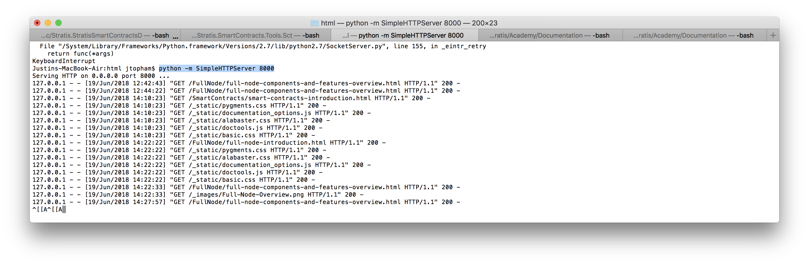

# Documentation

## RST Resources

RST files have an *.rst extension, and GitHub does a great job of rendering them. They use a markup that means the source file is very readable. Look at one of the RST files in the source directory. Click the *Raw* button to view the VST file. 

The links will help get you up to speed with editing RST files:  

[RST (and Sphinx) CheatSheat](https://thomas-cokelaer.info/tutorials/sphinx/rest_syntax.html#internal-and-external-links)

[RST Primer](http://www.sphinx-doc.org/en/master/usage/restructuredtext/basics.html)

## Installing Sphinx 

If you are writing a new article for the academy or doing a heavy edit involving adding links etc., it is best to clone this repository and build and test the updated version of the Stratis Academy locally.
### For macOS and GNU/Linux

1. Python must be installed. Currenly, macOS seems to be shipping with version 2.7, but to build documentation you need Python >= 3.7. New Python's versions are avilable on [the official downloads page](https://www.python.org/downloads/).
2. Make sure you have `pip` (which is a package management system for Python) installed on your computer. If you don't have `pip`, look for [the official installation guide](https://pip.pypa.io/en/stable/installing/).
3. (_Optional_) To avoid situation called _Python's Dependency hell_, we are strongly recommend you to use _virtual environment_. Create virtual environment by entering the following: `python -m venv /path/to/env`, where `/path/to/env` is the path where you want to create your environment. Then, you need to activate your environment by entering the following: `source /path/to/env/bin/activate`. Now, all of dependencies you'll install will belong to your virtual environment and not to global Python installation.
4. Clone this Documentation repository after first creating a folder in which hold the clone. You will see why in the next step.
5. Go to the cloned Documentation directory and install Sphinx and other required dependencies by entering the following: `pip install -r requirements.txt`.
6. (_If you are **NOT** using virtual environment_) The sphinx-build command is now in `$HOME/Library/Python/3.7/bin`. If you are using the up-to-date version of python, the version number will be different. It is best to add this path to the \$PATH enviromental variable. To do this, add the follwing line: `export PATH="$HOME/Library/Python/3.7/bin:$PATH"` to your `$HOME/.bash_profile` file. Note that this file is hidden.
7. In the "root" of the Documentation repository, enter `make html`. You should see something like this: The output be in a `build` directory at the same level as your Documentation repository. The `build` directory position is to stop the output getting mixed up with the source.
8. In your browser, now open `build/html/index.html` using the file protocol. From here, you should be able to navigate around your updated version of the academy.
9. When you are happy with your updates, submit a pull request.

#### A quick way to run a local host

As an alternative to using the file protocol to view the academy, Python provides a quick way to run a local Http Server. Start a bash shell (terminal) and navigate to `build/html` from within the folder you created to hold the Documentation repository clone.

To run a local host, enter:

`python -m http.server`

Navigate to  [http://localhost:8000](http://localhost:8000/) and you should see the your updated version of the academy.

### For Windows

Almost all the steps are identical to corresponding steps in macOS and GNU/Linux instruction. However, some steps are slighly different:
- To build this documentation, you need MSVC++ Build Tools to be installed on your PC. For more information, check out [the VS tools download page](https://visualstudio.microsoft.com/ru/downloads/).
- (_If you are **NOT** using virtual environment_) On Windows, Python may be installed on path: `C:\Users\<username>\AppData\Local\Programs\Python\Python37\bin`, and additional packages may be installed on `C:\Users\<username>\AppData\Roaming\Python\Lib`.
- (_If you are **NOT** using virtual environment_) Keep in mind that PATH environmental variables are added in different way on Windows than on *nix systems. If you need help, check out [this instruction](https://java.com/en/download/help/path.html).
- Instead of using `make html` command, you should use `make.bat html`.

## Ideas for new articles

The pages listed here contain ideas for articles for each category. Currently, the plan is add more articles on the full node, and the ideas for this so far are listed here:

[Full Node](Full_Node_Document_Ideas.md)

This will give the full node category a "cookbook" type approach, which I think will work well under the current circumstances. I am thinking that when you look down the full node contents, you will see engaging questions like "How do you interpret the full node output?" Please feel free to add more ideas to the list (and start another list for smart contracts etc.).

## Internal links
Regarding links, Sphinx can be a a bit cryptic on the subject of internal links. If offers a number of options but, at least on the subject of anchors, I had to dig around for info:

###Link to a header in the same file and use the header text

Take the following header:

My header
=========

If you are OK with the link text being the same as the header text: 

This is how to link to `My header`_.

###Link to something other than a header in the same file

The next thing you might want to do is create an link to an image, code example etc. The text in the link could be anything. To do this, create a label above the image or whatever to create an anchor:

.. _some_figure:

.. image:: stars.jpg
    :width: 200px
    :align: center
    :height: 100px
    :alt: alternate text

Then link like this:

Please refer to the :ref:`previous figure <some_figure>`. 

Remember to always leave a gap on one line between the label and what you want to link to; otherwise you get a warning.

###Link to a header in the same file but don't use the header text

