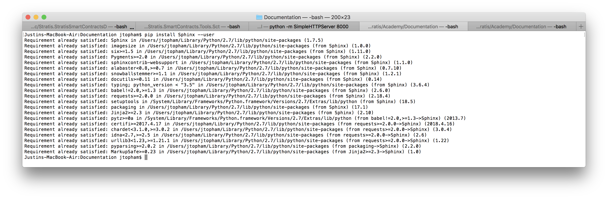
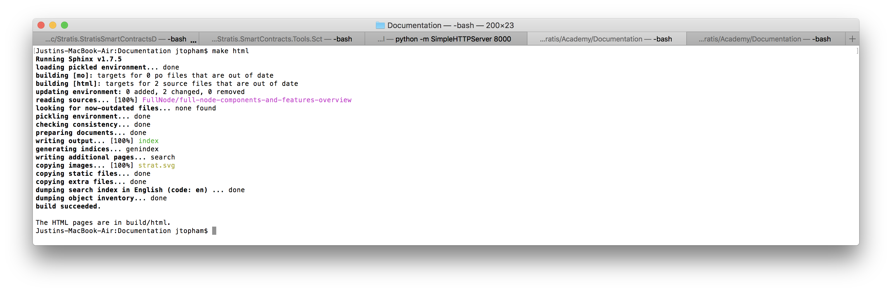

# Documentation

## RST Resources

RST files have an *.rst extension, and GitHub does a great job of rendering them. They use a markup that means the source file is very readable. Look at one of the RST files in the source directory. Click the *Raw* button to view the VST file. 

The links will help get you up to speed with editing RST files:  

[RST (and Sphinx) CheatSheat](https://thomas-cokelaer.info/tutorials/sphinx/rest_syntax.html#internal-and-external-links)

[RST Primer](http://www.sphinx-doc.org/en/master/usage/restructuredtext/basics.html)

## Installing Sphinx 

If you are writing a new article for the academy or doing a heavy edit involving adding links etc., it is best to clone this repository and build and test the updated version of the Stratis Academy locally.

Installing Sphinx using the resources available [here](http://www.sphinx-doc.org/en/master/index.html) meant a few queries in Stack Exchange etc. Therefore, I have documented the process for the Mac including building the Academy, which should smooth out the installation process. If anyone completes this for Windows, please update this document detailing the process.

### On a Mac

1. Python must be installed. Currenly, Macs seem to be shipping with version 2.7. That is not the latest version (which is 3.7) but it worked without the need for an upgrade.
2. Install pip, which is a package management system for Python. To do this, start a bash shell (terminal) and enter the following: `sudo easy_install pip`. The sudo program will ask for your password before proceeding.
3. Install Sphinx by entering the following: `pip install Sphinx –-user`. Ideally, you should now see this:However, it will (most likely) complain some packages it relies on, such as tornado and nose are not installed.
4. If required, use sudo to install the missing packages: `sudo easy_install tornado`, `sudo easy_install nose`. Then enter `pip install Sphinx --user` again and you should see the requirement has been satisfied for all packages.
5. The sphinx-build command is now in `$HOME/Library/Python/2.7/bin`. If you are using the up-to-date version of python, the version number will be different. It is best to add this path to the \$PATH enviromental variable. To do this, add the follwing line: `export PATH="$HOME/Library/Python/2.7/bin:$PATH"` to your `$HOME/.bash_profile` file. Note that this file is hidden.
6. Clone this Documentation repository. Create a folder in which hold the clone. You will see why in the next step.
7. In the "root" of the Documentation repository, enter `make html`. You should see something like this: The output be in a `build` directory in the same level as your Documentation repository. This was done to stop the output getting mixed up with the source.
8.  In your browser, now open `build/html/index.html` using the file protocol. From here, you should be able to navigate around your updated version of the academy.
9. When you are happy with your updates, submit a pull request.

#### A quick way to run a local host

As an alternative to using the file protocol to view the academy, Python provides a quick way to run a local Http Server. Start a bash shell (terminal) and navigate to `build/html` from within the folder you created to hold the Documentation repository clone.

If you are using version 2.7, enter:

`python -m SimpleHTTPServer 8000`

If you are using version 3.x, enter:

`python -m http.server`

Haven't tried the 3.x command... Once the local Http Server is running, you should see something like this:

Navigate to  [http://localhost:8000](http://localhost:8000/) and you should see the your updated version of the academy. 

## Ideas for new articles

The pages listed here contain ideas for articles for each category. Currently, the plan is add more articles on the full node, and the ideas for this so far are listed here:

[Full Node](Full_Node_Document_Ideas.md)

This will give the full node category a "cookbook" type approach, which I think will work well under the current circumstances. I am thinking that when you look down the full node contents, you will see engaging questions like "How do you interpret the full node output?" Please feel free to add more ideas to the list (and start another list for smart contracts etc.).

