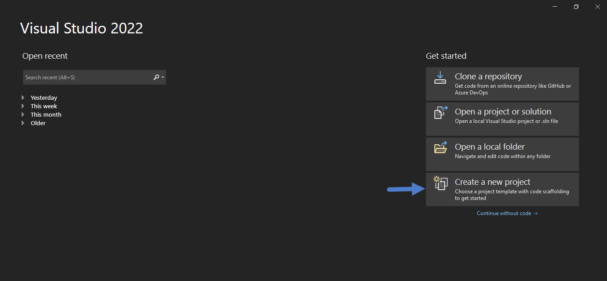
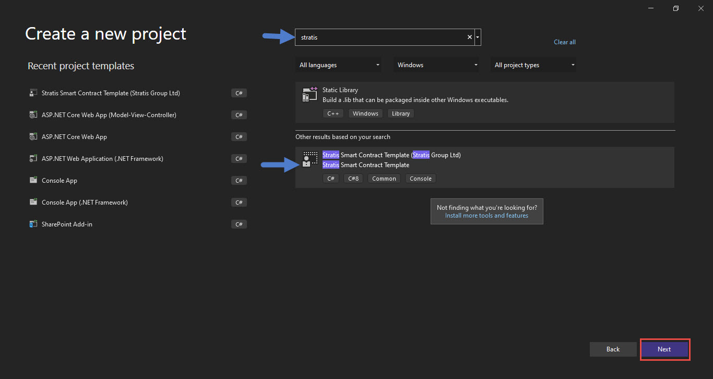
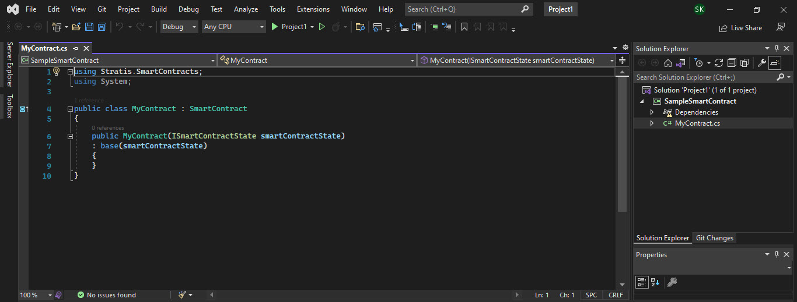

#####################################
Working with Contracts
#####################################

Writing a contract
-------------------
Stratis smart contracts are CIL bytecode that is executed on top of the dotnet core runtime. Tooling and support are currently provided for writing and compiling contracts in the C# language.

Contracts can be written in any editor that supports C#, however Visual Studio is the recommended contract development environment.

Creating a contract from a template
~~~~~~~~~~~~~~~~~~~~~~~~~~~~~~~~~~~~~~~~~~~~~~~~~~~~~
To get started with a basic contract quickly, install the smartcontract CLI template.

::

    dotnet new --install Stratis.SmartContracts.Templates.CLI

Then, create a new directory and run the following command:

::

    dotnet new smartcontract -n YOUR_PROJECT_NAME

This will scaffold a basic contract with the necessary NuGet package references.

Using Visual Studio for a contract 
~~~~~~~~~~~~~~~~~~~~~~~~~~~~~~~~~~~~~~~~~~~~~~~~~~~~~
Alternatively, once you installed Smart Contract template CLI using the command:

::

    dotnet new --install Stratis.SmartContracts.Templates.CLI

You can create a Smart Contract using Visual Studio. Open Visual Studio, click on Create new project.

Then, type Stratis in search box and search for Stratis Smart Contract. You can see the Stratis Smart Contract template in the list as depicted below. Select the template and click on Next.

Give Project Name, Folder location and solution name as usual. Then, your Smart contract project will be created where you will get default MyContract class as illustrated below. 

Hence, your basic Smart Contract with necessary NuGet package references is ready to use.

Validating a contract
--------------------------
A Stratis smart contract must not contain any non-deterministic elements. This restricts the standard .NET libraries that can be used when writing a contract. There are additional constraints around the format of the contract that are required to be met before it can be executed. 

All contracts are validated by a node when the contract is being deployed. Invalid contracts will fail validation on-chain. Because of this, it is recommended to validate contracts locally before deployment. 

Validation can be done using the ``sct`` command line tool which you can download `here <https://github.com/stratisproject/Stratis.SmartContracts.Tools.Sct>`_.

::

  dotnet run -- validate [CONTRACT_PATH_HERE]

Compiling a contract
------------------------
Contracts can be compiled using the ``sct`` command line tool.

::

  cd src/Stratis.SmartContracts.Tools.Sct
  dotnet run -- validate [CONTRACT_PATH_HERE] -sb

If compilation is successful, the output will be the compiled bytecode of the contract.

Deploying a contract
-----------------------
Contracts can be deployed in several ways:

* Using the ``sct`` command line tool.
* Via the `API <../../Swagger/index.html>`_.
* Via the wallet.

Please see the documentation of each for more details.

Interacting with a contract
------------------------------
Interaction with a contract comes in two forms:

* Interacting with a contract through a transaction - a contract call
* Interacting with a contract without a transaction - a local call

Calls and Local Calls
~~~~~~~~~~~~~~~~~~~~~~~~~~~~~
A contract call uses a regular transaction that is broadcast to the network. The call parameters are encapsulated in the transaction and handled by the network in the same way as any other transaction. Every node in the network will execute a contract call. If a contract call modifies the state database, the global state is changed.

A local call does not require a transaction. Instead, it passes the call data directly to the local node and executes it on the local machine only. A local call runs against a copy of the state database. If the local call makes changes to the state, these changes are discarded after execution.

Local calls can be used to read the contract state without expending gas (to query the value of a property for example). A local call can also aid in estimating gas costs without needing to broadcast transactions to the main network.

Interacting with a contract can be done in several ways:

* Via the `API <../../Swagger/index.html>`_.
* Via the wallet.

At the moment, it is only possible to make local calls via the API.

.. _parameter-serialization:

Parameter Serialization
--------------------------

When deploying or interacting with a contract via the wallet, the API, or SCT, contract parameters must be provided as a string. This requires that a parameter is serialized to a string in the format that the API is expecting.

Additionally, when using the API or SCT, the type of each parameter must be provided in the format "{0}#{1}", where: {0} is an integer representing the Type of the serialized data and {1} is the serialized data itself.

Refer to the following table to see the mapping between a type and its integer representation, the serializer for the type, and an example of using the type as a parameter.

.. csv-table:: Param Type Serialization
  :header: "Type", "Integer representing
   serialized type", "Serializer", "Example"

  System.Boolean, 1, System.Boolean.ToString(), "1#true"
  System.Byte, 2, System.Byte.ToString(), "2#255"
  System.Char, 3, System.Char.ToString(), "3#c"
  System.String, 4, System.String, "4#Stratis"
  System.UInt32, 5, System.UInt32.ToString(), "5#123"
  System.Int32, 6, System.Int32.ToString(), "6#-123"
  System.UInt64, 7, System.UInt64.ToString(), "7#456"
  System.Int64, 8, System.Int64.ToString(), "8#-456"
  Stratis.SmartContracts.Address, 9, Base58Address.ToString(), "9#mtXWDB6k5yC5v7TcwKZHB89SUp85yCKshy"
  System.Byte[], 10, BitConverter.ToString(), "10#04A6B9"
  Stratis.SmartContracts.UInt128, 11, Stratis.SmartContracts.UInt128.ToString(), "11#789"
  Stratis.SmartContracts.UInt256, 12, Stratis.SmartContracts.UInt256.ToString(), "12#987"

The parameters must be provided in the order they occur in the method signature. For example, calling a method with the signature ``SomeMethod(Address myAddress, byte[] someData)`` with the values ``myAddress = mtXWDB6k5yC5v7TcwKZHB89SUp85yCKshy``, ``someData = 0xFF00AA`` looks like:

In the API:
::

  parameters: [
    "9#mtXWDB6k5yC5v7TcwKZHB89SUp85yCKshy",
    "10#FF00AA"
  ]

As parameters to SCT:
::

  -param="9#mtXWDB6k5yC5v7TcwKZHB89SUp85yCKshy" -param="10#FF00AA"

In the wallet:

.. figure:: wallet-params.png
    :alt: Wallet Params
    :align: center

    Entering contract parameters in the wallet

Gas
-------------------

Contracts require 'gas' to run. How much gas is needed is related to the amount of processing required to execute the contract. Gas is an additional expenditure to transaction fees and is different from STRAX. Its relationship to STRAX is defined by ``strat = gas * gasPrice``.

All contract transactions contain a gas price and gas limit specified by the sender of the transaction. When a miner mines the contract transaction, they receive the gas as a fee for the work they had to do to execute the contract. Miners can choose to prioritize transactions based on profitability by mining transactions with a higher gas price first.

Gas fees are charged according to the :doc:`gas price schedule <appendix-gas-prices>`. When a contract execution takes place, gas is consumed until the gas limit is reached. If execution completes before the gas limit is reached, the gas will be refunded to the sender of the transaction. If execution exhausts all available gas, the execution will fail, the contract state will not change, and no gas will be refunded.
