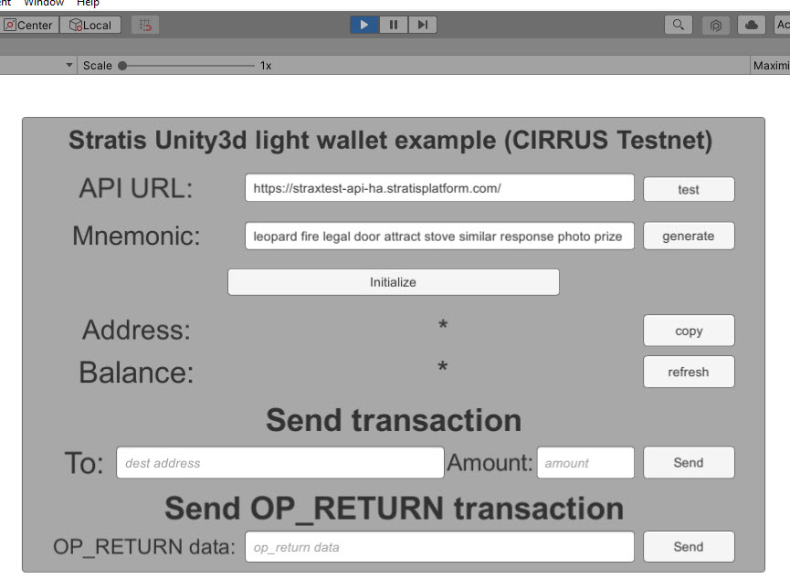
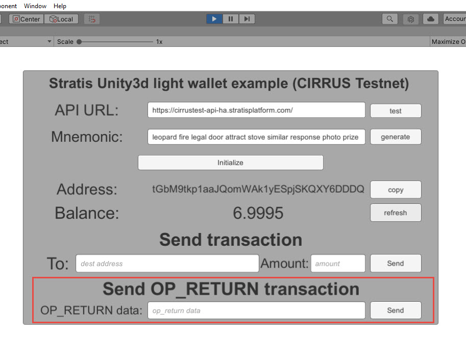

###################
Unity3D Integration
###################

This tutorial will take you through the steps of setting up an environment and performing basic
interaction with the Cirrus Testnet Blockchain.

**************
Pre-Requisites
**************

-  Download and install `.NET Core SDK 3.1 <https://dotnet.microsoft.com/download/dotnet/3.1>`_

-  Download and install `Git <https://git-scm.com/downloads>`_

-  Download `Stratis Unity SDK Package <https://github.com/stratisproject/Unity3dIntegration/tree/main/Resources>`_

*The Stratis Unity SDK is currently going through the Unity Store approval process, in the meantime, the package can be obtained from our GitHub source above.*

To integrate Stratis Unity SDK in your Unity project you can use Stratis hosted Public nodes which is a recommended way. Alternatively, if you prefer to use a local node then you can run the Full Node locally as well.

***********************************
Stratis Public Node for Integration
***********************************

This section provides you information about public **Cirrus Node** references that you will need for integration.

Below are API references for Cirrus Node:

.. code-block:: csharp

   this.ApiUrl_InputField.text = "https://cirrus-api-ha.stratisplatform.com"; //for mainnet
   this.ApiUrl_InputField.text = "https://cirrustest-api-ha.stratisplatform.com/"; //for testnet

BlockCore API reference for Cirrus testnet is: https://cirrustestindexer.stratisnetwork.com/api/

BlockCore API reference for Cirrus mainnet is: https://cirrusindexer.stratisnetwork.com/api/

*************
Running Unity
*************

Create a new project within Unity and import the Stratis Blockchain SDK Unity Package that we obtained earlier.
Once it's imported we can open and run the example scene. It is a simple UI that you can use to test the
solution, first, we will need to provide the correct endpoint and for Cirrus testnet it is, ``https://cirrustest-api-ha.stratisplatform.com/``, so if you've set up
everything properly, click test.

|

You will see that the API test was successful. And you can now generate a new mnemonic. 
You can also just use your old mnemonic in case you already have a wallet created in unity. 
Click on ``Initialize`` and here is your address to which you can deposit
CRS. Let's copy it. 
Once you get the Unity wallet address, you need to have balance in you address. So before you proceed make sure you have some TCRS (CIRRUS on testnet) deposited to your address.

This can be obtained from members of the community in the `Stratis Discord Server <https://discord.gg/P5ZsX37M4X>`_

For Mainnet, you can also just use a Wallet GUI to deposit fund from existing wallet to your Unity Address. The GUI Wallet can be downloaded below:

https://github.com/stratisproject/CirrusCore/releases

Once the fund is transferred, now if we go back to unity and refresh our balance we can see that the balance has changed.

***********************
Performing Transactions
***********************

We can send two types of transactions, one is a normal transaction where
you supply the destination address and the amount you want to send.

.. image:: images/1.Normaltransaction.jpg
   :target: images/1.Normaltransaction.jpg
   :alt: Send Transaction

|

The second is an op return transaction which basically allows you to
encode any data and post it to the blockchain. 

|

So let's try both of those. Let's say I deposited ``1`` to an address.

Now we can see the transaction was created and we get the transaction
id, based on which we can explore about the transaction on
`Stratis Block Explorer <https://chainz.cryptoid.info/cirrus-test/>`_  or `Blockcore Explorer <https://explorer.blockcore.net/tcrs/explorer/>`_.
Let's open this address in the blockchain explorer and see if any transaction was
created, so it will take some time for the transaction to be mined
before it will appear. Typically it will be less than half a minute, so
let's wait.

Once the transaction is confirmed, it will appear on the explorer, you can select the transaction to see the
transaction detail. i.e. What inputs were selected and what the outputs were.
Now you can do the second type of transaction, which is encoding any
operator and data. So let's put any data in the ``SEND OP_RETURN transaction`` field and click send.

Then again open `Stratis Block Explorer <https://chainz.cryptoid.info/cirrus-test/>`_ or `Blockcore Explorer <https://explorer.blockcore.net/tcrs/explorer/>`_ and look for this address, once the
transaction is confirmed and we can see the transaction details, if we
open it that we have an output ``OP_RETURN`` and it will have your data encoded
there.

***********************************
Preparing Stratis Full Node Locally
***********************************
This section provides you insight into how to run Full node locally for Unity SDK integration. However, running a Full node locally may take more time for synchronisation so we recommend using Public node references. If you prefer to use the public node then you don't need to run Full Node locally.

Now let's commence. First, you must obtain a local copy of the Stratis Full Node; this can
be achieved by using the git clone command. 

For the purpose of this document, we will be using the desktop as the
root directory. 

**Execute the below command**: 

.. code-block:: bash

   git clone http://github.com/stratisproject/StratisFullNode C:/Users/Admin/Desktop/StratisFullNode

The above command will clone the source code to the below directory,

.. code-block:: bash

   C:\Users\Admin\Desktop\StratisFullNode\src\Stratis.CirrusD

It's cloned now so let's go to the source and let's build it.

.. code-block:: bash

   dotnet build

Once the build has completed, we can run the project.

.. code-block:: bash

   dotnet run -testnet

To run it in mainnet you can just execute the command without *-testnet*. Once we execute the command, a local version of Stratis FullNode will
start running and syncing with the testnet. While it's syncing we can open the port in the firewall, as we want to
allow inbound ports.

Now let's check if it works, so first let's go to swagger on
http://localhost:38223/swagger/index.html for testnet and if you are launching node in mainnet then go to http://localhost:37223/swagger/index.html.

**Note**: The node can take some time depending on the internet speed, and available resources
to get fully synced. The synchronization completion can be confirmed by the viewing the console and checking the below.

.. code-block:: bash
   
   >> Consensus Manager
	Tip Age                 : 00.00:00:07 (maximum is 00.00:12:48)
	Synced with Network     : Yes

Once the node is fully synchronized; let's go and run unity and try to connect to our API providing the correct endpoint: ``http://localhost:38223/``.

So that's pretty much it! Click next to view a further guide based on integrating Stratis Smart Contracts.