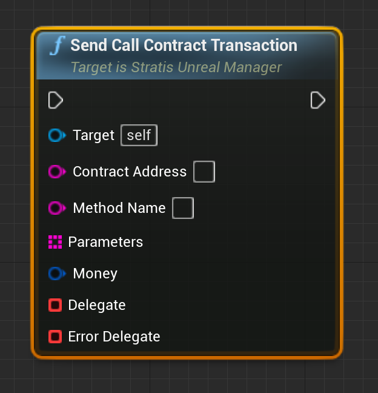
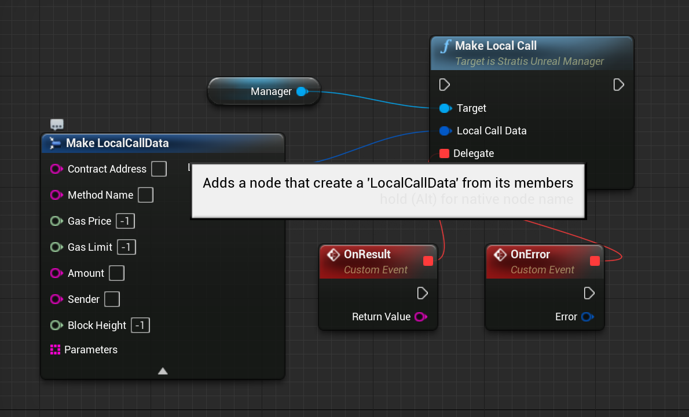

Tutorial #2 - Interacting with smart contracts
==============================================

In this tutorial, we will learn how to deploy and interact with `smart contracts <https://academy.stratisplatform.com/Architecture%20Reference/SmartContracts/smartcontracts-introduction.html>`_ supported by the Stratis blockchain.
Let's get started!

Prerequisite
------------

For this tutorial, you need to fully-setup the ``StratisUnrealManager`` instance, as described in Tutorial #0.

Transaction-level API
---------------------

At first, let's see how we can interact with smart contracts using low-level (i.e. transaction-level) API.

Deploying a smart contract
^^^^^^^^^^^^^^^^^^^^^^^^^^

To deploy smart contract, we should use method ``sendCreateContractTransaction``\ :

.. image:: images/0-deploy-contract.png
   :target: images/0-deploy-contract.png
   :alt: Deploy contract

|

where:

* 
  ``contractCode`` - hex-encoded bytecode of the contract. You can compile your contract using `sct tool <https://academy.stratisplatform.com/Architecture%20Reference/SmartContracts/working-with-contracts.html#compiling-a-contract>`_\ , 
  or you can use one of the whitelisted contracts from ``UWhitelistedSmartContracts`` class.

* 
  ``parameters`` - `serialized <https://academy.stratisplatform.com/Architecture%20Reference/SmartContracts/working-with-contracts.html#parameter-serialization>`_ arguments passed to contract's constructor.
  You can encode parameters using ``USmartContractsParametersEncoder``.

* 
  ``money`` - the number of satoshis to deposit on the contract's balance.

* 
  ``delegate``\ , ``error delegate`` - return delegates, returns either ``transactionID`` of contract creation or error.

Example:

.. image:: images/1-deploy-contract-example.png
   :target: images/1-deploy-contract-example.png
   :alt: Example contract deployment

|

Calling contract's methods
^^^^^^^^^^^^^^^^^^^^^^^^^^

To call contract's methods, we need to use ``sendCallContractTransaction`` method:

|

where:

* ``contractAddress`` - transaction ID of contract deployment transaction
* ``methodName`` - name of the method we want to call.
* ``parameters`` - serialized parameters list. See more in **Deploying smart contract** section.
* ``money`` - amount of satoshis to send to contract.
* 
  ``delegate``\ , ``error delegate`` - return delegates, returns either ``transactionID`` of contract call or error.

  Example:

.. image:: images/3-call-contract-example.png
   :target: images/3-call-contract-example.png
   :alt: Call contract example

|

Making a local call
^^^^^^^^^^^^^^^^^^^

Sometimes, we want to get some information from the smart contract, but we don't want to post any updates to the blockchain. In this case, we can use a `\ **local call** functionality <https://academy.stratisplatform.com/Architecture%20Reference/SmartContracts/working-with-contracts.html#calls-and-local-calls>`_.

To make a local call, we need to use the ``makeLocalCall`` method:

.. image:: images/4-local-call.png
   :target: images/4-local-call.png
   :alt: Local call

|

where: 

* ``data`` - structure containing all necessary information to resolve smart contract's method call.
* ``delegate``\ , ``error delegate`` - return delegates, returns either string-encoded return value or error.

Example:

|

Smart contract wrappers
-----------------------

Although, we can use any method of any of smart contracts with 3 methods we discussed above, 
this requires a lot of boilerplate code for each call.

That's why we have wrappers for some of the white-listed contracts, such as the NFT contract.
These wrappers encapsulate all of the necessary boilerplate, giving you a simple and powerful interface.

Conclusion
----------

In this tutorial, we've learned how to interact with smart contracts using low-level and high-level APIs.
In the next tutorial we will see how we can use Stratis Unreal plugin to integrate NFT into your game.

If you found a problem, you can `open an issue <https://github.com/stratisproject/UnrealEnginePlugin/issues>`_ on the project's Github page.
If you still have questions, feel free to ask them in `our Discord channel <https://discord.gg/9tDyfZs>`_.

Stay tuned!
