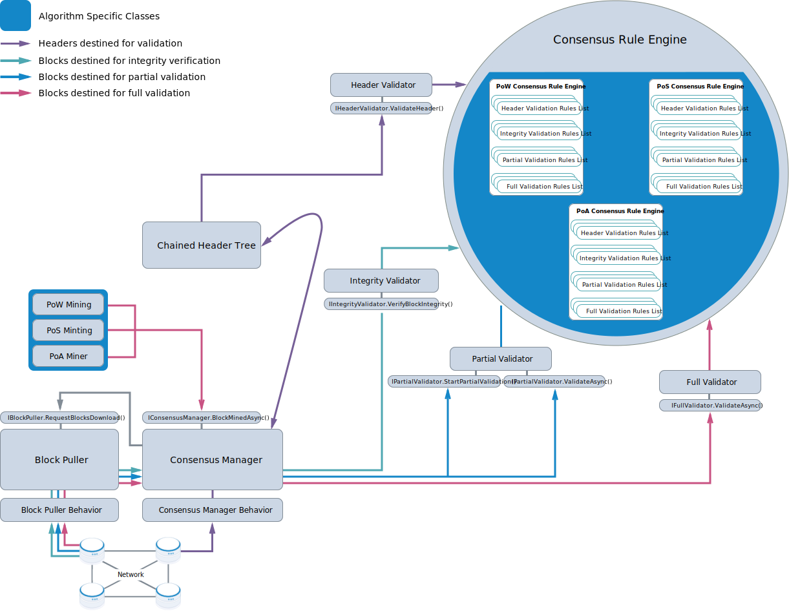

****************************************************
Consensus architecture
****************************************************

The following figure shows the components that make up the consensus architecture. The components within blue shapes are algorithm specific, which is to say that they are added to a Full Node build depending on the consensus algorithm/s the build needs to support.

	
	
The Consensus Manager, which is a ``ConsensusManager`` singleton, is the central part of the consensus architecture and implements the ``IConsensusManager`` interface. It interacts closely with the Chained Header Tree (a ``ChainedHeaderTree`` singleton). The Consensus Manager receives headers via the Consensus Behavior Manager and these are forwarded to the Chained Header Tree. The Chained Header Tree decides which of the headers are interesting and requests the Consensus Manager retrieves the headers' blocks. The Block Puller is responsible for handling the block retrieval from the network.

.. note:: The decisions on what level block validation needs to go to are taken by the Consensus Manager, which may rely on feedback from the Chained Header Tree. When looking at the routes taken by blocks on their way to validation, be aware that blocks undergoing full validation will have passed at least partial validation first. Blocks that are required to undergo only partial validation will have passed integrity verification.       

The ``ConsensusRulesEngine`` is an abstract class that the algorithm-specific ``PowConsensusRulesEngine``, ``PosConsensusRulesEngine``, and ``PoAConsensusRulesEngine`` classes inherit from. Each ``ConsensusRulesEngine`` object contains a list of rules for the four types of validation. The Consensus Manager does not interact directly with the instances of ``PowConsensusRulesEngine``, ``PosConsensusRulesEngine``, and ``PoAConsensusRulesEngine`` which are created. Instead, the Consensus Manager calls into three wrapper class singletons: ``IntegrityValidator``, ``Partial Validator``, and the ``FullValidator``. These lean objects provide, internally, a logging facility and implement the ``IIntegrityValidator``, ``IPartialValidator``, and ``IFullValidator`` interfaces respectively. Except for ``IPartialValidator``, each of these singletons implements a single method, and it is these methods the Consensus Manager calls.

The Chained Header Tree follows the same pattern and interacts with the required header validation rules list via a ``HeaderValidator`` wrapper singleton, which implements the ``IHeaderValidation`` interface.

The table below provides links to the source files in which the C# classes and related interfaces (were relevant) for these components can be found:

+----------------------------+-------------------------------------------------------------------------------------------------------------------------------------------------------------------------+------------------------------------------------------------------------------------------------------------------------------------------------------------+
| Component                  | C# Class                                                                                                                                                                | C# Interface                                                                                                                                               |
+============================+=========================================================================================================================================================================+============================================================================================================================================================+
| PoW Mining                 | `PowMining <https://github.com/stratisproject/StratisBitcoinFullNode/blob/master/src/Stratis.Bitcoin.Features.Miner/PowMining.cs>`_                                     | `IPowMining <https://github.com/stratisproject/StratisBitcoinFullNode/blob/master/src/Stratis.Bitcoin.Features.Miner/Interfaces/IPowMining.cs>`_           |
+----------------------------+-------------------------------------------------------------------------------------------------------------------------------------------------------------------------+------------------------------------------------------------------------------------------------------------------------------------------------------------+
| PoS Minting                | `PosMinting <https://github.com/stratisproject/StratisBitcoinFullNode/blob/master/src/Stratis.Bitcoin.Features.Miner/Staking/PosMinting.cs>`_                           | `IPosMinting <https://github.com/stratisproject/StratisBitcoinFullNode/blob/master/src/Stratis.Bitcoin.Features.Miner/Interfaces/IPosMinting.cs>`_         |
+----------------------------+-------------------------------------------------------------------------------------------------------------------------------------------------------------------------+------------------------------------------------------------------------------------------------------------------------------------------------------------+
| PoA Miner                  | `PoAMiner <https://github.com/stratisproject/StratisBitcoinFullNode/blob/master/src/Stratis.Bitcoin.Features.PoA/PoAMiner.cs>`_                                         | `IPoAMiner <https://github.com/stratisproject/StratisBitcoinFullNode/blob/master/src/Stratis.Bitcoin.Features.PoA/PoAMiner.cs>`_                           |
+----------------------------+-------------------------------------------------------------------------------------------------------------------------------------------------------------------------+------------------------------------------------------------------------------------------------------------------------------------------------------------+
| Chained Header Tree        | `ChainedHeaderTree <https://github.com/stratisproject/StratisBitcoinFullNode/blob/master/src/Stratis.Bitcoin/Consensus/ChainedHeaderTree.cs>`_                          | `IChainedHeaderTree <https://github.com/stratisproject/StratisBitcoinFullNode/blob/master/src/Stratis.Bitcoin/Consensus/ChainedHeaderTree.cs>`_            |
+----------------------------+-------------------------------------------------------------------------------------------------------------------------------------------------------------------------+------------------------------------------------------------------------------------------------------------------------------------------------------------+
| Consensus Manager          | `ConsensusManager <https://github.com/stratisproject/StratisBitcoinFullNode/blob/master/src/Stratis.Bitcoin/Consensus/ConsensusManager.cs>`_                            | `IConsensusManager <https://github.com/stratisproject/StratisBitcoinFullNode/blob/master/src/Stratis.Bitcoin/Consensus/IConsensusManager.cs>`_             |
+----------------------------+-------------------------------------------------------------------------------------------------------------------------------------------------------------------------+------------------------------------------------------------------------------------------------------------------------------------------------------------+
| Consensus Manager Behavior | `Consensus Manager Behavior <https://github.com/stratisproject/StratisBitcoinFullNode/blob/master/src/Stratis.Bitcoin/Consensus/ConsensusManagerBehavior.cs>`_          | N/A                                                                                                                                                        |
+----------------------------+-------------------------------------------------------------------------------------------------------------------------------------------------------------------------+------------------------------------------------------------------------------------------------------------------------------------------------------------+
| Header Validator           | `HeaderValidator <https://github.com/stratisproject/StratisBitcoinFullNode/blob/master/src/Stratis.Bitcoin/Consensus/Validators/BlockValidator.cs>`_                    | `IHeaderValidator  <https://github.com/stratisproject/StratisBitcoinFullNode/blob/master/src/Stratis.Bitcoin/Consensus/Validators/BlockValidator.cs>`_     |
+----------------------------+-------------------------------------------------------------------------------------------------------------------------------------------------------------------------+------------------------------------------------------------------------------------------------------------------------------------------------------------+
| Integrity Validator        | `IntegrityValidator <https://github.com/stratisproject/StratisBitcoinFullNode/blob/master/src/Stratis.Bitcoin/Consensus/Validators/BlockValidator.cs>`_                 | `IIntegrity Validator  <https://github.com/stratisproject/StratisBitcoinFullNode/blob/master/src/Stratis.Bitcoin/Consensus/Validators/BlockValidator.cs>`_ |
+----------------------------+-------------------------------------------------------------------------------------------------------------------------------------------------------------------------+------------------------------------------------------------------------------------------------------------------------------------------------------------+
| Partial Validator          | `PartialValidator  <https://github.com/stratisproject/StratisBitcoinFullNode/blob/master/src/Stratis.Bitcoin/Consensus/Validators/BlockValidator.cs>`_                  | `IPartialValidator  <https://github.com/stratisproject/StratisBitcoinFullNode/blob/master/src/Stratis.Bitcoin/Consensus/Validators/BlockValidator.cs>`_    |
+----------------------------+-------------------------------------------------------------------------------------------------------------------------------------------------------------------------+------------------------------------------------------------------------------------------------------------------------------------------------------------+
| Full Validator             | `FullValidator  <https://github.com/stratisproject/StratisBitcoinFullNode/blob/master/src/Stratis.Bitcoin/Consensus/Validators/BlockValidator.cs>`_                     | `IFullValidator <https://github.com/stratisproject/StratisBitcoinFullNode/blob/master/src/Stratis.Bitcoin/Consensus/Validators/BlockValidator.cs>`_        |
+----------------------------+-------------------------------------------------------------------------------------------------------------------------------------------------------------------------+------------------------------------------------------------------------------------------------------------------------------------------------------------+
| Consensus Rule Engine      | `ConsensusRuleEngine <https://github.com/stratisproject/StratisBitcoinFullNode/blob/master/src/Stratis.Bitcoin/Consensus/ConsensusRuleEngine.cs>`_                      | `IConsensusRuleEngine <https://github.com/stratisproject/StratisBitcoinFullNode/blob/master/src/Stratis.Bitcoin/Consensus/IConsensusRuleEngine.cs>`_       |
+----------------------------+-------------------------------------------------------------------------------------------------------------------------------------------------------------------------+------------------------------------------------------------------------------------------------------------------------------------------------------------+
| PoW Consensus Rule Engine  | `PowConsensusRuleEngine <https://github.com/stratisproject/StratisBitcoinFullNode/blob/master/src/Stratis.Bitcoin.Features.Consensus/Rules/PowConsensusRuleEngine.cs>`_ | N/A                                                                                                                                                        |
+----------------------------+-------------------------------------------------------------------------------------------------------------------------------------------------------------------------+------------------------------------------------------------------------------------------------------------------------------------------------------------+
| PoS Consensus Rule Engine  | `PosConsensusRuleEngine <https://github.com/stratisproject/StratisBitcoinFullNode/blob/master/src/Stratis.Bitcoin.Features.Consensus/Rules/PosConsensusRuleEngine.cs>`_ | N/A                                                                                                                                                        |
+----------------------------+-------------------------------------------------------------------------------------------------------------------------------------------------------------------------+------------------------------------------------------------------------------------------------------------------------------------------------------------+
| PoA Consensus Rule Engine  | `PoAConsensusRuleEngine <https://github.com/stratisproject/StratisBitcoinFullNode/blob/master/src/Stratis.Bitcoin.Features.PoA/PoAConsensusRuleEngine.cs>`_             | N/A                                                                                                                                                        |
+----------------------------+-------------------------------------------------------------------------------------------------------------------------------------------------------------------------+------------------------------------------------------------------------------------------------------------------------------------------------------------+
| Block Puller               | `BlockPuller <https://github.com/stratisproject/StratisBitcoinFullNode/blob/master/src/Stratis.Bitcoin/BlockPulling/BlockPuller.cs>`_                                   | `IBlockPuller <https://github.com/stratisproject/StratisBitcoinFullNode/blob/master/src/Stratis.Bitcoin/BlockPulling/BlockPuller.cs>`_                     |
+----------------------------+-------------------------------------------------------------------------------------------------------------------------------------------------------------------------+------------------------------------------------------------------------------------------------------------------------------------------------------------+
| Block Puller Behavior      | `BlockPullerBehavior <https://github.com/stratisproject/StratisBitcoinFullNode/blob/master/src/Stratis.Bitcoin/BlockPulling/BlockPullerBehavior.cs>`_                   | N/A                                                                                                                                                        |
+----------------------------+-------------------------------------------------------------------------------------------------------------------------------------------------------------------------+------------------------------------------------------------------------------------------------------------------------------------------------------------+

When does the Consensus Manager request block validation?
===========================================================

Let's look in the code at the situations which require that the Consensus Manager performs validation:  

1. PoW Mining, PoS Minting, and PoA Miner singletons call into the Consensus Manager, via the ``ConsensusManager.BlockMinedAsync()`` method, when a new block is created. Calling ``BlockMinedAsync()`` results in the new block undergoing both partial and full validation. As older blocks mined prior to the last checkpoint do not require full validation, partial validation includes a check to see if a block requires full validation. However, if a supposedly new block does not require full validation, something has gone wrong, and an error is raised.

2. The Consensus Manager holds a reference to the Block Puller component. When the Consensus Manager is initialized, it supplies ``ConsensusManager.BlockDownloaded()`` to the Block Puller as a callback. The ``ConsensusManager.HeadersPresented()`` method is used to request that the Consensus Manager initiates block downloading for a set of block headers. The request is forwarded to the Block Puller. Each block retrieved from the network by the Block Puller is pushed into the ConsensusManager via the supplied ``BlockDownloaded()`` callback. In this callback, the integrity of the downloaded block is verified with a call to ``IntegrityValidator.VerifyBlockIntegrity()``. All requests to the Block Puller are made via the ConsensusManager.

3. Within ``ConsensusManager.HeadersPresented()`` is a call to the private function ``ConsensusManager.DownloadBlocks()``, which takes a callback function as its second parameter. In the call to ``DownloadBlocks()``, ``ConsensusManager.ProcessDownloadedBlock()`` is supplied as the callback and is held in the ``ConsensusManager.callbacksByBlocksRequestedHash`` dictionary. ``ProcessDownloadedBlock()`` ultimately gets retrieved from the dictionary and called in ``ConsensusManager.BlockDownloaded()``, and here it matches up a downloaded block with the block's chained header in the Chained Header Tree. This is achieved via a call to ``ChainedHeaderTree.BlockDataDownloaded()``, which returns ``true`` if the downloaded block requires partial validation and false if it does not. If partial validation is required, a call is made to ``PartialValidator.StartPartialValidation()``. If partial validation succeeds at this point, full validation may be required.

4. The decision to proceed with full validation is made by the Chained Header Tree. Specifically, this occurs when ``ChainedHeaderTree.PartialValidationSucceeded()`` is called at two points in the Consensus Manager code: within ``BlockMinedAsync()`` and within ``ConsensusManager.OnPartialValidationSucceededAsync()``, which is called from the callback passed to ``PartialValidator.StartPartialValidation()``. Importantly, ``PartialValidationSucceeded()`` has an ``out`` parameter which returns whether full validation is required. It decides this by checking if the block has more chainwork than the current consensus tip. If this is the case, the new block will become the consensus tip if it passes full validation.

.. note:: The Chained Header Tree component does not hold a reference to the Consensus Manager. Communication with the Consensus Manager occurs when it calls the ``IChainedHeaderTree`` interface, and the Chain Header Tree's response is either by return values or `out <https://docs.microsoft.com/en-us/dotnet/csharp/language-reference/keywords/out-parameter-modifier>`_ parameters. Therefore, the communication can be thought of as two-way. 
      
When does the Chained Header Tree request header validation?
==============================================================

The Chained Header Tree tries to create a new chained header (an instance of ``ChainedHeader``) each time it receives a header (an instance of ``BlockHeader``). Straight after the new chained header is created, it is validated with a call to ``HeaderValidator.ValidateHeader()``. The creation of the new chained header takes place in ``ChainedHeaderTree.CreateAndValidateNewChainedHeader()``, and this private function is ultimately only invoked in response to two public functions: ``ChainedHeaderTree.ConnectNewHeaders()`` and ``ChainedHeaderTree.CreateChainedHeaderOfMinedBlock()``. These public functions are only ever called by ``ConsensusManager.HeadersPresented()`` and ``ConsensusManager.BlockMinedAsync()`` respectively.

