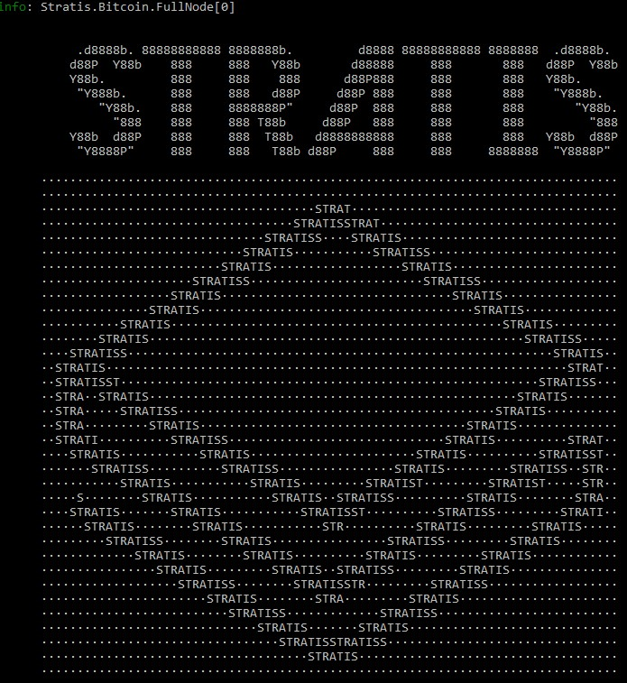

****************************************************
Console Output
****************************************************

When you run the Stratis Full Node from the command line, a stream of information is returned to your console to keep you informed about what is going on. The first thing displayed is the Stratis banner:

After the banner has been displayed, the node will start to initialize, and while this is going on, information will be displayed on the console to update you on the node's progress. This information may be:

* Prefixed by an “info:” label in **green font** for lines that are "for information only". For example:

::

    info: Stratis.Bitcoin.FullNode[0]
          Full node initialized on StratisTest.
    info: Stratis.Bitcoin.FullNode[0]
          Starting node.
    info: Stratis.Bitcoin.Base.BaseFeature[0]
          Loading finalized block height.
    info: Stratis.Bitcoin.Base.BaseFeature[0]
          Loading chain.

* In a **yellow font** for warnings that do not necessarily require any action to be taken.
* In a **red font**, which denotes errors that need to be addressed.

Eventually, the following “Application started” notice appears:

::

    Application started. Press Ctrl+C to shut down.

Following the “Application started” notice, logging begins with the display and regular update of two pages of statistics, which relate to the operation of the Full Node. The refresh frequency varies but is typically every 30-60 seconds. The statistics are displayed in the format described in the following sections, and each of the two pages is prefixed by the following information line:

::

    info: Stratis.Bitcoin.FullNode[0]

.. note:: More detail on the components mentioned in the following sections can be found in :doc:`../ComponentsOverview/full-node-components-and-features-overview`.

.. note:: The node benchmarks are only outputted when the node is running in :ref:`IBD mode <ibd-mode>`.

Page 1 - Node benchmarks
================================

The first page records the time taken for various activities during block validation and is introduced by the following information line:

::

        info: Stratis.Bitcoin.FullNode[0]

Consensus Manager benchmarks 
-------------------------------

This section of the log records the time taken for various tasks comprising the consensus process:

::

      ======ConsensusManager Bench======
      Total connection time (FV, CHT upd, Rewind, Signaling): 8.336 ms
      Block connection (FV excluding rewind): 7.0731 ms
      Block connected signal: 0.2497 ms
      Block disconnected signal: NaN ms

Consensus Rules benchmarks
--------------------------------

This section of the log records the time taken executing the :ref:`consensus rules <consensus-rules>` used in each block validation process (Header Validation, Block Integrity Validation, Partial Validation, and Full Validation):

::

      ======ConsensusRules Bench======
      Header validation rules. Average total execution time: 3.8234 ms.
          HeaderTimeChecksRule------------------------------0.0036 ms---0 %
          HeaderTimeChecksPosRule---------------------------0.0002 ms---0 %
          StratisBugFixPosFutureDriftRule-------------------0.0009 ms---0 %
          CheckDifficultyPosRule----------------------------0.0061 ms---0 %
          StratisHeaderVersionRule--------------------------0.0002 ms---0 %
          ProvenHeaderSizeRule------------------------------0.0004 ms---0 %
          ProvenHeaderCoinstakeRule-------------------------3.8118 ms---100 %

      Integrity validation rules. Average total execution time: 1.9799 ms.
          BlockMerkleRootRule-------------------------------0.0701 ms---4 %
          PosBlockSignatureRepresentationRule---------------0.0037 ms---0 %
          PosBlockSignatureRule-----------------------------1.9082 ms---96 %

      Partial validation rules. Average total execution time: 0.1628 ms.
          SetActivationDeploymentsPartialValidationRule-----0.0316 ms---19 %
          PosTimeMaskRule-----------------------------------0.0099 ms---6 %
          TransactionLocktimeActivationRule-----------------0.0034 ms---2 %
          CoinbaseHeightActivationRule----------------------0.0128 ms---8 %
          WitnessCommitmentsRule----------------------------0.0023 ms---1 %
          BlockSizeRule-------------------------------------0.0579 ms---36 %
          EnsureCoinbaseRule--------------------------------0.0013 ms---1 %
          CheckPowTransactionRule---------------------------0.0196 ms---12 %
          CheckPosTransactionRule---------------------------0.0021 ms---1 %
          CheckSigOpsRule-----------------------------------0.0173 ms---11 %
          PosCoinstakeRule----------------------------------0.0042 ms---3 %

      Full validation rules. Average total execution time: 6.9494 ms.
          SetActivationDeploymentsFullValidationRule--------0.0202 ms---0 %
          CheckDifficultyHybridRule-------------------------0.0173 ms---0 %
          LoadCoinviewRule----------------------------------0.3465 ms---5 %
          TransactionDuplicationActivationRule--------------0.0014 ms---0 %
          PosCoinviewRule-----------------------------------6.1095 ms---88 %
          PosColdStakingRule--------------------------------0.0035 ms---0 %
          SaveCoinviewRule----------------------------------0.4636 ms---7 %

UTXO Benchmarks
--------------------

The Coin View represents the set of unspent transactions (UTXOs) that have been recorded and is recalculated each time the consensus tip moves forward. It makes use of a database and cache, and is the last thing to be updated during the full validation process, hence it appears at the end of this page of benchmark statistics:

::

      ======DBreezeCoinView Bench======
      Insert time:        00:00:00
      Inserted UTXO:      0
      Query speed:        1.0710 ms/utxo
      Query time:         00:00:01.8431845
      Queried UTXO:       1721

      ======CashedCoinView Bench======
      Cache entries       74280
      ====Cache Stats(%)====
      Hit:                60.48 %
      Miss:               39.52 %

      ======ProvenBlockHeaderStore Bench======
      Insert time:        00:00:00
      Inserted UTXO:      0
      Query time:         00:00:00
      Queried UTXO:       0

Page 2 - Node data
===================

The second page records data that is related to block validation and comprises information about chain height, connections, and block and transaction storage. It is introduced by the same information line as the first page::

        info: Stratis.Bitcoin.FullNode[0]

Node statistics
--------------------

The node statistics display information about the current chain heights:

.. _node-stats:

::

      ======Node stats====== 12/13/2018 13:39:27
      Headers.Height:      1079403  Headers.Hash:     a376389e702233e59c99b1bf9e4ade0555fec570151f38cd167d9b4a20249eeb
      Consensus.Height:    1078700  Consensus.Hash:   71b535824158acca7092510233129c72bdde6a6bfc848a6cbe61829f05534529
      BlockStore.Height:   1076500  BlockStore.Hash:  46b7a1525ef128e55243b252fc7bd3fb9a03b807ed3384bd86c1758dd531de27
      Wallet.Height:       1078700  Wallet.Hash:      71b535824158acca7092510233129c72bdde6a6bfc848a6cbe61829f05534529

These heights will generally be slightly different, depending on the relative progress of various activities on the blockchain:

* ``Headers.Height`` shows the current number of block headers that have been read. Headers are relatively quick to read, and this height will always be the largest of the four heights listed.
* ``Consensus.Height`` is the point in the blockchain up to which consensus has been validated, so this will generally be a little lower than ``Headers.Height``.
* ``BlockStore.Height`` indicates the point in the blockchain up to which block data has been downloaded. ``Headers.Height`` always reads ahead of this slower block reading process, and this height will be somewhere below that of ``Headers.Height`` and ``Consensus.Height``.
* ``Wallet.Height`` shows the height of blocks recorded in any wallets detected as residing on the node. “No Wallet” will be displayed here if no wallet has been detected; otherwise you will see the height of the blocks recorded by the wallet. The wallet keeps a record of blockchain transactions in order to calculate the Unspent Transaction Outputs (UTXOs) available for the wallet owner to spend. If more than one wallet is detected, then you will see more than one entry here.

Connection data 
------------------------------

This section in the log lists the other “agent” nodes or peers to which the node is connected. Initially this number will be low, maybe 2 or 3, but will build as the node discovers more peers. In the example below, 16 peers have been discovered:

::

      ======Connection====== agent StratisNode:3.0.0 (70012) [in:0 out:14]
      Peer:[::ffff:209.202.207.27]:16178,      connected:outbound,       (r/s):1000000/1000000       agent:/Stratis:2.0.0.5/
      Peer:[::ffff:86.19.203.97]:16178,        connected:outbound,       (r/s):1000000/1000000       agent:/Stratis:2.0.0.5/
      Peer:[::ffff:52.151.86.242]:16178,       connected:outbound,       (r/s):1006000/1006000       agent:StratisNode:3.0.0 (70012)
      Peer:[::ffff:46.147.243.193]:16178,      connected:outbound,       (r/s):1000000/1000000       agent:/Stratis:2.0.0.5/
      Peer:[::ffff:94.10.209.236]:16178,       connected:outbound,       (r/s):1000000/1000000       agent:/Stratis:2.0.0.5/
      Peer:[::ffff:137.116.46.151]:16178,      connected:outbound,       (r/s):1018304/1018304       agent:StratisNode:3.0.0 (70012)
      Peer:[::ffff:86.20.236.108]:16178,       connected:outbound,       (r/s):1079403/1079403       agent:jbaz-StratisNode:1.2.6 (70012)
      Peer:[::ffff:40.74.67.242]:16178,        connected:outbound,       (r/s):1004000/1004000       agent:StratisNode:3.0.0 (70012)
      Peer:[::ffff:52.231.68.191]:16178,       connected:outbound,       (r/s):1004000/1004000       agent:StratisNode:1.2.6 (70012)
      Peer:[::ffff:191.234.163.134]:16178,     connected:outbound,       (r/s):1004000/1004000       agent:StratisNode:1.2.6 (70012)
      Peer:[::ffff:40.91.203.186]:16178,       connected:outbound,       (r/s):1000000/1000000       agent:StratisBitcoin:1.1.2
      Peer:[::ffff:52.233.170.176]:16178,      connected:outbound,       (r/s):1000000/1000000       agent:/Stratis:2.0.0.3/
      Peer:[::ffff:163.172.142.218]:16178,     connected:outbound,       (r/s):1000000/1000000       agent:/Stratis:2.0.0.3/
      Peer:[::ffff:1.11.2.31]:16178,           connected:outbound,       (r/s):729640/729640         agent:/Stratis:2.0.0.5/

A peer designated as “outbound” is one which the node is pulling data from, and “inbound” denotes peers that are pulling data from the node. Because the example above is a snapshot taken during the initialization cycle, all peers are outbound and will remain so until initialization is complete. At this point, the node is ready to send data to connected peers:

The third column in the above table shows the height of the chain data requested from each of the communicating nodes. As time progresses, these values will approach the ``Consensus.Height`` displayed under :ref:`"Node Stats" <node-stats>`.

The fourth column lists the version of the Stratis Full Node being run on each of the connected peers. In this example, most of the peers are running versions of the C# node (StratisNode:1.2.x) available at the time, although you will see a couple of the peers are running older, but still compatible, StratisX nodes (/Stratis:2.0.0.5/).

Consensus Manager data
--------------------------

:ref:`Initial Block Download (IBD) <ibd-mode>` is one of two modes used to download blocks. IBD mode is used when the Block Puller is not operating near the consensus tip of the chain:

::

      ======Consensus Manager======
      IBD Stage
      Unconsumed blocks: 537 -- (463,582 / 209,715,200 bytes). Cache is filled by: 0.22%

Block Puller data
---------------------

This section of the log provides statistics about the :doc:`block pulling process <../Consensus/consensus-architecture>` that is currently going on inside the node:

::

      ======Block Puller======
      Blocks being downloaded: 0
      Queueued downloads: 0
      Average block size: 0.69 KB
      Total download speed: 46074.36 KB/sec
      Average time to download a block: 0.01 ms
      Amount of blocks node can download in 1 second: 67227.92

Block Store data
---------------------

This section of the log contains information about the blocks that have been downloaded for storage on disk:

::

      ======BlockStore======
      Batch Size: 1172 kb / 5000 kb  (2200 blocks)

Proven Header data
------------------------

This section of the log contains information about the :doc:`proven headers <../ProvenHeaders/proven-headers-introduction>` that have been downloaded for storage on disk:

::

      ======ProvenBlockHeaderStore======
      Batch Size: 1.07 Mb (2632 headers)

Mempool data
------------------------

The Mempool is a transient store where transaction records are stored during validation, before they are incorporated into blocks. In this example, the Mempool is empty:

::

      =======Mempool=======
      MempoolSize: 0    DynamicSize: 0 kb   OrphanSize: 0

Wallets data 
---------------------

If you have one or more wallets running associated with the node, then data about your wallets will appear here:

::

      ======Wallets======
      academy_wallet/account 0,                Confirmed balance: 0.00000000           Unconfirmed balance: 0.00000000

In the example shown, you can see a wallet called “academy_wallet” has been detected, and that it is currently empty. The current state of the UTXOs belonging to the wallet is calculated and saved in a cached Coin View, which you can see here displaying a zero balance. By keeping track of this balance, a node does not have to reconstruct this balance from primary transactions whenever it receives a spend request.
