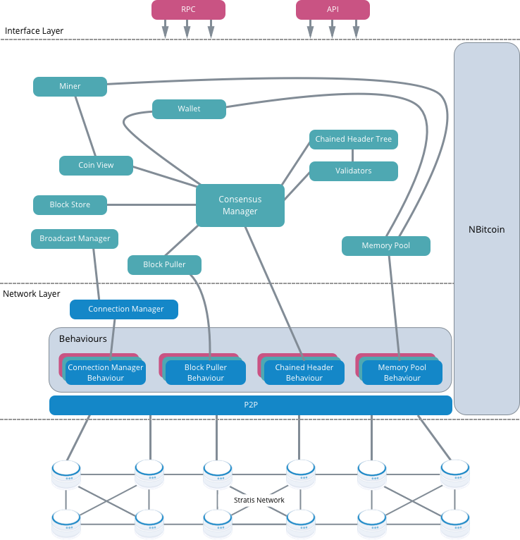

****************************************************
Components and Features Overview
****************************************************

The following figure shows the components and features of the Full Node:

All the components and features are described in the following sections, each of which covers a task that the full node needs to carry out.  

Accessing the network
======================

The *P2P* and *Connection* components are responsible for getting and maintaining access to other peers on the P2P network.  

When a full node is connected to the network, *Behaviours* respond to messages received from other nodes.

P2P
---
The *P2P* component tries to make the P2P network bigger. As more peers are found, they are added to a local database. This information is kept up-to-date. The decision about which peer to connect to when a choice is available is designed to be unpredictable. This adds an extra element of security.

The mechanism used to grow the P2P network is the Peer Discovery Loop, which asks the peers it discovers about the location of other peers.

The *P2P* component also needs to represent the located peers. Once it is represented, a peer can, for example, be asked which version of the protocol it is running. Communication with other peers is achieved by sending messages. Behaviour components on the other peers process received messages depending on whether the message is relevant to them.     
The *P2P* component also takes care of message payloads. A payload is a description of a message, which describes how to take a C# object and serialize it for the network. This also works for incoming messages. Once the message has been identified by its message type, it can be changed from a byte stream to a C# object.

An example of the P2P component messaging
^^^^^^^^^^^^^^^^^^^^^^^^^^^^^^^^^^^^^^^^^^

1. A peer is located on the network, and an object is created to represent this peer.
2. An attempt is made to connect to the peer.
3. The Peer Discovery Loop asks for a "handshake" to be initialized.
4. After the handshake has been completed a ``getaddr`` message sent.
5. The returned ``addr`` message containing information on known nodes is handled by *Peer Address Manager Behaviour*.

The Stratis network protocol is 98% similar to the Bitcoin network protocol. More information on Bitcoin network protocol is available `here <https://en.bitcoin.it/wiki/Protocol_documentation#Message_types>`_.

Connection
-----------

The *Connection* component contains a list of the comnnected peers. This component and not *P2P* is talked to by the higher-level components. This component is also responsible for banning peers and decides who to ban and why. The mechanism for banning the peers is implemented by *Peer Banning Behaviour*. The *Peer Banning Behaviour* component does not consume any message; instead, if a message identifies a banned peer, the connection to the banned peer is cut.

Behaviour Components
---------------------

There are numerous behaviour components in the Full Node. For example: *Block Puller Behaviour*, *Chained Header Behaviour*, *Memory Pool Behaviour*, *Block Store Behaviour*. You can think of the behaviour components as plugins which are responsible for filtering out messages that are not relevant to their related component. For example, *Memory Pool Behaviour* only cares about messages related to the *Memory Pool*.

NBitcoin
==========