*************************
STRAX-Wallet Cold-Staking
*************************

We recommend setting up two separate wallets on separate systems to run
your cold staking setup.

Your hot wallet needs to be online 24/7 and has staking enabled to
cold-stake. You can host it yourself, or you can use a third-party hot
staking node provider.

Your cold wallet can and should be created and managed offline.

The setup process requires you do go back and forth between an online
and offline wallet with data. We recommend using a thumb drive that you
can use to share a text file.

**Please note:** We do not support any form of setup that has multiple
wallets on one computer.

Creating a Hot-Wallet (Online)
==============================

We will be using an online, fully synchronized wallet as the hot staking
wallet.

Create a new wallet using the Stratis wallet user interface.

In our example, we will be using a wallet named "HotStakingWallet1".

After decrypting the hot wallet; navigate to the Cold-Staking tab within
the STRAX Wallet.

.. image:: media/image2.png
   :width: 6.5in
   :height: 4.22431in

We will set up the wallet as a hot staking wallet first. In the "Hot
wallet functionality" section, click the "Setup this wallet as a hot
staking node" tab, enter your password and click confirm.

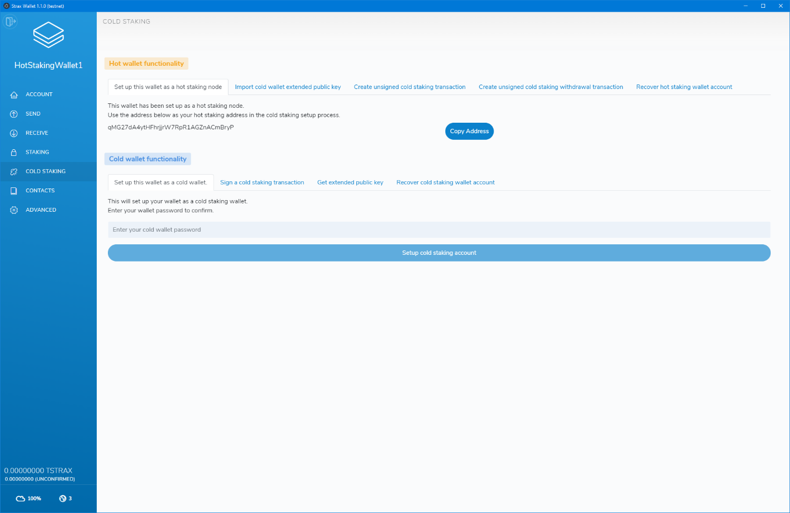

After confirming and successfully setting up the wallet as a hot staking
wallet, the page will display your hot staking address. Keep this
address at hand as we will use it to set up cold staking.

We suggest keeping a text file with all the necessary data on a thumb
drive and will assume you do too throughout the rest of the setup
process.

**Please note:** If you are not using a third party, this wallet will
have to be online and unlocked for staking to actively cold stake.
Staking can be activated in the "staking" page by entering your wallet
password and clicking the unlock button.

Using a third-party service as your hot node
============================================================

If you do not want to run a hot wallet node 24/7, you can opt to use a
third-party service to run it for you. We do not officially endorse any
third party services that offer this service.

When using a third-party service, they will give you the hot staking
node address you can use to set up your cold staking wallet. **Do not
send funds to that address under any circumstance!**

**Please note:** You still require an online and synchronized wallet to
complete the setup process.

Setting up your cold wallet
==============================

As mentioned at the start of the setup process, we will be using a
separate wallet on a different computer to set up the cold wallet. The
computer should be offline; thus, the wallet is not connected or
synchronized.

In our example, we will be creating a new wallet called
ColdStakingWallet1.

After decrypting the wallet go to the receive tab to get a new address
to fund your wallet. Fund the address with the number of tokens you want
to use for cold staking.

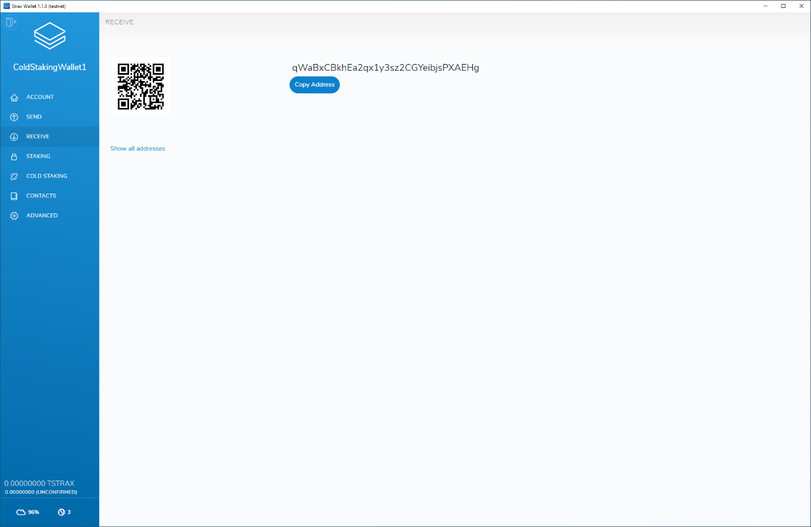

Since your wallet is offline and not synchronized, you will not see your
transaction history or total balance. Please use the block explorer to
check if your address was successfully funded:
https://chainz.cryptoid.info/strax/

| After funding the address head over to the cold staking page on your
  cold (offline) wallet.
| In the "Cold wallet functionality" section, click the "Set up this
  wallet as a cold wallet" tab, enter your password and click "Set up
  cold staking account".

.. image:: media/image5.png
   :width: 6.5in
   :height: 4.22639in

After confirming and successfully setting up the wallet as a cold
wallet, the page will display your cold staking address. Save this
address in your text file on your thumb drive as the cold staking wallet
address.

In addition to the cold-staking address, we also need the Extended
Public Key of your cold wallet. Head over to the "ADVANCED" tab and
click "Copy key to clipboard" at the end of the Extended Public Key
section.

.. image:: media/image6.png
   :width: 6.5in
   :height: 4.22639in

Save the extended public key in your text file on the thumb drive.

This is an example of how the current text file should look; please note
that your values will be different.

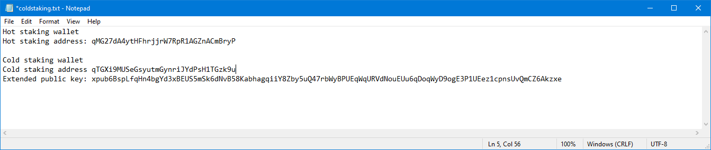

Because our cold staking wallet is offline, we can not create the cold
staking setup transaction. Therefore we will need an online and
synchronized wallet to complete the process. You can use any online
wallet on an online system; it does not have to be the hot staking
wallet we created in the first step.

We will need the data that we saved in the text file for the next steps,
so you should switch your thumb drive from the offline computer to your
online computer that contains an online wallet.

In the online wallet, go to the "COLD STAKING" page and click the
"Import cold wallet extended public key" tab. Please select the "I want
to import an extended public key to set up cold staking" option in the
dropdown. The form will also ask you for a wallet name, the extended
public key and the cold wallet creation date.

**Please note:** The wallet name does not need to match your cold wallet
name; it can be anything you want, but please write it down as we will
need it in the next step.

Use the correct data and click "Import". On success, you will see a
message on the bottom of your screen.

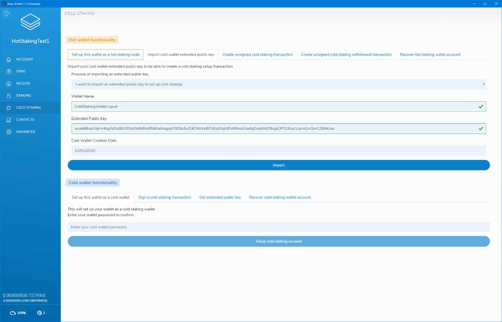

After importing the extended public key, click the "Create unsigned cold
staking transaction" tab.

Complete the form with the data from your text file.

Set the amount you want to stake; we recommend using the entire balance
that was used to fund the cold staking wallet.

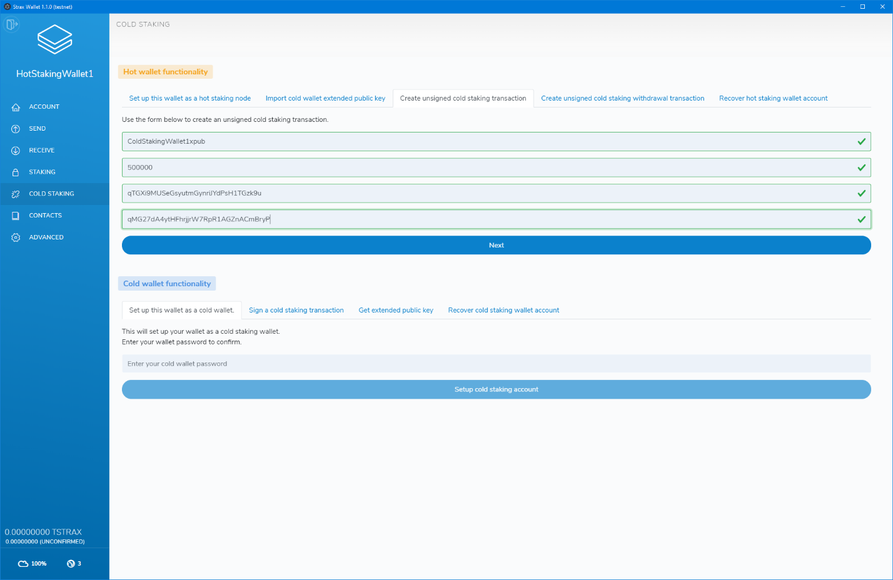

After entering the correct values, click "Next".

On this page, carefully check and confirm the cold-staking setup values.
If everything checks out, click "Next".

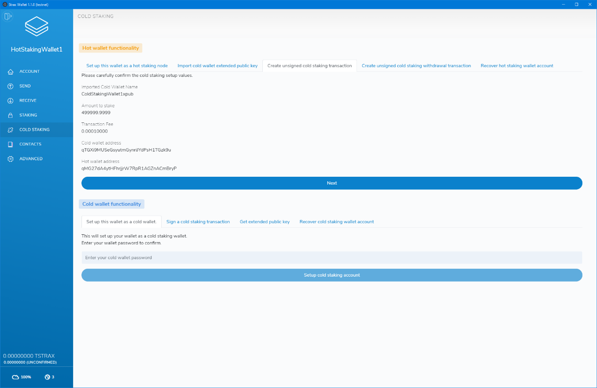

If all data was entered correctly, the process will now show you a very
long encoded transaction that you can copy. Copy the encoded transaction
into your text file on your thumb drive.

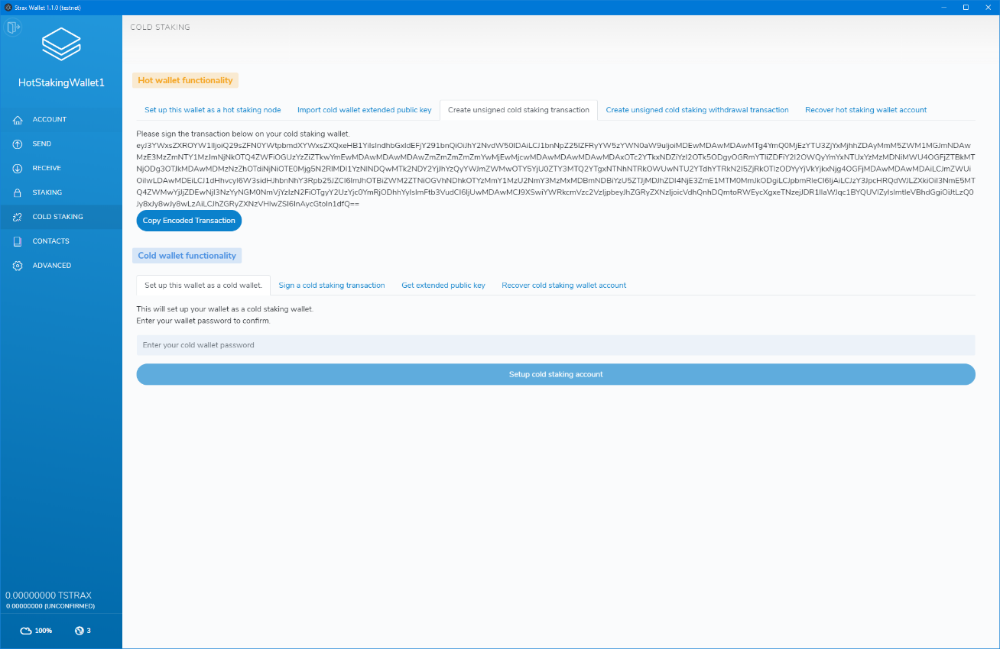

We currently have the following data in our text file:

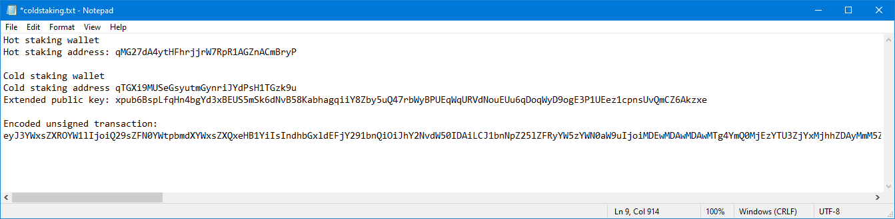

The encoded transaction is an unsigned transaction, and you will need to
head back to the offline computer with your thumb drive to sign the
transaction.

Open your cold staking wallet, go to the "COLD STAKING" page and in the
"Cold wallet functionality" section click the "Sign a cold staking
transaction" tab.

Paste the entire encoded transaction into the form and enter your
password, then click "Confirm.

**Please note:** The encoded transaction is very long, make sure you
copy it entirely.

.. image:: media/image13.png
   :width: 6.5in
   :height: 4.22639in

| After confirming, your cold wallet will sign the transaction and
  return a transaction hex.
| Since our cold wallet is offline, it can not broadcast this
  transaction by itself.

Copy the transaction hex to the text file of your thumb drive.

Our text file currently looks like this:

.. image:: media/image14.png
   :width: 6.5in
   :height: 1.66458in

As the final step, we need to broadcast this transaction on an online
node. Take your thumb drive back to the computer containing an online
wallet, head over to the "ADVANCED" page and click "Broadcast
transaction"

.. image:: media/image15.png
   :width: 6.5in
   :height: 4.22431in

Copy the signed transaction hex into the "Transaction Hex" input and
click "Broadcast Transaction"

.. image:: media/image16.png
   :width: 5.10416in
   :height: 3.3125in

If all went well, your wallet should display a "Transaction broadcasted
successfully" message on the bottom of the page.

Congratulations, you have now successfully set up cold staking.

**Please note:** You will only get rewards if your hot staking node is
online and has staking enabled.

Withdrawing from Cold-Staking
==============================

To withdraw your cold staking balance, you need access to a synchronized
online wallet and your cold wallet.

We will start with getting the extended public key of the cold staking
account of your cold wallet. **Open your cold wallet** and head over
to the "COLD STAKING" page.

In the "Cold wallet functionality" section, click the "Get extended
public key" tab.

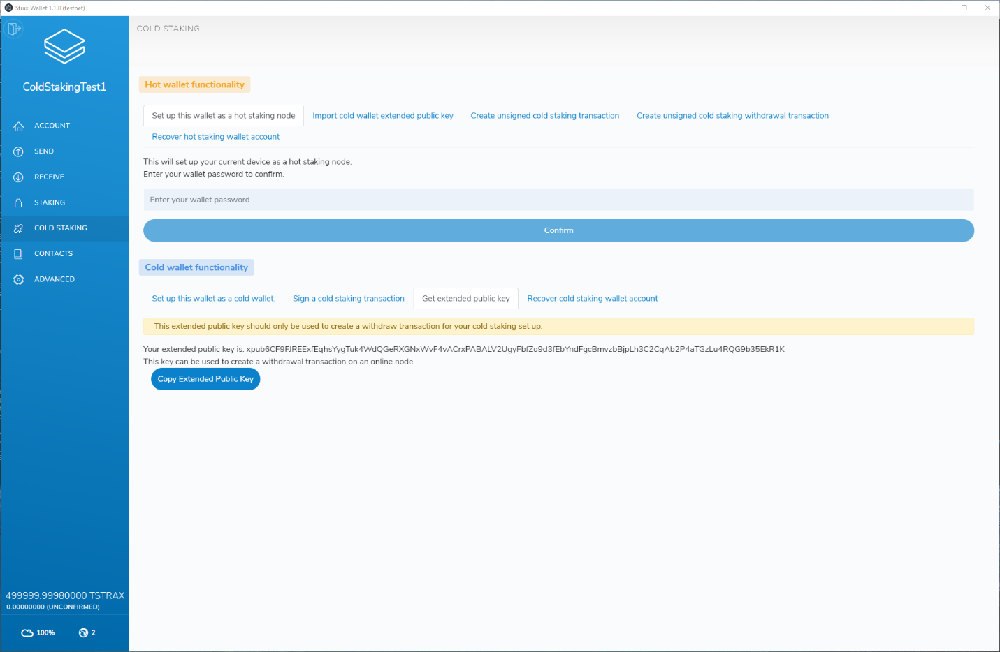

Copy the extended public key and save it into a text file on a thumb
drive.

| Now we will import that extended public key into an **online,
  synchronized wallet**.
| Open the **online** wallet and head over to the "COLD STAKING" page.
| In the "Hot wallet functionality" section click the "Import cold
  wallet extended public key."

In the dropdown select "I want to import an extended public key to
withdraw from my cold staking wallet".

Enter a wallet name, paste the cold wallet extended public key generated
in the previous step, enter the creation date of your cold staking
wallet, and click "Import".

.. image:: media/image19.png
   :width: 6.5in
   :height: 4.23958in

After importing the extended public key, head over to the "COLD STAKING"
page and click the "Create unsigned cold staking withdrawal transaction"
tab.

-  Enter the wallet name you chose in the previous step.

-  Enter the amount you would like to withdraw from the cold staking
   setup.

-  Enter the destination address you want to funds to be sent to.

After populating all fields, click "Estimate fee" to estimate the fee of
the transaction.

After fee estimation has completed, click "Create unsigned withdraw
transaction".

Generating the unsigned withdraw transaction can take a while and, it
will result in a long string made up of different characters.

Scroll down to the bottom of the page and click "Copy unsigned
transaction". Paste the entire text into a text file on a thumb drive.

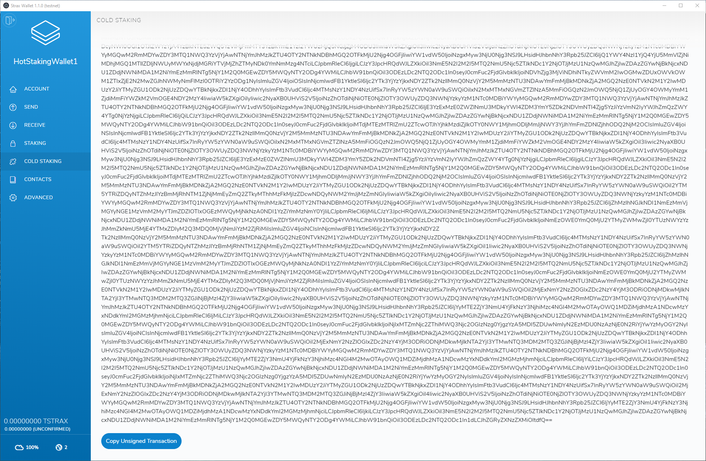

Now that we have generated an unsigned transaction, we need to sign the
transaction on the **cold wallet**. Move your thumb drive back to the
computer that holds the cold wallet and open your cold wallet.

Head over to the "COLD STAKING" page and in the "Cold wallet
functionality" section click the "Sign a cold staking transaction" tab.

Paste in the unsigned transaction generated in the previous step, enter
your cold wallet password and click "Confirm"

Generating the transaction can take a while, but will result in a
transaction hex that we can sign on an online node. Copy the transaction
hex and paste it into a file on a thumb drive.

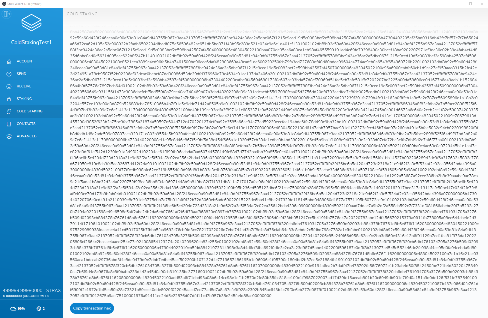

The final step is to broadcast the transaction on an **online wallet**.
Open the wallet and head over to the "ADVANCED" tab then click the
"Broadcast transaction" button.

Paste the transaction hex into the box and click "Broadcast Transaction"

.. image:: media/image22.png
   :width: 3.72in
   :height: 2.25in

Broadcasting can take a while on large transactions. However, if
everything went well, you will see a "Transaction broadcasted
successfully" message at the bottom of your wallet.

Your funds are now withdrawn from your cold staking wallet.
