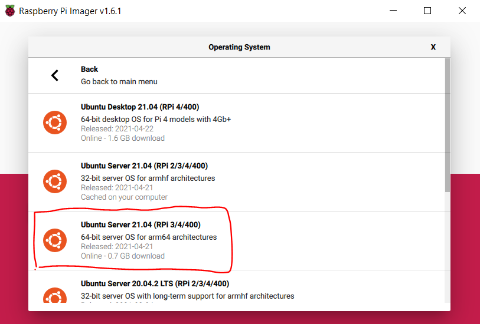
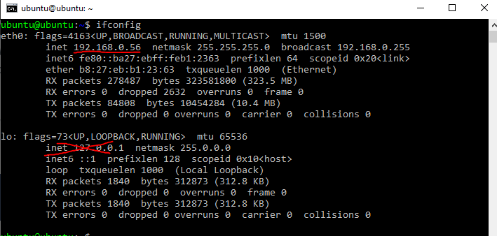
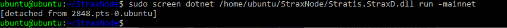
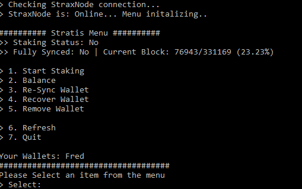
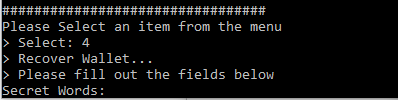

###############################
Staking STRAX On a Raspberry Pi
###############################

************
Introduction
************

This guide was put together by a Stratis Community member @velo#8907!

..

https://strax.miew.org/

..

If you liked the guide so much that you want to donate, his STRAX Address is: *XRFYUHNonApGeBtgkipgJceBcE9ZMTQoEF*

This guide will teach you how to stake your STRAX's on a Raspberry Pi. Fortunately, I have tried my best to make this guide, so you don't have to be tech-savvy or computer genius to follow along. 

Why would you want to use Raspberry Pi instead of your computer or VPS for staking?
===================================================================================
First of all, a Raspberry Pi consumes almost no electricity. The wattage requirement is practically equivalent to charging your Phone with a fast charger. It is small and mobile. It is essentially a mini-computer.
Furthermore, you most likely use your PC for all sorts of tasks, for example, browsing the Internet. This can make you vulnerable to malware, whereas, with a Raspberry Pi, you tend to leave it be.

If you are using a VPS, you trust someone else, for example, a hosting company, to keep your server secure and pay a monthly subscription. Additionally, you would probably need to use an external remote connection to the VPS, which isn't necessarily insecure. Still, it is less secure than a local remote connection or not remote at all. Using a Raspberry Pi allows you to a greater extent to stay local than a VPS would, generally speaking. Whatever you decide to choose, whether it is PC, VPS, Raspberry Pi, or other, please make sure you are familiar with the risks of Hot Staking.

Benefits of Raspberry Pi
========================

- Low wattage usage
- Small and mobile
- Secure (At least more secure than staking on your PC)
- Easy to use (If you follow this guide).
- Low operating cost.

If you are convinced and don't have a Raspberry Pi yet, you can buy a complete desktop starter kit here: https://www.raspberrypi.org/products/raspberry-pi-4-desktop-kit/. Select your Country, and it will give you a list of vendors where you can purchase one. If you don't want to pay extra for a mouse and keyboard because you already have this at home, use what you have and make sure they connect via USB.

Learning goals
==============

What you will learn.

- How to install an operating system (OS) to your Pi, specifically Ubuntu Server 21.04 64-bit or 32-bit. 
- How to use basic commands in the terminal/console and install packages.
- How to set up a remote connection to your Pi
- How to use a user-friendly, awesome CLI.  
- How to run the "Strax Wallet aka CLI".
- How to Stake with your Strax Wallet.
- How to improve and enforce basic security, to avoid intruders... aliens?

Equipment
=========
For this guide, you will need the following items:

- **Raspberry Pi** (any will do, 1Gb+ ram recommended)
- **MicroSD Card** (minimum 8 GB of free storage, 16 GB recommended), get one that has decent read/write speeds. If you don't know how to choose, just don't cheap out on it. Normally, if you buy a Raspberry Pi starter kit, a 16 GB microSD card will be included; that should be sufficient.
- **HDMI cable** to connect your Raspberry Pi to a monitor. Depending on your Pi, it might be a different cable!
- **Ethernet cable**, Although most Raspberry Pi's have WIFI, avoid it for most stable connections and even in some cases security reasons!
- **Power brick** (for your Pi)
- **Keyboard** 
- **Mouse**
- **PC or laptop** (to install the OS to the Raspberry Pi, more on this later)

***************************
Installing Ubuntu Server OS
***************************
Your Raspberry Pi isn't really that useful without an OS (operating system), not if you are reading this guide, anyways. So, let's install an OS on your Pi.

Preparing the SD Card
=====================
Now, insert your microSD card into your computer, NOT your Pi. You will need an SD card reader for this. 

.. code:: bash

   Many laptops have built-in SD card readers, so be sure to check that if you are on a 
   laptop. In other cases, you will need to buy an SD card reader that you insert the card 
   into and afterward connect it to your computer via USB or other.

Now you will need to install an OS to the microSD card. In this guide we will be installing **Ubuntu Server 21.04 (RPI 3/4/400) 64-bit** OS or 32-bit, you could choose a different version, but if you want to make sure there are no compatibility issues, try to use the same one.  To get started, you will need the **Raspberry Pi Imager**. 

You can grab the Pi Imager from the link below, remember to select the one that is compatible with your OS, (Windows, Mac, or Linux) : 
https://www.raspberrypi.org/software/

..
 
After the installation of the Pi Imager is completed, open it. It should look something like this:

.. image:: media/image1.png

Go ahead and click **CHOOSE OS** then a new popup menu will appear, from here navigate to **Other general purpose OS**. Select **Ubuntu**. Now select **Ubuntu Server 21.04 (RPI 3/4/400)** OS, 64-bit or 32-bit version, as seen in the image below:

After that, you press the next button **CHOOSE STORAGE** and from there you select the name of your microSD card. Usually, there is only one option. If you happen to see no options, your microSD card is not read by your computer. Try re-inserting, or google search for further troubleshooting.

Finally, press **WRITE**. Now, it should write the chosen OS to your microSD card. This process can take a while. A good time to grab a coffee or a snack. When the process is finished, it will let you know and a popup will tell you it is safe to remove the microSD card from your computer, including the SD card reader.

Inserting the microSD card
==========================
I hope you got your Pi ready and set up, more specifically, you have a monitor connected to the Raspberry Pi via an HDMI cable. An Ethernet cable connected to your Router or Switch

************************
Booting the Raspberry Pi
************************

Insert the **microSD card** into your **Raspberry Pi** and power it up. Remember to ensure that all the cables (USB keyboard, ethernet cable, and HDMI ) needed are firmly attached to your Pi. 
In a few seconds, you should see a bunch of gibberish text on your monitor. This is the initializing phase, and you will just have to wait out until you are prompted with the login screen, it might not have fully loaded, once you see it (**cloud-init** has to finish as well):

.. code:: bash

   Ubuntu 21.04 ubuntu tty1

   ubuntu login:

Every fresh installation of ubuntu has the same login details (unless configured beforehand). You can log in with username: **ubuntu** and password: **ubuntu**. So start by typing **ubuntu** and then hit enter on your keyboard.

.. code:: bash

   You are required to change your password immediately (administrator enforced)
   Changing password for ubuntu.
   Current password:

Great! You are now logged in. You should be connected to the internet right away if you have your ethernet cable plugged in. You check your internet connection by running the command:

.. code:: bash

   ping -c 4 google.com

When the ping command has finished running you should see an overview. If you have 0% package loss, that is a good indication, you are connected.

Update packages
===============

Let's see if there are any updates (Everything from security updates to new package versions). Type the command shown below (remember to press ENTER, when finished typing):

.. code:: bash

   sudo apt-get update

And run the command:
 
.. code:: bash

   sudo apt-get upgrade

It will then list packages that can be upgraded and probably ask you this:
 
.. code:: bash

   Do you want to continue [y/N]?

Here you just type "y" for yes and press enter.

**Optional:** Your keyboard layout might have the wrong layout, you can fix that by typing:
 
.. code:: bash

   sudo loadkeys <language abbrivation>

Please do a google search for which keys that fit your spoken language and keyboard layout. If you are from the US it would be *sudo loadkeys us* but it is usually the default one, for Scandinavians use *sudo load keys no*

************
Remote Login
************

Instead of typing all the commands manually from the Raspberry Pi, it is possible to remote login to your Pi from your computer with the Pi's local IP. We can accomplish this from a terminal (**macOS**) or cmd (**Windows**). So, before switching our focus to our computer again, let's find the local IP of the Pi first.

A good way to find the IP is by using the package net-tools. We can install it by running this command:

.. code:: bash

   sudo apt-get -y install net-tools

Afterward type **ifconfig** and then write down/memorize the field inet where it starts with **192.168.X.X**. An example of this can be seen below:

Please note your local IP can change on reboot, you might have to check it again. It is possible to make it static, but a dynamic address is always more secure. Okay, so my local IP is **192.168.0.56**, yours MIGHT not be the same. Alright, to continue, go back to your computer.

On the Computer
===============

For Windows
-----------
Press **WIN + R** on your keyboard to open up **Run**. Now type **cmd** and click **OK**. Alternatively, you can usually get away with just searching for **cmd** in the start menu.

For MacOS
---------
Search for **Terminal** and click it or use the shortcut **Control + Option + Shift + T**.

Once opened type the ssh cmd below and press **ENTER**:

.. code:: bash

   ssh ubuntu@<YOUR LOCAL IP>
   Example: ssh ubuntu@192.168.0.56

Now it will tell you the **ECDSA key fingerprint** and ask if you are sure you want to connect, here you type **yes**.

..

After, It will prompt you for a password, so type your password. Your login screen should something like this:

.. image:: media/image4.png

*********************************
Installing .NET and StraxFullNode
*********************************

Next up, we have to install .NET to run the StraxNode and connect to the main net. We'll do this to be available to stake. Please be aware there is no graphical user interface. I have made a script that is close to a GUI, which makes everything a lot easier for you, but more on that later. Let's first install .NET.

..

Remember, you can now paste the commands into your console/terminal by copying it and using Right-Click for pasting.

..

Run the command below corresponding to your Pi's computer architecture.

For 64-bit Pi
=============

.. code:: bash

   sudo curl -SL -o dotnet.tar.gz https://dotnetcli.blob.core.windows.net/dotnet/Sdk/master/dotnet-sdk-latest-linux-arm64.tar.gz

For 32-bit Pi
=============

.. code:: bash

   sudo curl -SL -o dotnet.tar.gz https://dotnetcli.blob.core.windows.net/dotnet/Sdk/master/dotnet-sdk-latest-linux-arm.tar.gz

After the download is finished, both **64-bit/32-bit** need to run the commands below one by one, please be patient between each command:

.. code:: bash

   sudo mkdir -p /usr/share/dotnet
   sudo tar -zxf dotnet.tar.gz -C /usr/share/dotnet
   sudo ln -s /usr/share/dotnet/dotnet /usr/bin/dotnet

Great! You have .NET. Check if the dotnet command works now when typing **dotnet** in cmd/terminal. Try typing it and it should display this:

.. image:: media/image5.png

********************
Installing StraxNode
********************

Okay, let's download the latest `StraxFullNode release from Stratis official GitHub <https://github.com/stratisproject/StratisFullNode/releases>`_. Depending on your Pi's architecture you can download it for:

StraxFullNode for 64-bit
========================

.. code:: bash

   sudo wget -O SNode.zip https://github.com/stratisproject/StratisFullNode/releases/latest/download/Stratis.StraxD-linux-arm64.zip

StraxFullNode for 32-bit
========================

.. code:: bash

   sudo wget -O SNode.zip https://github.com/stratisproject/StratisFullNode/releases/latest/download/Stratis.StraxD-linux-arm.zip

Once you have chosen the one that fits your system, install zip, so we can extract it. You can do that by running the command:

.. code:: bash

   sudo apt-get -y install zip

Now extract it using the unzip command:

.. code:: bash

   sudo unzip SNode.zip -d ~/StraxNode 

Awesome, we have the StraxFullNode installed. In the next chapter, we learn how to start the StraxFullNode in the background and how to interact with it.  More specifically, we will be using a CLI that makes it super-easy and user-friendly!

***********************
Setting up Strax Wallet
***********************

Starting the StraxNode
======================

First, let us start the StraxFullNode in a way, so it has to opportunity to run in the background. To do that run the following command:

.. code:: bash

   sudo screen dotnet ~/StraxNode/Stratis.StraxD.dll run -mainnet

Now the node is actually running and you are downloading blocks from the chain. To make it a background process, use shortcut **Ctrl+A** and then **Ctrl+D**.

When you have exited the node, you should get a message that tells you the pid of the process **[detached from <x>.pts-0.ubuntu]**:

This is useful when we want to hook the process again. If you forget the id, no worries, you can get a list of active screens running in the background by running the following command:

.. code:: bash

   sudo screen -ls

You can hook the process again by runnig the below command:

.. code:: bash

   sudo screen -r <id>.

Usingthe picture above as an example it would be:

.. code:: bash

   sudo screen -r 2848

You can stop the StraxNode after hooking the process id, by pressing Ctrl+C (but don't do that now, if you did, please start the node again)

Setting up Strax Wallet
=======================

We are finally ready to set up your Strax Wallet. I have written a script, that makes this super easy. Cool, get it by running the following commands.

.. code:: bash

   sudo wget https://github.com/stratisproject/StraxCLI/archive/refs/tags/StraxCLI-1.0.0.zip
   sudo unzip StraxCLI-1.0.0.zip -d ~/StraxCLI

Alright, now run the script by typing:

.. code:: bash

   sudo python3 ~/StraxCLI/StraxCLI-StraxCLI-1.0.0/straxcli.py

It should start by checking if the StraxNode is online and running, if it for some reason isn't, repeat the steps on top of this page. After it has checked, you will be represented with different options. These options will be explained in the next chapter! Good job, if you made it this far.

**************************
Using the Strax Wallet CLI
**************************

The script is now started and you should be presented with this:

There are as of now 7 options. You can select each option by typing a number from 1 to 7. The first thing, we want to do is to recover our wallet. If you don't have a wallet yet, use your computer to create one and then recover it on your Pi by following these steps.

Recover Wallet
==============

To recover your wallet, type **4** to choose **Recover Wallet**. It will now ask you to fill out the fields below:

Type in your secret words, use a space between each word. For example:

.. code:: bash

   Secret Words: word1 word2 word3 word4 word5...

When you are done press **ENTER**.

..

Now it will ask you for your wallet password and to re-type it for confirmation.

The next step is the **passphrase**, to leave empty just press **ENTER** if you don't have a passphrase for your wallet and if you do, please type it.
After that, you have to give your wallet a name and lastly, it will ask you the date you created your wallet. It uses the format *yyyy-mm-dd*. For example, **2021-05-06**.

..

Once your wallet is recovered, it will automatically re-sync your transactions from the date the wallet was created. This is necessary even if you already were fully synced when recovering the wallet. It will also display the main menu again.

Staking
=======

You can enable staking by selecting the first option **1. Start Staking**, remember you cannot stake before you are fully synced with the network. In the menu, you can see the status **>> Fully Synced: Yes/No>** and the **Current Block** <number> and sync percentage. The current block has to be equal to the latest block on the network before you are synced. Remember the CLI is not live data, you will have to use option **6. Refresh** to refresh the numbers and status.

..

We can still enable staking (without actually staking), so select **1.** It will ask you for the name and password of the wallet you want to stake on (unless if you in the same session have recovered a wallet). 

..

You can see your current wallets in the main menu **Your Wallets:** once the network is fully synced, it should start staking automatically, else try the option again.

..

When staking is enabled the option should now have changed to **1. Stop staking** you can select it again to stop staking and vice versa.

Balance
=======

You can check your balance by selecting option **2. Balance** it will then display your current balance. The result won't be accurate before the wallet is fully synced, it will notify you if this is the case. 

..

A good way to tell, if you have recovered the right wallet is that the balance matches the amount you know is on it. Remember you probably cannot see your full balance before the network is synced!

Quit
====

When you are done, you can quit by selection **7. Quit**. NOTE: you don't have to have the script open when staking. Once you have enabled staking, it is active until the StraxFullNode goes offline, NOT the script.

Other Options
=============

All the other options should be self-explanatory, so use them if you need them. Remember to **Refresh** the wallet when you want to update the numbers and status. The wallet is automatically refreshed after selecting any option!

***********************
Security Considerations
***********************

Firewall
========

Disable Remote SSH / Restrict it to local
-----------------------------------------

Right now, we have configured the Pi using a monitor, keyboard, and mouse and using a remote connection. If you want your Pi as secure as possible, I recommend disabling remote SSH altogether. The next best thing is to only allow local remote connections.

..

If you want to disable remote connections altogether, download the **uncomplicated firewall** by running the command.

.. code:: bash

   sudo apt-get -y install ufw

It is now possible to enable the firewall. If you are on a remote connection - this will lock you out. If you want to restrict it to local, please wait before executing the command below. 

.. code:: bash

   sudo ufw enable

If you ever need to, you can disable the firewall subsequently by running the following command:

.. code:: bash

   sudo ufw disable

By default, the firewall, when enabled, blocks any incoming and allows all outbound connections.

Restrict remote connection to local
-----------------------------------

If you want to allow remote connections but restrict them to only local. You can set the following firewall rule, please replace **X.Y.Z** with the first three octets of your local IP address.

.. code:: bash

   sudo ufw allow from X.Y.Z.0/24 to any port 22

****************
Closing Comments
****************

You can leave the Pi alone; I would recommend checking on it again once the network has completely synchronized to check if staking has changed to Staking Status: YES; if not, try start staking again. 

..

Again, you don't need to have the script running (the menu) when staking. You can quit it once you finished selecting options. The next thing to do is to make a startup script that starts the StraxNode and staking automatically. If you want to make it begin staking automatically, please be aware there is NO easy/practical way to hide your wallet password, as this would have to be saved in a text file. 

..

Furthermore, when you reboot your system, you have to rerun these two commands, remember the first command starts the StraxNode (use **Ctrl+A**, **Ctrl+D**, to make it run in the background), the second one starts up the CLI, so you can enable staking (which requires you to type your password, as of now). If possible try to close the *node* safely before rebooting by hooking the process, first get the pid **sudo screen -ls** and attach with **sudo screen -r <pid>** (as explained earlier) and press **Ctrl+C** to shut it down. The script will soon be extended, so you can choose to start staking when rebooting automatically.

.. code:: bash

   sudo screen dotnet ~/StraxNode/Stratis.StraxD.dll run -mainnet
   sudo python3 ~/StraxCLI/StraxCLI-StraxCLI-1.0.0/straxcli.py