************
Introduction
************

This guide details the process required for joining the Cirrus
Sidechain as a Block Producing Node, known as an InterFlux Masternode. The request to join the Cirrus Sidechain as a block
producer, requires you to effectively setup an InterFlux Masternode, therefore, a request to join the Cirrus Sidechain will be
made once the Masternode is fully configured.

Pre-Requisites
==============

To join as a InterFlux Masternode, there are a number of criteria
that must be met.

Wallet Requirements
-------------------

You must know the mnemonic and passphrase (if applicable) for a STRAX
Wallet that contains the required collateral and fee.

-  **Collateral Amount:** 100,000 STRAX

-  **Fee Amount:** 501 STRAX

Sidechain Masternode Hardware Requirements
------------------------------------------

The below hardware requirements are a minimum.

-  2x vCPU / Dual Core

-  8GB RAM

-  50GB SSD / HDD

Sidechain Masternode Software Requirements
------------------------------------------

There are only three pre-requisites software installations that need to
take place before operating a InterFlux Masternode.

.NET Core SDK
~~~~~~~~~~~~~

.NET Core is the platform that the InterFlux Masternode has been
developed upon. Therefore, you will need to install the .NET Core SDK.

Please install the latest version of .NET Core SDK 3.1

https://dotnet.microsoft.com/download/dotnet-core/3.1

Git for Windows
~~~~~~~~~~~~~~~

Navigate to the URL below to download the Git for Windows Installer.
This should be the topmost file with .exe extension.

https://github.com/git-for-windows/git/releases

PowerShell Core
~~~~~~~~~~~~~~~

To provide cross-platform support moving forward, the script that is
utilized to configure and launch the InterFlux Masternode uses
PowerShell Core.

https://github.com/PowerShell/PowerShell/releases

#. For simplicity, it is recommended you download and install the MSI
   relevant for your operating system.

Network Requirements
~~~~~~~~~~~~~~~~~~~~

There are three firewall rules required to allow connectivity between
your InterFlux Masternode and other nodes on the network.

============= ============= ============ ========
**Rule Name** **Direction** **Protocol** **Port**
============= ============= ============ ========
StraxMain     Inbound       TCP          17105
CirrusMain    Inbound       TCP          16179
ICMP          Inbound       ICMPv4       N/A
============= ============= ============ ========

Wallet Configuration
====================

It is recommended that you create a new wallet when completing this
process, so your STRAX Tokens can be separated from any other STRAX
Tokens you may hold.

1. Download the STRAX Wallet and Create a New Wallet

https://github.com/stratisproject/StraxUI/releases

2. Please ensure you take note of your Mnemonic and Passphrase. These
   **will be required** later in the process

2. Download Cirrus Core and Create a New Wallet

https://github.com/stratisproject/CirrusCore/releases

3. Please ensure you take note of your Mnemonic and Passphrase. These
   **will be required** later in the process

3. Login to your STRAX Wallet

.. image:: media/image2.jpeg
   :width: 4.40157in
   :height: 4.02362in

4. Obtain a Receive Address and send 100,501 STRAX to this address

.. image:: media/image3.png
   :width: 4.40157in
   :height: 4.02362in

4. You will have to wait for 100% Wallet Synchronization before seeing
   your balance

5. Login to your Cirrus Core Wallet

.. image:: media/image4.png
   :width: 4.57874in
   :height: 3.86614in

6. Select Address 0

.. image:: media/image5.png
   :width: 4.58268in
   :height: 3.86614in

7. Obtain a Receive Address

.. image:: media/image6.png
   :width: 4.58268in
   :height: 3.86614in

8. Perform a Cross-Chain Transfer of **500.9 STRAX** to your Cirrus
   Address

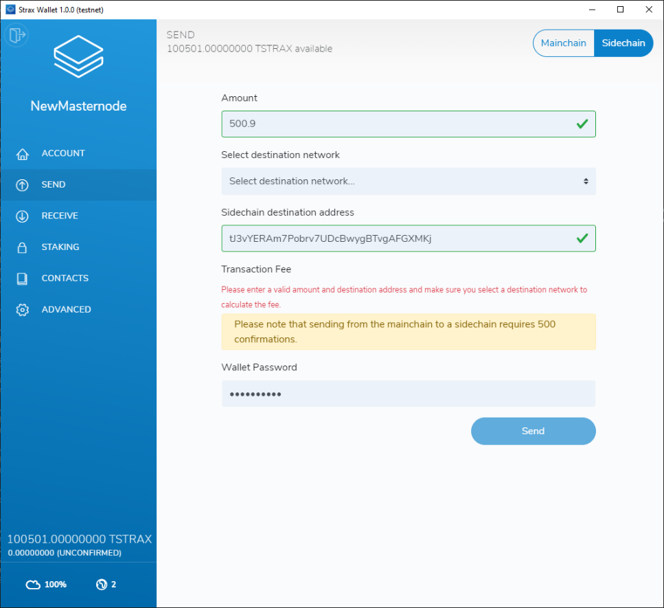

9. The Cirrus Core Wallet will receive 500.8~ CRS after 80 Blocks have
   passed on the STRAX Blockchain (~1Hr)

.. image:: media/image8.png
   :width: 4.58268in
   :height: 3.86614in

10. Now, you must consolidate the STRAX Balance to ensure it all resides
    in a single address. To do this, obtain another Receive Address and
    send **100,000 STRAX**

.. image:: media/image9.png
   :width: 4.1811in
   :height: 3.82283in

5. You are sending back to an address that you own. Not an external
   address.

11. Your resulting balance and transaction history should look very
    similar to the below

.. image:: media/image10.png
   :width: 4.1811in
   :height: 3.82283in

12. Wallet preparation is now complete; you should now be in position of
    the following.

1. **STRAX Wallet that contains 100,000+ STRAX Tokens.**

2. **The Mnemonic and Passphrase for the aforementioned wallet.**

3. **Cirrus Wallet that contains 500+ CRS Tokens.**

4. **The Mnemonic and Passphrase for the aforementioned wallet.**

13. You must now wait for **80 Confirmations** before the **CRS Tokens**
    are received through the Cross-Chain Transaction, in addition, the
    transaction that was made in **Step 10** also requires 500
    Confirmations.

InterFlux Masternode Registration 
=======================================

Whilst we wait for confirmations, the host that will run your STRAX
Sidechain Masternode configured and prepared to launch the STRAX
Federation Join Script.

Please ensure you meet the requirements set out at the `beginning of
this guide <#sidechain-masternode-hardware-requirements>`__, before
you continue.

You must now create a key-pair that will be used to identify your
registration on-chain.

Stratis Keygen Utility 
----------------------

1. Download the Stratis Keygen Utility using the below URL

https://www.stratisplatform.com/wp-content/uploads/2020/11/Stratis-KeyGen-Utility.zip

2. Open Stratis KeyGen Utility.zip and extract the contents to a new
   location, in this example we are extracting to C:\\Stratis

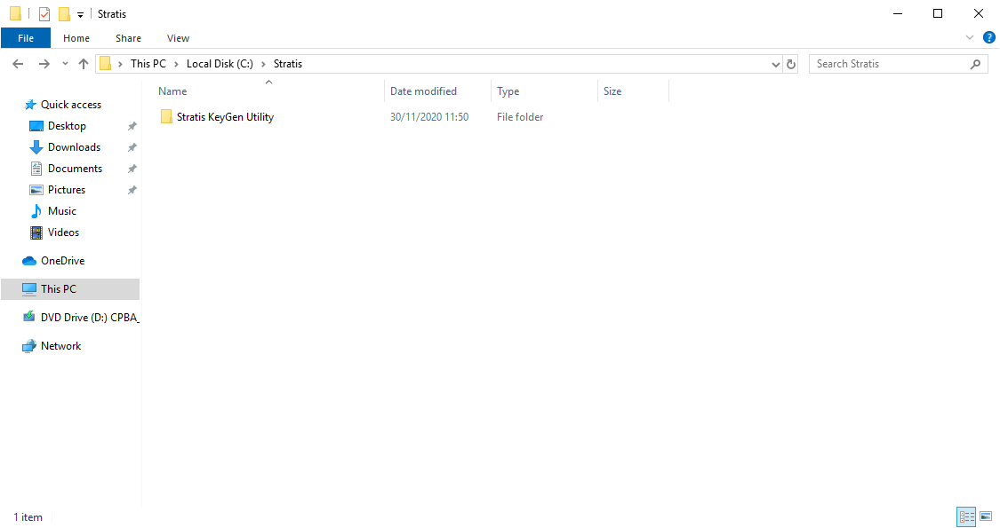

3. Navigate to “Stratis KeyGen Utility\\Stratis KeyGen Utility”

.. image:: media/image12.png
   :width: 6.26806in
   :height: 3.31528in

4. Locate the executable named “StratisFederationApp.exe”

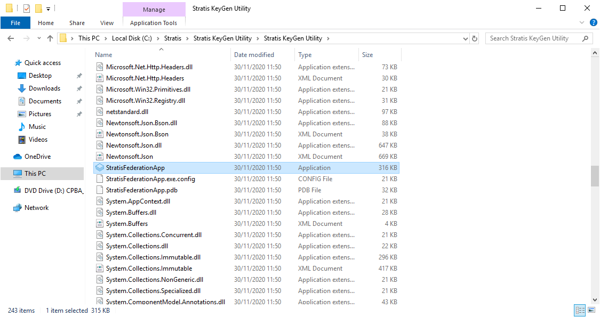

5. Double-Click the “StratisFederationApp.exe” to launch the utility

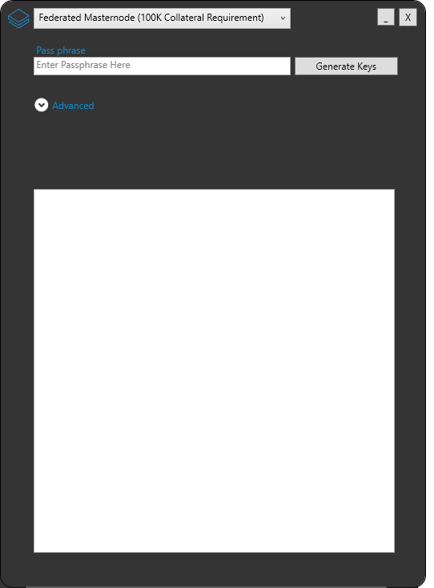

6. Select ‘Federated Masternode (100K Collateral Requirement)’ and enter
   a Passphrase

.. image:: media/image15.png
   :width: 5.64584in
   :height: 7.64584in

7. Select a location to save the “federationKey.dat” file

.. image:: media/image15.png
   :width: 5.64584in
   :height: 7.64584in

8. Click the “Generate Keys” button

.. image:: media/image16.png
   :width: 5.64584in
   :height: 7.64584in

9. You **must** take note of the **Public Key**, **Passphrase** and keep
   a secure copy of the **federationKey.dat** file.

Obtain the InterFlux Masternode Registration Script
---------------------------------------------------

A script has been constructed to ease the setup process and ensure
consistency, the script can be obtained from the below URL.

https://www.stratisplatform.com/wp-content/uploads/2021/08/STRAX-Sidechain-Registration-Launch-Script.zip

Extract the STRAX Sidechain Registration Launch Script.PS1 Script to the
Desktop of the where you are intending to run your Masternode.

Verifying the Script
--------------------

Stratis Group Ltd will digitally sign any PowerShell Script that they
provide for operating one of their products.

This can be verified by right-clicking the PS1 script, selecting
properties and viewing the digital signature.

1. Highlight the listed signature and select “Details”

.. image:: media/image17.png
   :width: 4.00787in
   :height: 5.03544in

2. Select “View Certificate”

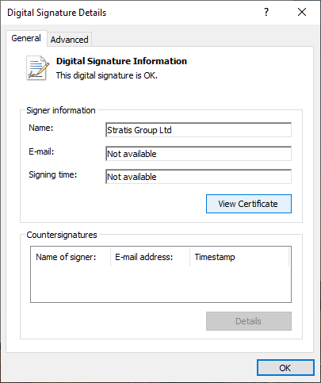

Verify the issuing information in the Certification Path to ensure the
authenticity of the script.

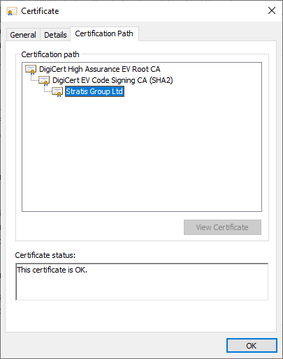

Executing the Registration Script
---------------------------------

As the script is written in PowerShell Core, it needs to be called from
an instance of PowerShell Core and not the standard PowerShell that is
shipped with all latest versions of Windows Operating Systems.

To launch PowerShell Core, you will need to invoke it from the command
line or run command.

.. image:: media/image20.png
   :width: 4.15625in
   :height: 2.14583in

Clicking OK on the above will launch a new instance of PowerShell Core

.. image:: media/image21.png
   :width: 6.26806in
   :height: 3.27778in

Assuming that the launch script is located on the desktop, you will need
to navigate to the desktop, this can be achieved by executing the below
command.

.. code-block:: bash

  Set-Location .\Desktop\

The PowerShell Core script can now be invoked from the PowerShell Core
window using the below command.

.. code-block:: bash

  & '.\STRAX Sidechain Registration Launch Script.ps1'

The PowerShell Core instance should look something like the below.

.. image:: media/image22.png
   :width: 6.26806in
   :height: 3.27778in

The script will now launch and synchronize both the STRAX Blockchain and
the Cirrus Sidechain, this may take some time and is wholly dependent on
your specifications. Once complete, you will see the below.

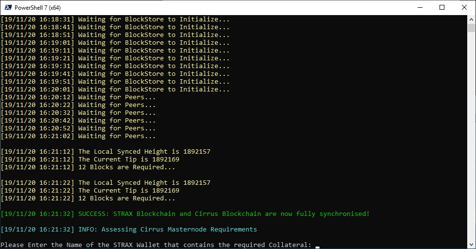

1. Enter the Name of your STRAX Wallet from the `Wallet
   Configuration <#wallet-configuration>`__ section earlier in this
   guide.

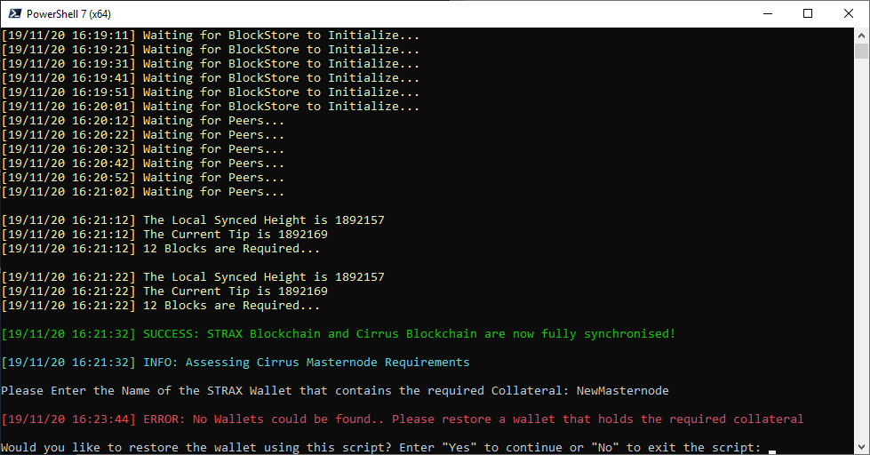

2. As the Wallet does not exist (assuming the script is running on a
   different machine as to where the wallets were created) you must
   enter ‘Yes’ to perform the wallet restoration within the script.

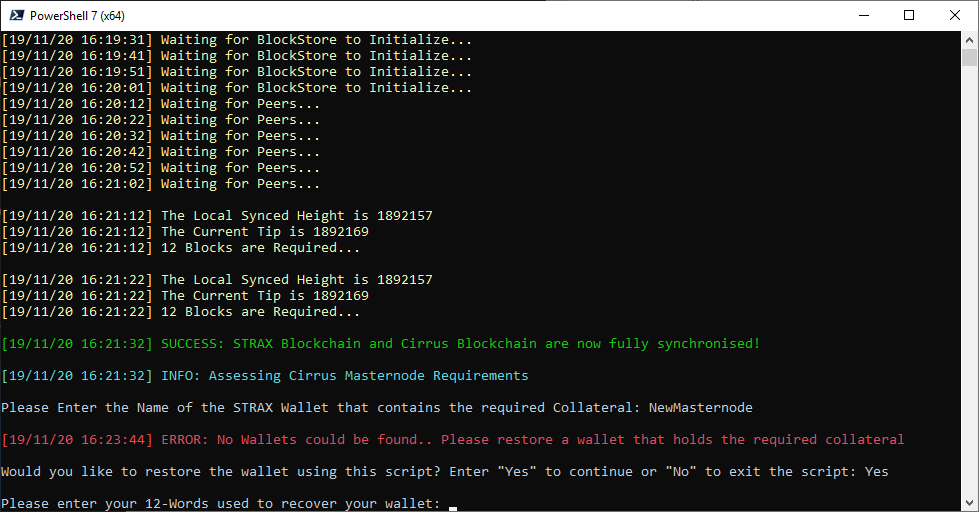

3. Enter the mnemonic that were generated earlier

.. image:: media/image26.png
   :width: 6.26806in
   :height: 3.27778in

4. Enter your passphrase

.. image:: media/image27.png
   :width: 6.26806in
   :height: 3.27778in

5. Enter a password that will be used to encrypt the restored wallet

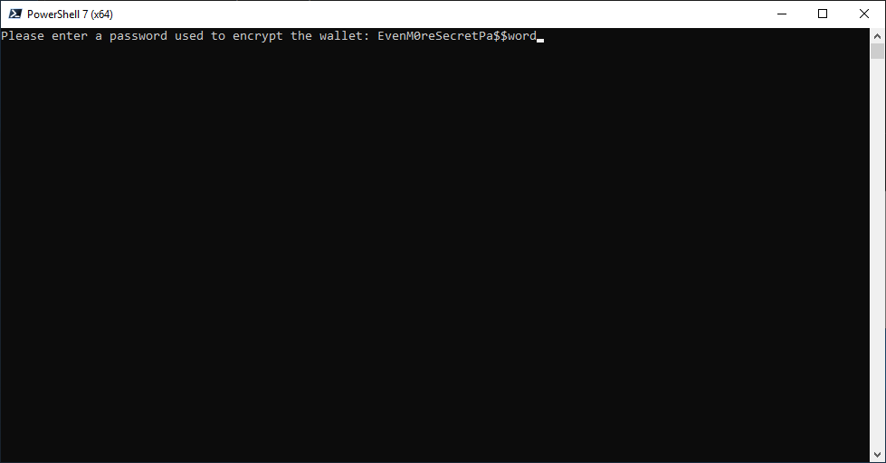

6. The wallet will now begin to synchronize with the blockchain

.. image:: media/image29.png
   :width: 6.26806in
   :height: 3.27778in

7. Once complete, you will be prompted to enter in the Cirrus Core
   Wallet detail

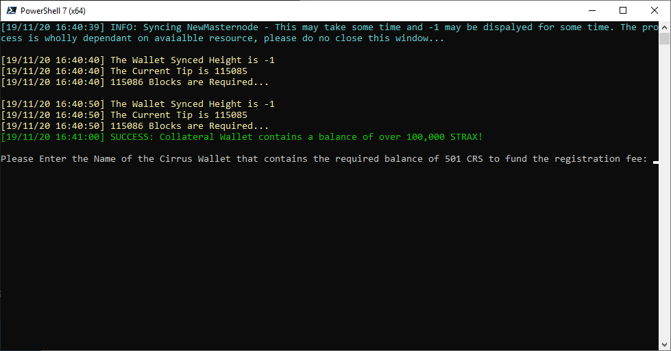

8. Follow the steps as before to restore your wallet, once complete, the
   synchronization may take some time.

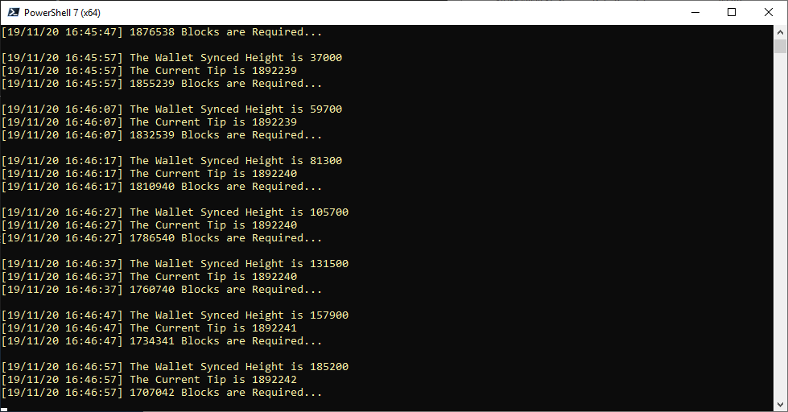

9. Once complete, you will be prompted to enter the path to your
   federationKey.dat that you generated earlier using the Stratis Keygen
   Utility.

.. image:: media/image32.png
   :width: 6.26806in
   :height: 3.27778in

10. Now, you must enter the Collateral Address that holds the 100,000
    STRAX. Balances can be queried on the `Block
    Explorer <https://chainz.cryptoid.info/strax/>`__ to ensure that the
    correct address is entered.

.. image:: media/image33.png
   :width: 6.26806in
   :height: 3.27778in

11. After entering the Collateral Address the Registration Transaction
    will be made

.. image:: media/image34.png
   :width: 6.26806in
   :height: 3.27778in

12. Enter “Yes” to perform the transaction, once complete you will
    receive confirmation. You now have 240 Confirmations before your
    Masternode will be accepted into the federation and able to produce
    blocks.

Running the InterFlux Masternode
================================

Congratulations, you are now able to operate an InterFlux Masternode!

Now you have performed registration, you can run your Sidechain
Masternode by clicking next and following the Running an InterFlux Masternode guide.