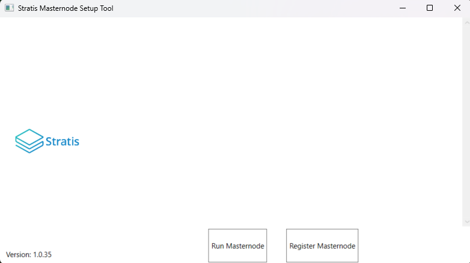
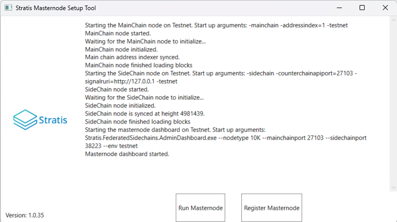

************
Introduction
************

This manual details the process required for joining the Cirrus
Sidechain as a member of Federation using the Masternode Setup 
Tool. The request to join the Cirrus Sidechain as a block
producer, requires you to setup the Masternode Setup tool, 
therefore, a request to join the Cirrus Sidechain will be made 
once the Masternode is fully configured.

This guide details the steps necessary to join the *Federation* 
as a *Masternode member*, utilizing the newly launched 
*Masternode Setup Tool*. This tool is a revolutionary application 
designed to simplify the integration process for users wishing to 
join the federation.

About
=====
To join the *Federation* as a *Masternode*, the 
*Masternode Setup Tool* must be needs to be set up; a request to 
join will be automatically initiated once the Masternode is 
fully configured.

The *Masternode Setup Tool* has many features:

- **Intuitive Interface:** Provides a user-friendly experience.
- **Secure Private Key Generation:** Essential for federation participation.
- **Automated Installation:** Simplifies setup.

Wallet Management
-----------------
The tool provides abilities to:

- **Create and Recover Wallets:** Allows for the effortless creation and recovery of wallets.
- **Integrate Existing Wallets:** Aids users in joining the federation easily.

While using the *Masternode Setup Tool*, users are guided through every step of the 
registration process, ensuring that all the requirements and prerequisites are met, 
resulting in the successful operation of a Masternode as a member of the *Federation*.

Pre-Requisites
==============
To join as an InterFlux Masternode, several criteria and requirements must be met.

Wallet Requirements
-------------------

You must know the mnemonics and passphrases (if applicable) for a STRAX and Cirrus
Wallets that contains the required collateral and fee amounts.

-  **Collateral Amount:** 100,000 STRAX

-  **Fee Amount:** 501 STRAX

Sidechain Masternode Hardware Requirements
------------------------------------------

The below hardware requirements are a minimum.

-  2x vCPU / Dual Core

-  8GB RAM

-  50GB SSD / HDD

Sidechain Masternode Software Requirements
------------------------------------------

Masternode Setup Tool
~~~~~~~~~~~~~~~~~~~~~

The Masternode Setup Tool is a specialized utility designed to streamline
the experience of joining the federation by providing a intuitive interface.

For simplicity, it is recommended you download and install the MSI
relevant for your operating system. Currently, the Masternode Setup supports only Windows with Intel processors.

Network Requirements
~~~~~~~~~~~~~~~~~~~~

There are three firewall rules required to allow connectivity between
your InterFlux Masternode and other nodes on the network.

============= ============= ============ ========
**Rule Name** **Direction** **Protocol** **Port**
============= ============= ============ ========
StraxMain     Inbound       TCP          17105
CirrusMain    Inbound       TCP          16179
ICMP          Inbound       ICMPv4       N/A
============= ============= ============ ========

Wallet Configuration
====================

It is recommended that you create a new wallet when completing this
process, so your STRAX Tokens can be separated from any other STRAX
Tokens you may hold.

1. Download the STRAX Wallet and Create a New Wallet

  https://github.com/stratisproject/StraxUI/releases

Please ensure you take note of your Mnemonic and Passphrase. These
**will be required** later in the process

2. Download Cirrus Core and Create a New Wallet

  https://github.com/stratisproject/CirrusCore/releases

Please ensure you take note of your Mnemonic and Passphrase. These
**will be required** later in the process

3. Login to your STRAX Wallet

  .. image:: media/image2.jpeg
   :width: 4.40157in
   :height: 4.02362in

4. Obtain a Receive Address and send 100,501 STRAX to this address

  .. image:: media/image3.png
   :width: 4.40157in
   :height: 4.02362in

5. You will have to wait for 100% Wallet Synchronization before seeing
   your balance

6. Login to your Cirrus Core Wallet

  .. image:: media/image4.png
   :width: 4.57874in
   :height: 3.86614in

7. Select Address 0

  .. image:: media/image5.png
   :width: 4.58268in
   :height: 3.86614in

8. Obtain a Receive Address

  .. image:: media/image6.png
   :width: 4.58268in
   :height: 3.86614in

9. Perform a Cross-Chain Transfer of **500.9 STRAX** to your Cirrus
    Address

  .. image:: media/image7.png
   :width: 4.40157in
   :height: 4.02362in

10. The Cirrus Core Wallet will receive 500.8~ CRS after 80 Blocks have
    passed on the STRAX Blockchain (~1Hr)

  .. image:: media/image8.png
   :width: 4.58268in
   :height: 3.86614in

11. Now, you must consolidate the STRAX Balance to ensure it all resides
    in a single address. To do this, obtain another Receive Address and
    send **100,000 STRAX**

  .. image:: media/image9.png
   :width: 4.1811in
   :height: 3.82283in

12. You are sending back to an address that you own. Not an external
    address.

13. Your resulting balance and transaction history should look very
    similar to the below

  .. image:: media/image10.png
   :width: 4.1811in
   :height: 3.82283in

14. Wallet preparation is now complete; you should now be in position of
    the following.

  **STRAX Wallet that contains 100,000+ STRAX Tokens.**

  **The Mnemonic and Passphrase for the aforementioned wallet.**

  **Cirrus Wallet that contains 500+ CRS Tokens.**

  **The Mnemonic and Passphrase for the aforementioned wallet.**

You must now wait for **80 Confirmations** before the **CRS Tokens**
are received through the Cross-Chain Transaction, in addition, the
transaction that was made in **Step 10** also requires 500 confirmations.

InterFlux Masternode Registration 
=================================

Whilst we wait for confirmations, the host that will run your 
Masternode configured and prepared to launch the Masternode
Setup Tool.

Please ensure you meet the requirements set out at the `beginning of
this guide <#sidechain-masternode-hardware-requirements>`__, before
you continue.

Obtain the Masternode Setup Tool installer
------------------------------------------

A tool has been developed to ease the setup process and ensure
consistency, the tool can be obtained from the below URL.

`Click here to download the Masternode Setup Tool <https://github.com/stratisproject/MasternodeSetupTool/releases>`_

Install the Masternode Setup Tool.

Executing the Desktop App
-------------------------

Launch the Masternode Setup Tool from the Start Menu or the 
desktop. The desktop application should resemble the 
following interface.

You now have two options: either run the STRAX Blockchain 
and the Cirrus Sidechain with the Masternode dashboard, or 
initiate Masternode registration within the Federation.

Setup Masternode
================

To join the Federation, launch the app and select the 
"Setup Masternode" button. Follow the setup steps as prompted. 
The app will initialize and synchronize both the STRAX 
Blockchain and the Cirrus Sidechain. It will also guide you 
through the setup process, requesting necessary information. 
Completion time varies depending on your system specifications. 
Upon completion, the following screen will appear.

1. Agree with the notification about required amount to fund the registration transaction.
   
  .. image:: media/image13.png
   :width: 6.26806in
   :height: 3.27778in

2. Create new or use existing Federation key.

  .. image:: media/image14.png
   :width: 6.26806in
   :height: 3.27778in

3. Choose an option to create, restore, or use an existing wallet.

  .. image:: media/image15.png
   :width: 6.26806in
   :height: 3.27778in

Create Wallet
-------------
1. Copy and paste mnemonic phrase for your STRAX (collateral) wallet.

  .. image:: media/image22.png
   :width: 6.26806in
   :height: 3.27778in

2. Enter new collateral wallet name for your STRAX (collateral).

  .. image:: media/image23.png
   :width: 6.26806in
   :height: 3.27778in

3. Enter the passphrase for your wallet twice for confirmation.

  .. image:: media/image24.png
   :width: 6.26806in
   :height: 3.27778in

4. Enter the password for your wallet twice for confirmation.

  .. image:: media/image25.png
   :width: 6.26806in
   :height: 3.27778in

5. Copy and paste mnemonic phrase for your Cirrus (mining) wallet.

  .. image:: media/image26.png
   :width: 6.26806in
   :height: 3.27778in

6. Enter new mining wallet name for your Cirrus (mining) wallet.

  .. image:: media/image27.png
   :width: 6.26806in
   :height: 3.27778in

7. Enter the passphrase for your wallet twice for confirmation.

  .. image:: media/image28.png
   :width: 6.26806in
   :height: 3.27778in

8. Enter the password for your wallet twice for confirmation.

  .. image:: media/image29.png
   :width: 6.26806in
   :height: 3.27778in

9. You will be prompted to select the collateral address from the collateral 
   wallet selected on previous steps.

  .. image:: media/image30.png
   :width: 6.26806in
   :height: 3.27778in

10. Send coins to selected address and wait to get 300 confirmations

11. Send coins to the first address provided by the tool from the 
    mining wallet you created; this address is already selected

12. Upon successful verification of collateral height and mining fee, 
    the following screen will appear, and the Masternode Dashboard will launch.

  .. image:: media/image21.png
   :width: 6.26806in
   :height: 3.27778in

Restore Wallet
--------------
1. Copy and paste mnemonic phrase for your STRAX (collateral) wallet.

  .. image:: media/image31.png
   :width: 6.26806in
   :height: 3.27778in

2. Enter new collateral wallet name for your STRAX (collateral).

  .. image:: media/image23.png
   :width: 6.26806in
   :height: 3.27778in

3. Enter the passphrase for your wallet twice for confirmation.

  .. image:: media/image24.png
   :width: 6.26806in
   :height: 3.27778in

4. Enter the password for your wallet twice for confirmation.

  .. image:: media/image25.png
   :width: 6.26806in
   :height: 3.27778in

5. Copy and paste mnemonic phrase for your Cirrus (mining) wallet.

  .. image:: media/image32.png
   :width: 6.26806in
   :height: 3.27778in

6. Enter new mining wallet name for your Cirrus (mining) wallet.

  .. image:: media/image27.png
   :width: 6.26806in
   :height: 3.27778in

7. Enter the passphrase for your wallet twice for confirmation.

  .. image:: media/image28.png
   :width: 6.26806in
   :height: 3.27778in

8. Enter the password for your wallet twice for confirmation.

  .. image:: media/image29.png
   :width: 6.26806in
   :height: 3.27778in

9. You will be prompted to select the collateral address from the collateral 
   wallet selected on previous steps.

  .. image:: media/image30.png
   :width: 6.26806in
   :height: 3.27778in

10. Upon successful verification of collateral height and mining fee, 
    the following screen will appear, and the Masternode Dashboard will launch.

Use existing Wallet
-------------------

1. Select wallet already configured in the section 
   the `Wallet Configuration <#wallet-configuration>`__ earlier in this guide.

  .. image:: media/image16.png
   :width: 6.26806in
   :height: 3.27778in

2. Enter the password for your STRAX (collateral) wallet twice for confirmation.

  .. image:: media/image17.png
   :width: 6.26806in
   :height: 3.27778in

3. You will be prompted to select the Cirrus (mining) wallet to where you have 
   transferred your mining fee.

  .. image:: media/image18.png
   :width: 6.26806in
   :height: 3.27778in

4. Enter the password for your Cirrus (mining) wallet twice for confirmation.

  .. image:: media/image19.png
   :width: 6.26806in
   :height: 3.27778in

5. You will be prompted to select the collateral address from the collateral 
   wallet selected on previous steps.

  .. image:: media/image20.png
   :width: 6.26806in
   :height: 3.27778in

6. Upon successful verification of collateral height and mining fee, 
   the following screen will appear, and the Masternode Dashboard will launch.

  .. image:: media/image21.png
   :width: 6.26806in
   :height: 3.27778in

Congratulations, you have successfully completed the registration and are now 
a member of the Federation. Your node will begin to earn rewards.

Run Masternode
==============
If you are already a member of the Federation, simply launch the app and 
click on the "Run Masternode" button. The app will initialize and 
synchronize both the STRAX Blockchain and the Cirrus Sidechain. The time 
to complete this process will vary depending on your system and network 
specifications. Once completed, the following screen will appear, and a 
browser will open with the Masternode Dashboard page.

