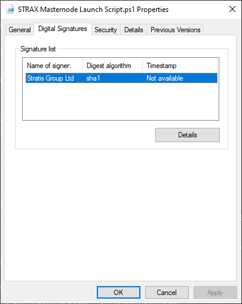
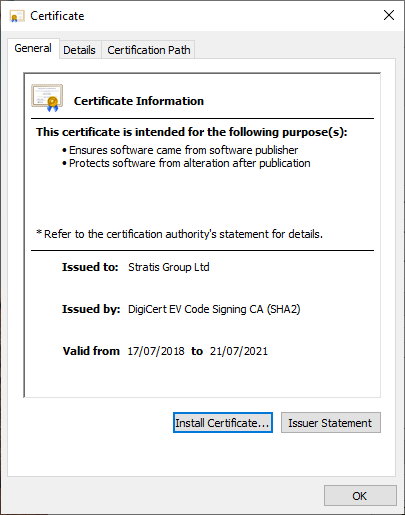
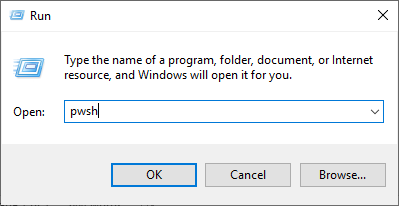
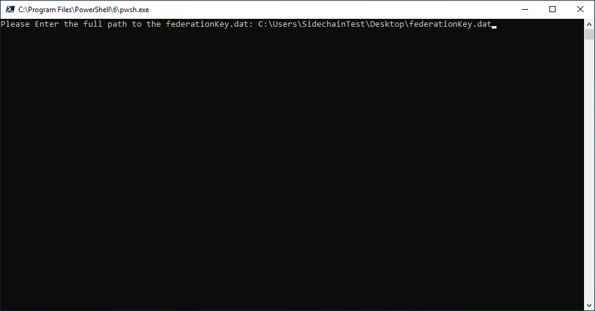
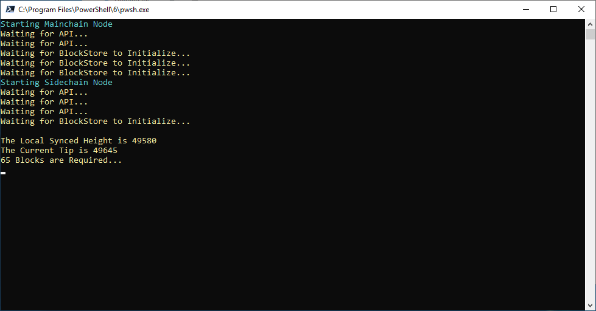
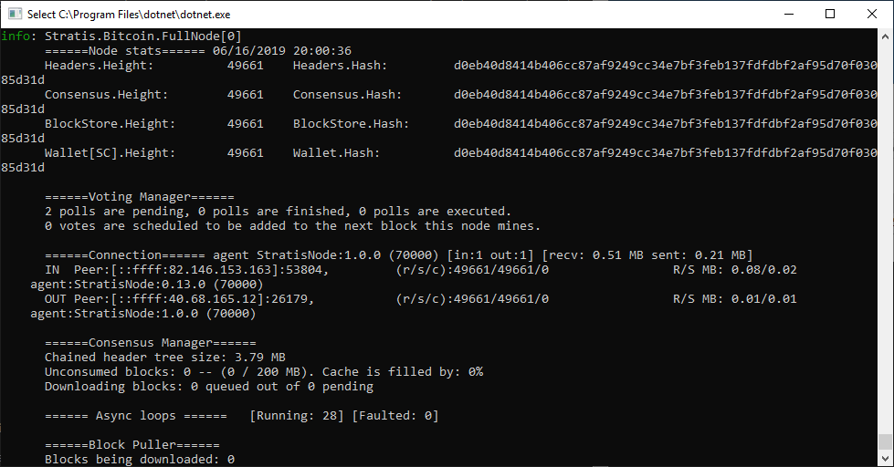

#######################
Masternode Requirements
#######################

To successfully configure your Masternode you will need to have a record
of the data that was returned from running the Stratis KeyGen Utility,
these are highlighted below.

- Passphrase (That was entered into the Stratis KeyGen Utility
- FederationKey.DAT

Obtaining Launch Script
=======================

Once the above steps have been completed and confirmed, you are now able
to launch an InterFlux Masternode.

To configure and launch the InterFlux Masternode, you will have to
execute a PowerShell Core script provided and signed by Stratis Group
Ltd.

This script can be obtained from the below URL

https://www.stratisplatform.com/wp-content/uploads/2022/02/STRAX-Masternode-Launch-Script-v2.zip

Verifying the Launch Script
===========================

Stratis Group Ltd will digitally sign any PowerShell Script that they
provide for operating one of their products.

This can be verified by right-clicking the PS1 script, selecting
properties and viewing the digital signature.

.. image:: media/image2.png
   :width: 4.21875in
   :height: 5.30208in

Highlight the listed signature and select “Details”

Select “View Certificate”

.. image:: media/image4.png
   :width: 3.58661in
   :height: 4.27559in

Verify the issuing information in the certificate to ensure the
authenticity of the PowerShell Script.

Executing the Launch Script
===========================

As the script is written in PowerShell Core, it needs to be called from
an instance of PowerShell Core and not the standard PowerShell that is
shipped with all latest versions of Windows Operating Systems.

To launch PowerShell Core, you will need to invoke it from the command
line or run command.

Clicking OK on the above will launch a new instance of PowerShell Core

.. image:: media/image7.png
   :width: 6.26806in
   :height: 3.27778in

Assuming that the launch script is located on the desktop, you will need
to navigate to the desktop, this can be achieved by executing the below
command.

.. code-block:: bash

  Set-Location .\Desktop\

The PowerShell Core script can now be invoked from the PowerShell Core
window using the below command.

.. code-block:: bash

  & '.\STRAX Masternode Launch Script.ps1'

The PowerShell Core instance should look something like the below.

.. image:: media/image8.png
   :width: 6.26806in
   :height: 3.27778in

Hit Return/Enter to invoke the PowerShell Core Script.

.. image:: media/image9.png
   :width: 6.26806in
   :height: 3.27778in

Enter the passphrase that was supplied to the Stratis KeyGen Utility and
hit Return/Enter.

You will now be prompted to enter in the full path to the
federationKey.dat file. This will then subsequently be copied to the
relevant folder. Enter the full path to the federationKey.dat.

Upon hitting enter, the mainchain node will be launched, the PowerShell
Core Script will advise you of the progress.

.. image:: media/image11.png
   :width: 6.26806in
   :height: 3.27778in

Once peers have been found and the mainchain node has begun syncing the
chain, the node will also index all addresses. This can take some time,
so please be patient. The PowerShell Core window will advise you of
progress.

.. image:: media/image12.png
   :width: 6.26806in
   :height: 3.27778in

Once the synchronization and indexing have completed, the sidechain node
will automatically be launched, this will also be evidenced in the
PowerShell Core window.

You can confirm that the sidechain node is operational by viewing your
agent string in the sidechain node console.

The agent string of a sidechain node is **StratisNode:1.0.7.2 (80000)**
