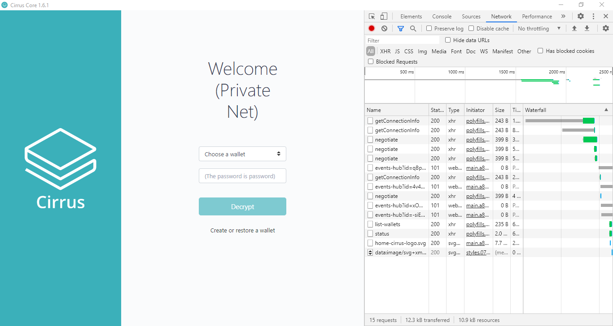
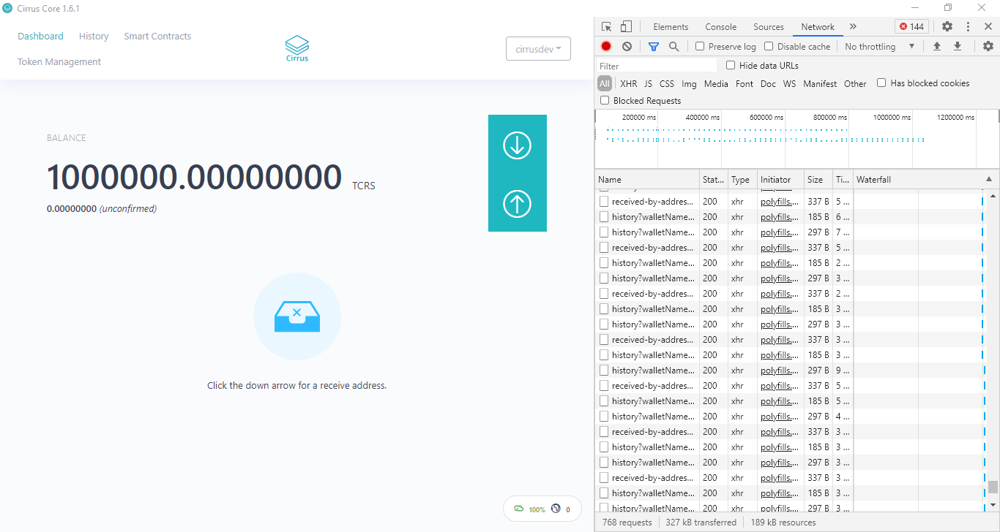
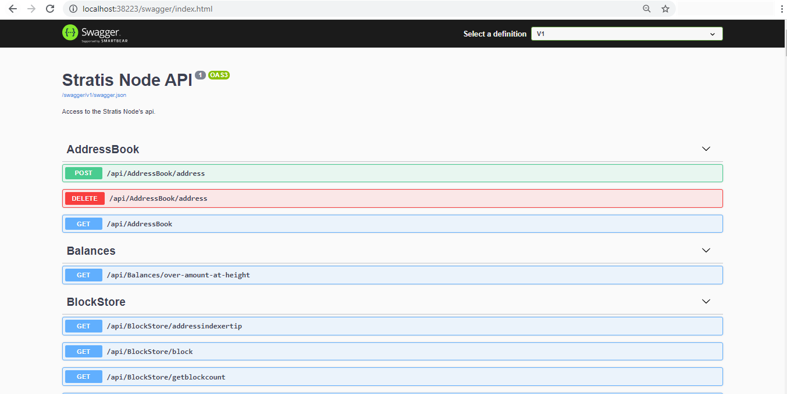

.. _gui-tutorials:

***********************
Setup Local Environment
***********************

A 'Development Edition' of the Cirrus Core Wallet has been made
available to greatly simplify the local development process; this
version is known as the "Private Net" version. This wallet is
pre-configured to launch a new chain, providing a local development
environment to deploy contracts and build solutions without any external
interference.

The "Cirrus Core Private Net" wallet is essentially a GUI that interacts
with an instance of the Stratis Full Node, specifically the
'Stratis.CirrusMinerD' project. The environment can be run in a headless
manner on a remote machine by performing the following steps.

 .. code-block:: bash

    git clone https://github.com/stratisproject/StratisFullNode
    cd ./StratisFullNode/src/Stratis.CirrusMinerD
    dotnet run -devmode=miner

This guide will focus on utilizing the Cirrus Core GUI as this
simplifies the contract deployment and overall management process.

If you would prefer to run the environment in Docker, you can follow the below guide:

* :ref:`creating-headless-network`

Getting Started
===============

Cirrus Core Private Net can be downloaded from the Cirrus Core
repository and is available for all leading Operating Systems.

https://github.com/stratisproject/CirrusCore/releases/tag/1.6.1.0-privatenet

For the purpose of this tutorial, we will focus on using the Windows x64
instance of the Cirrus Core Private Net wallet.

Once downloaded, run the installer through to completion.

Starting a Node
===============

Once Cirrus Core Private Net has been installed, you can now launch the
wallet via the shortcut created on your desktop. This will start a node.

Interacting with the UI
-----------------------

You would have noticed that when launching the node via Command Prompt,
an additional application appeared on your taskbar. This is the Cirrus
Core GUI, which can be seen below for reference.

In addition to the GUI, DevTools has been made available within the GUI
so you can see what calls are being made to the respective API endpoints
when interacting with the Cirrus Core GUI. As part of the Private Net Edition, wallets are automatically created to
save you time; log into the wallet by using the username `cirrusdev`
and password `password` as seen in the password text field.

.. note:: Even though the Stratis Blockchain is built upon a UTXO model,
 to improve user experience vastly, we have introduced an account-based
 model look and feel to the Cirrus Core Private Net wallet. This change
 provides the end-user with the ability to interact with Smart Contracts
 in a more efficient manner. 

Upon entering the password and logging into the wallet, you will be
presented with the above screen, requesting you to select an address.
Select the first address, `Address[0]` and continue. 

.. note:: Initially, you may notice that there is no balance within the wallet that has been
 automatically created. The pre-mine will be allocated after the second
 block has been mined. The current block time is set at 16 seconds; it
 will not be long before you see a balance credited to the wallet.

You can see in the above image; you have 1,000,000 TCRS which you can
utilize to deploy and call a contract for your development and testing
purpose. 

The `Dashboard` displays all information specific to your wallet. Since
this is a local chain this is the only node currently running on the
network, and all funds issued on-chain reside within this wallet.

There are several ways that the Stratis Full Node can be interacted with
within the Cirrus Core UI; aside from basic wallet functions, there is
also the ability to issue tokens and deploy and interact with Smart Contracts. If you are
interested in other API's that are available, the Swagger interface can
be accessed via browse swagger. Swagger is utilized to provide a
graphical representation of the APIs that are available on the Stratis
Full Node. These APIs are fully documented on the Academy and can be
accessed via the `API Documentation <https://academy.stratisplatform.com/Developer%20Resources/API%20Reference/api.html>`_ section.

.. note:: By default, only a single node can be running if utilizing the Cirrus Core Private Net Wallet. Additional nodes can be launched from the source code by passing the below parameters to the Stratis.CirrusMinerD project.

 ::

 -port=<>
 -signalruri=http://127.0.0.1:<>
 -apiuri=http://127.0.0.1:<>
 -datadir=<>

This concludes the network setup and configuration; you can now deploy a
contract on the local network in Tutorial 2.