***********************************************
Deploying the HelloWorld Smart Contract Example
***********************************************

Now let’s look into deploying the HelloWorld Smart Contract in C# on
your local network, firstly, let’s take a look at the contract itself.

How the concept of a class links to a smart contract
====================================================

Smart contracts in C# are intrinsically linked to object-oriented design
even when they are very basic.

Being object-oriented also enables smart contracts to inherit methods
and properties. This allows a level of basic smart contract
functionality to be readily available to all smart contracts via base
class methods and properties.

The smart contract constructor
-------------------------------

Deployment of a smart contract involves calling the constructor for the
smart contract class. This is where any initialization of the smart
contract should take place. Before we look at what the constructor does,
let’s examine its syntax.

Firstly, as previously mentioned, all smart contracts in C# inherit
from SmartContract. It is mandatory to include the following line at the
top of the file:

::

    using Stratis.SmartContracts;

This allows a smart contract to inherit from the
base SmartContract class.

The class declaration specifies that your class inherits from
the SmartContract class:

::
    
    [Deploy]

    public **class** **HelloWorld** : SmartContract

    {

    ...

    }

The ``[Deploy]`` attribute only needs to be specified when more than one
class is declared in the file, but specifying it anyway is fine. When a
smart contract is deployed, the entire C# file is compiled into Common
Intermediate Language (CIL), which is then supplied to the deployment
call.

The first parameter passed to the constructor must be an object
conforming to the ``ISmartContractState`` interface:

::

    public HelloWorld(ISmartContractState smartContractState)

    : base(smartContractState)

    {

    ...

    }

You can define additional parameters, and when you deploy the smart
contract, you only need to specify arguments for the parameters you
defined. The first parameter is handled internally. The ``base`` constructor
(the ``SmartContract`` constructor) must also be called with
the ``ISmartContractState`` parameter, and you can see this in the code
above. The name of the first parameter could theoretically be changed,
but ``smartContractState`` will work fine.

Greeting - a smart contract property
-------------------------------------

In our Hello World example, we do one thing and that is initialize
the ``Greeting`` property:

:: 

    this.Greeting = "Hello World!";

The actual line initiating the ``Greeting`` property is fairly
self-explanatory. Let’s take a look at the property getter and setters.

::

    private string Greeting

    {

    get

    {

    **return** this.PersistentState.GetString("Greeting");

    }

    set

    {

    this.PersistentState.SetString("Greeting", value);

    }

    }

The ``PersistentState`` property belongs to the ``SmartContract`` class and
facilitates the storage and retrieval of data (in this case a string).
Smart contract data is stored as a series of key-value pairs and in this
case **Greeting** is used as the key. The ``Greeting`` property is marked as
private as there is no need for it to be accessed from anywhere other
than inside the smart contract. Unlike methods, C# properties on a smart
contract cannot be called even if they are public.

SayHello() - a smart contract method
-------------------------------------

Finally, let’s look at the simple method ``Greeting()``, which returns the
“Hello World!” string.

::

    public string SayHello()

    {

    **return** this.Greeting;

    }

As you can see, this method just accesses the ``Greeting`` property.

You can see the complete Hello World Contract code
`here <https://github.com/stratisproject/StratisBitcoinFullNode/blob/LSC-tutorial/src/Stratis.SmartContracts.Examples.HelloWorld/HelloWorld.cs>`__.

.. _compiling-the-hello-world-smart-contract:

Compiling the HelloWorld smart contract
=======================================

A smart contract in C# must be compiled into CIL before it can be
deployed. For this, we are going to use the `Stratis Smart Contract
Tool <https://github.com/stratisproject/Stratis.SmartContracts.Tools.Sct>`__.

You will need to obtain the Stratis Smart Contract Tool, this can be
done using the below command

::

    git clone https://github.com/stratisproject/Stratis.SmartContracts.Tools.Sct

Follow below steps to validate and compile Smart Contract:

::

    cd Stratis.SmartContracts.Tools.Sct\Stratis.SmartContracts.Tools.Sct\
    dotnet run -- validate [PATH_TO_SMART_CONTRACT] -sb 

.. image:: media/image1.png
   :width: 6.26806in
   :height: 3.73194in

To see more information on the options available for the
sct validate command, use the following command:

::

    dotnet run -- validate --help

.. note:: If you are building the Stratis Smart Contract Tool from source and have
    previously cloned the repository, please ensure that before you compile
    any smart contracts, you sync the repository to the latest version of
    the source code and rebuild the tool.

.. _deploying-the-hello-world-smart-contract:

Deploying the HelloWorld smart contract
========================================

Begin by making sure that you have the Local Smart Contract network
running. You should now be in possession of 1,000,000 TCRS-TEST tokens
within your ``cirrusdev`` wallet. You can deploy the token from the Cirrus
Core UI or via Swagger which can be launched from the Wallet drop-down
in the top right. This tutorial will demonstrate the deployment from the
Cirrus Core GUI.

Navigate to the ``Smart Contracts`` tab within the Cirrus Core wallet and
select the ``Create Contract`` button

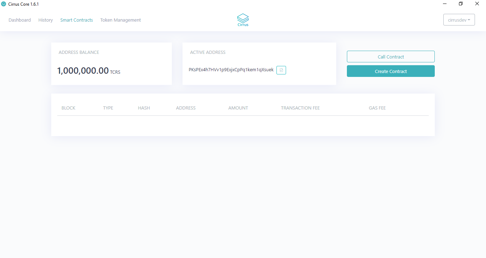

You will now be presented with the ``Create Contract`` dialog. To deploy the
contract, you will need to complete the relevant fields. Each member of
the object is fully documented `in the
API <https://academy.stratisplatform.com/Swagger/#/SmartContractWallet/Create>`__.
Use the ``CIL code`` you generated in the previous section for
the ``Byte Code`` field.

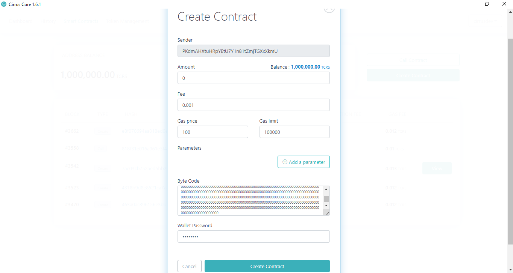

Once completed, select the ``Create Contract`` button to deploy the
contract. Once deployed, the contract will be visible on
the ``Smart Contracts Dashboard`` as per below:

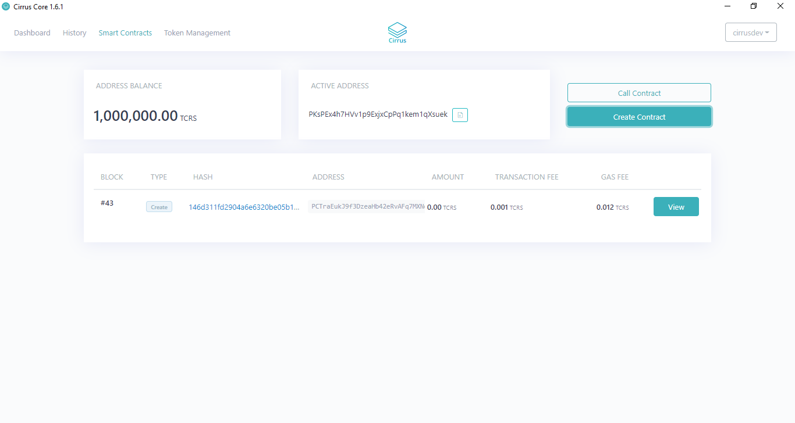

To interact with the deployed contract, you can simply select
the ``Browse API`` hyperlink to be directed to Swagger.

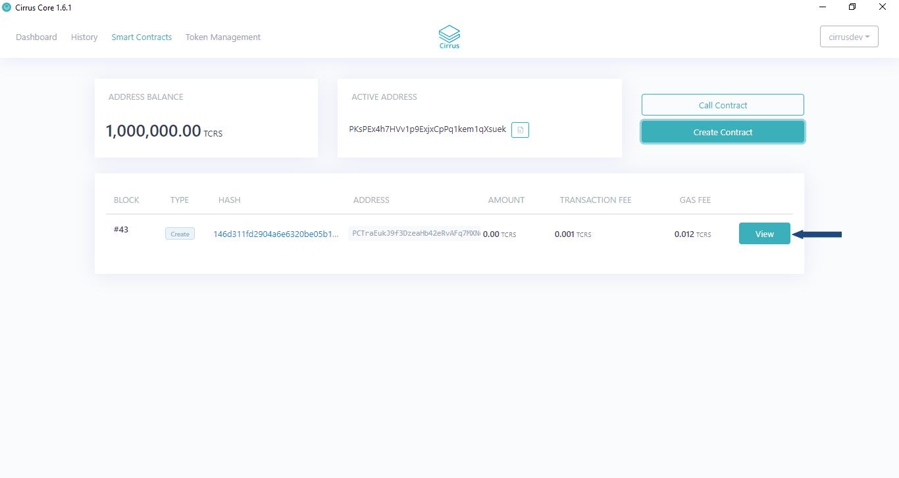

This will then launch your defined Internet Browser

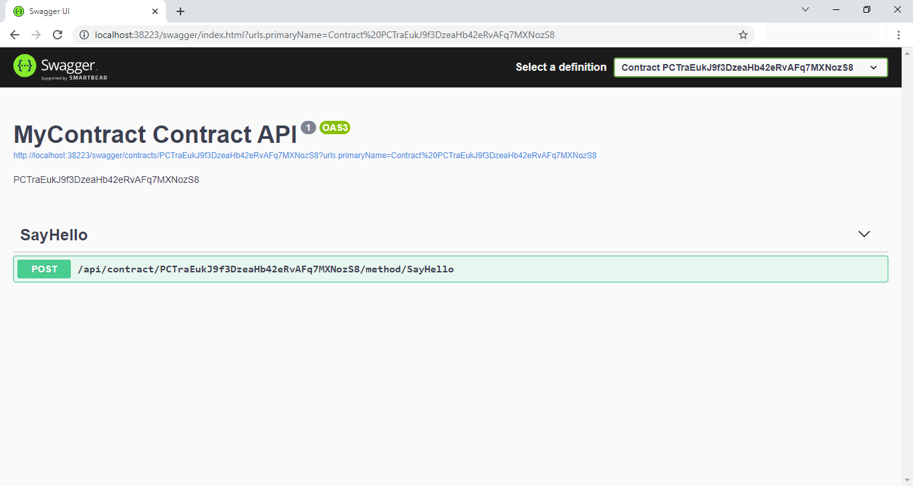

Select the ``SayHello`` post method to display the available parameters

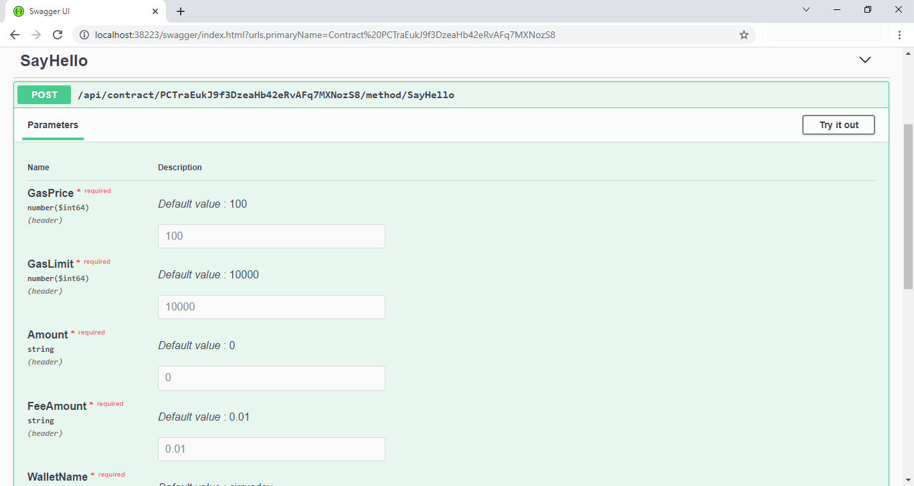

**Calling the SayHello() method**

We are going to call the ``SayHello()`` method, to do this click
the ``Try it out`` button.

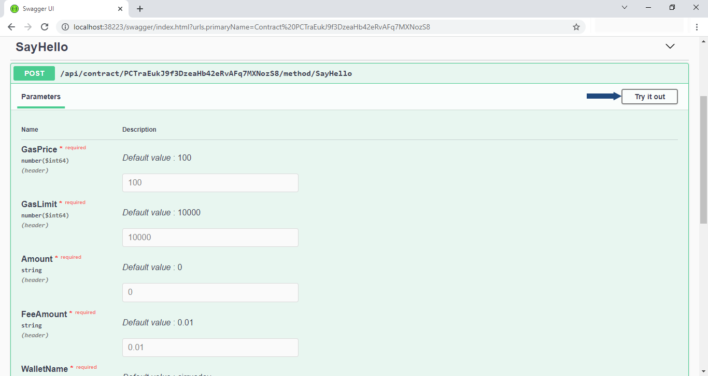

A lot of the text fields are pre-populated, all that is required is to
enter the password and replace the SayHello() string  with ().

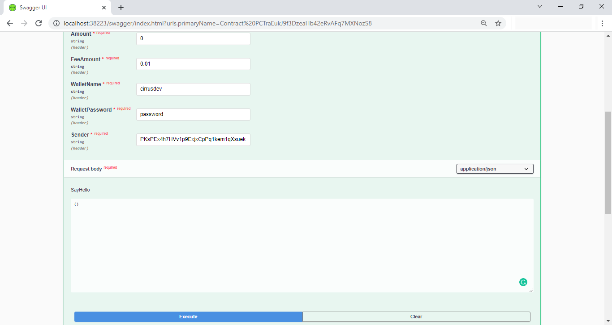

Click the ``Execute`` button to call the method. The response can be seen
below instantaneously.

.. image:: media/image10.png
   :width: 6.26806in
   :height: 3.34028in

As detailed in the response, we need to check the receipt to view what
was returned from the Smart Contract. Navigate back to
the ``Smart Contracts Dashboard`` within Cirrus Core where you will find
your balance has reduced slightly and in addition there is a new type of
Smart Contract execution listed.

Click the hyperlinked ``hash`` text to view the receipt.

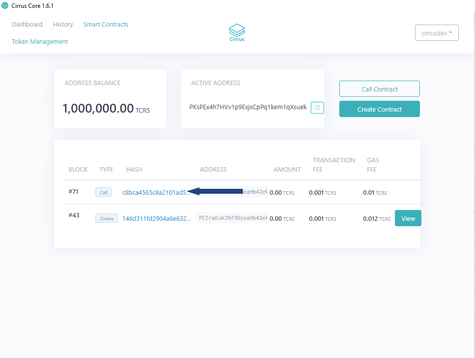

Upon clicking the hyperlinked text, you will be presented with a new
dialog that displays the receipt of the Smart Contract call. Here we can
see the ``returnValue`` proving that the Smart Contract call was successful!

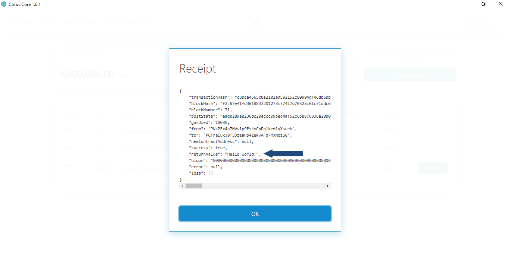

Alternatively, you can call the contract from wallet as well. To call
it, just copy the ``contract address`` as depicted below and click ``call
contract`` button.

.. image:: media/image14.png
   :width: 6.26806in
   :height: 3.34028in

Provide the method name, contract address, password, parameters, and
click call contract as illustrated below.

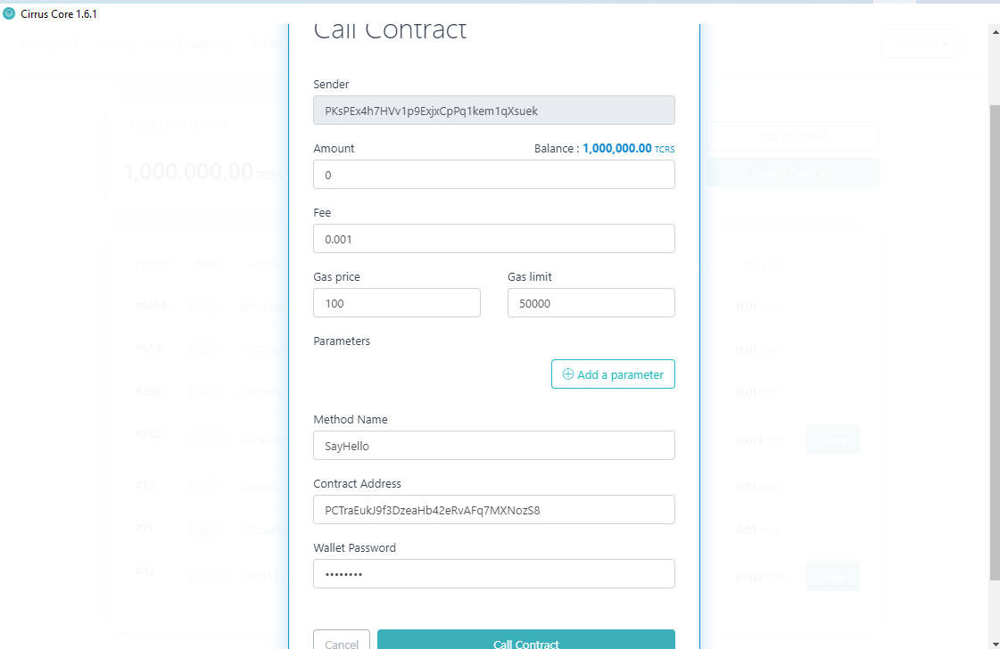

Now we have deployed a basic HellowWorld contract, we can now look at
extending the functionality in Tutorial 3.

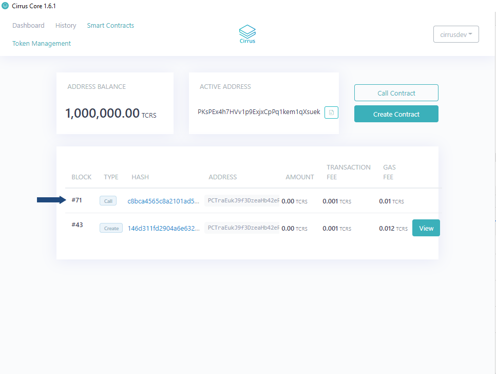
