#######################
Tutorial 1 Introduction
#######################

This tutorial will take you through the steps of setting up an environment and performing basic
interaction with the STRAX Mainnet Blockchain.

**************
Pre-Requisites
**************

-  Download and install .NET Core SDK 3.1 - https://dotnet.microsoft.com/download/dotnet/3.1

-  Download and install Git - https://git-scm.com/downloads

-  Download Stratis Unity SDK Package - https://github.com/stratisproject/Unity3dIntegration/tree/main/Resources
   
   The Stratis Unity SDK is currently going through the Unity Store approval process, in the meantime, the package can be obtained from here: 

*************************
Prepare Stratis Full Node
*************************

First, you must obtain a local copy of the Stratis Full Node; this can
be achieved by using the git clone command. 

For the purpose of this document, we will be using the desktop as the
root directory. 

**Execute the below command**: 

.. code-block:: bash

   git clone http://github.com/stratisproject/StratisFullNode -b release/1.1.0.0 C:/Users/Admin/Desktop/StratisFullNode

The above command will clone the source code to the below directory,

.. code-block:: bash

   C:\Users\Admin\Desktop\StratisFullNode 

.. image:: media/image1.jpeg
   :alt: Unity3D Blockchain SDK
   :width: 8.85417in
   :height: 4.4375in

It's cloned now so let's go to the source and let's build it. In order
to build it, you need to install the .Net SDK and 3.1.net core SDK
and build it for the release using the command

.. code-block:: bash

   dotnet build

Once the build has completed, we can run the project.

.. code-block:: bash

   dotnet exec .\Stratis.StraxD.dll -txindex=1 -addressindex=1 -unityapi_enable=true -unityapi_apiuri=http://0.0.0.0

We need to enable transaction index and address indexing, and then
enable unity API also, you need to run it on this IP address or IP of
your choice.

.. image:: media/image3.jpeg
   :alt: Unity3D Blockchain SDK
   :width: 8.85417in
   :height: 4.52083in

Once we execute the command, a local version of Stratis FullNode will
start running and syncing with the mainnet.

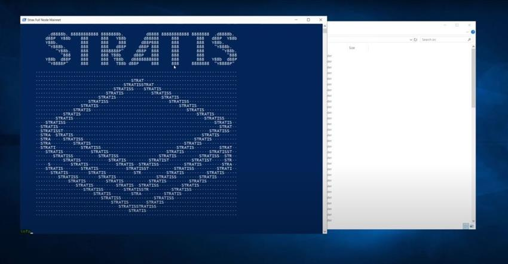

While it's syncing we can open the port in the firewall, as we want to
allow inbound and outbound ports.

.. image:: media/image5.jpeg
   :alt: Unity3D Blockchain SDK
   :width: 8.85417in
   :height: 7.27083in

So basically you need to create Inbound and Outbound rules for a port on
which you want to run Unity 3D API. The default port for unity API is
44336, but you can specify what you want.

.. image:: media/image6.jpeg
   :alt: Unity3D Blockchain SDK
   :width: 8.85417in
   :height: 4.35417in

Given below are some of the arguments which can be provided to modify
the Unity 3D API feature.

.. image:: media/image7.jpeg
   :alt: Unity3D Blockchain SDK
   :width: 8.85417in
   :height: 4.63542in

Now let's check if it works, so first let's go to swagger on
localhost:44336.

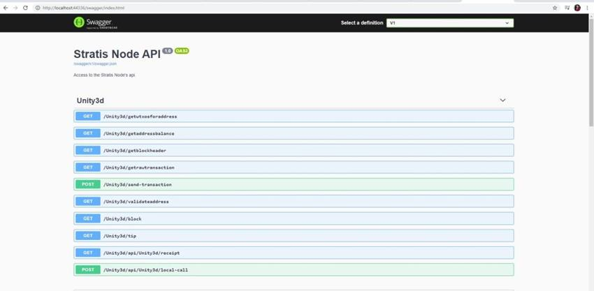

**Note**: The node can take some time depending on the internet speed, and available resources
to get fully synced.

Make sure your node completes the syncronization process.

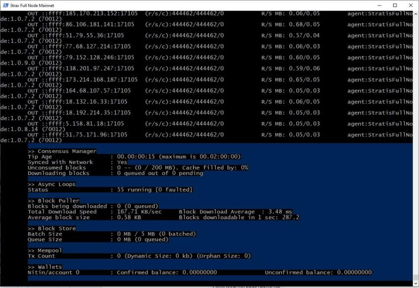

So now let's go and run unity and try to connect to our API.

*************
Running Unity
*************

Create the project

.. image:: media/image10.jpeg
   :alt: Unity3D Blockchain SDK
   :width: 8.85417in
   :height: 4.84375in

Now we have a new unity project and let's import our unity package,
click import.

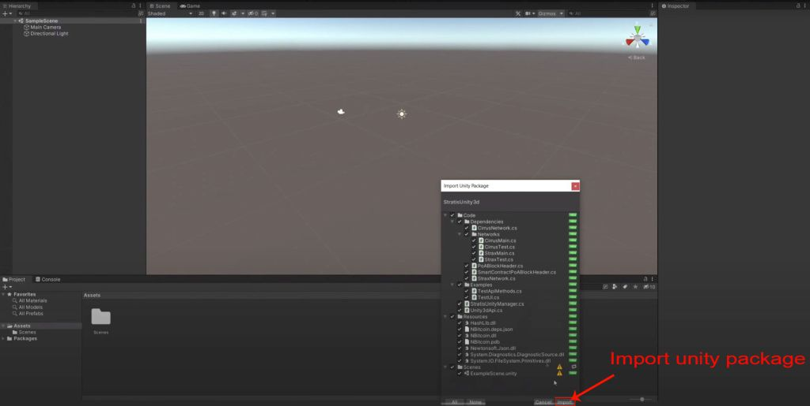

Now once it's imported we can open an example scene.

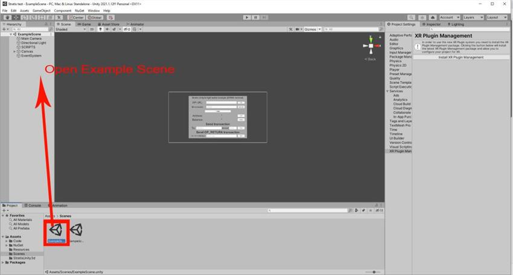

Run the example scene. It is a simple UI that you can use to test the
solution, first, we will need to provide the correct endpoint and in my
case, "http://localhost:44336" is the IP address, so if you've set up
everything properly, click test.

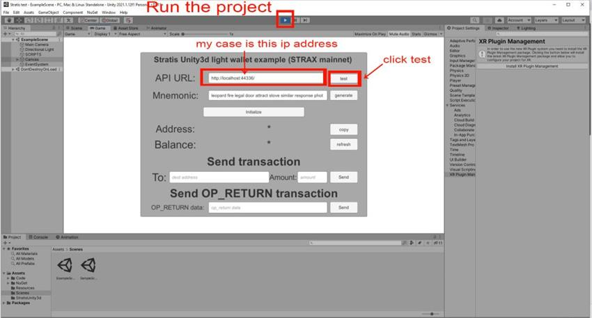

You will see that the API test was successful.

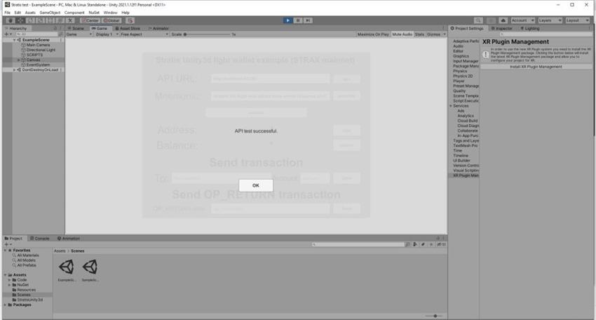

So what we can do after this is to generate a new mnemonic and once you
are done, click on generate. You can also just use your old mnemonic in
case you already have a wallet created in unity. 

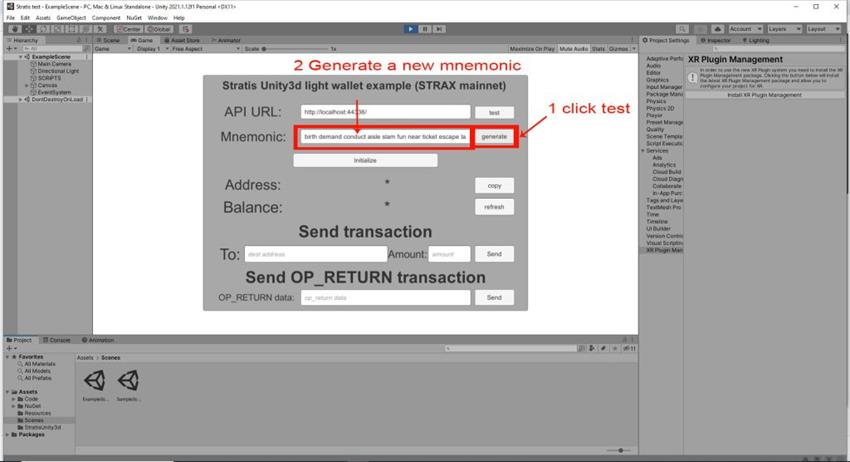

Click on "Initialize" and here is your address to which you can deposit
STRAX. Let's copy it and now let's go back to our swagger API server. I
have a default wallet that I have prepared here which has (0.1) STRAX.

.. image:: media/image16.jpeg
   :width: 20in
   :height: 10.84375in

So let's send some STRAX from this wallet. We will go to normal node API
and used build transaction endpoint so here it.

.. image:: media/image17.jpeg
   :alt: Unity3D Blockchain SDK
   :width: 8.85417in
   :height: 4.60417in

Let's deposit 0.1 Stratis coins to our address and click on execute
button.

.. image:: media/image18.jpeg
   :alt: Unity3D Blockchain SDK
   :width: 8.85417in
   :height: 4.70833in

Copy the hex text generated.

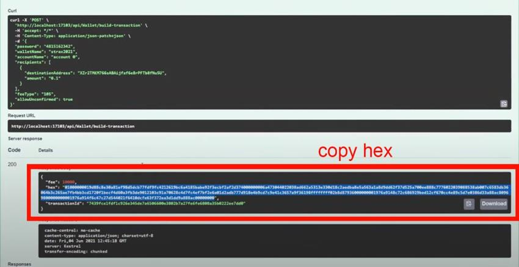

Now we have hex and we can use it to send transactions.

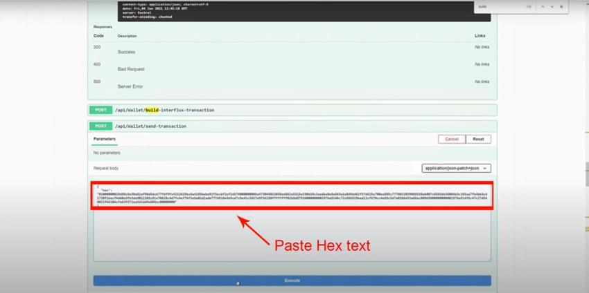

You can also just use a normal UI wallet to deposit to that address but
I,m doing it this way so we can see that now we have some unconfirmed
balance.

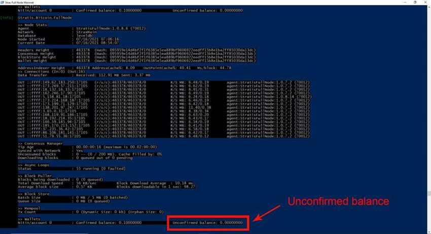

Now if we go back to unity and refresh our balance we can see that we
have some money here.

.. image:: media/image22.jpeg
   :alt: Unity3D Blockchain SDK
   :width: 8.85417in
   :height: 4.8125in

***********************
Performing Transactions
***********************

We can send two types of transactions, one is a normal transaction where
you supply the destination address and the amount you want to send, and
the second is an op return transaction which basically allows you to
encode any data and post it to the blockchain. So let's try both of
those. Let's say I deposited 0.0505 to an address.

.. image:: media/image23.jpeg
   :alt: Unity3D Blockchain SDK
   :width: 8.85417in
   :height: 4.42708in

Now we can see the transaction was created and we get the transaction
id, based on which we can explore about the transaction on
Stratis explorer.

.. image:: media/image24.jpeg
   :alt: Unity3D Blockchain SDK
   :width: 8.85417in
   :height: 4.42708in

Let's open this address in the blockchain explorer and see if any transaction was
created, so it will take some time for the transaction to be mined
before it will appear. Typically it will be less than half a minute, so
let's wait.

The STRAX Mainnet Blockchain Explorer can be viewed here: https://chainz.cryptoid.info/strax/

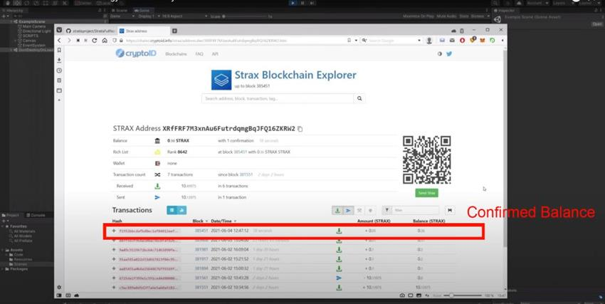

Once the transaction shows up, click on the transaction to see the
transaction details.

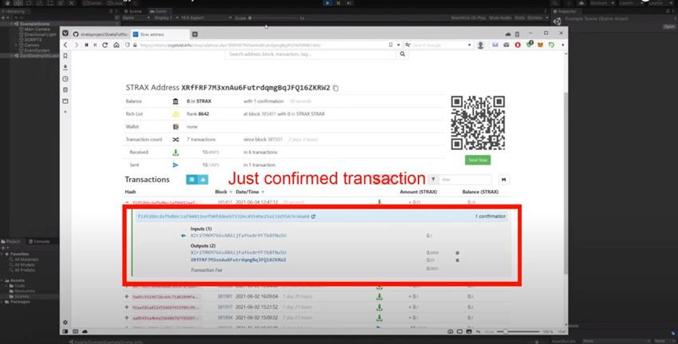

Now we will do the second type of transaction, which is encoding any
operator and data. So let's put any data here and click send.

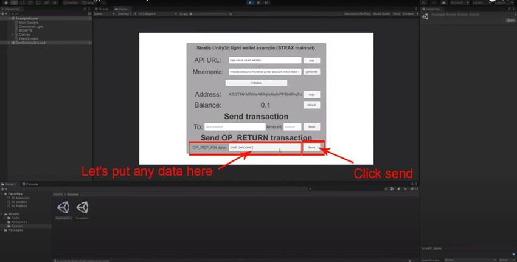

Then again open Stratis explorer and look for this address, once the
transaction is confirmed and we can see the transaction details, if we
open it that we have one output op return and it has our data encoded
there.

.. image:: media/image28.jpeg
   :alt: Unity3D Blockchain SDK
   :width: 8.85417in
   :height: 4.5in

So that's pretty much it, another example that you can look into is an
example without UI. if you open game object name scripts here is an
example with UI disabled.

.. image:: media/image29.jpeg
   :alt: Unity3D Blockchain SDK
   :width: 8.85417in
   :height: 4.77083in

We can open it in visual studio and here is basically code that calls
every API method available on unity 3d API and also how to send normal
transactions and how to send op return transactions, it's pretty simple
and self-explanatory so check it out.

.. image:: media/image30.jpeg
   :alt: Unity3D Blockchain SDK
   :width: 8.85417in
   :height: 4.45833in

.. |Unity3D Blockchain SDK| image:: media/image2.jpeg
   :width: 8.85417in
   :height: 4.75in
