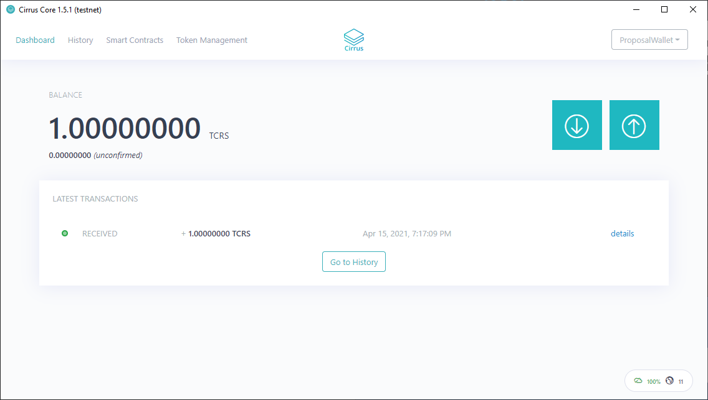
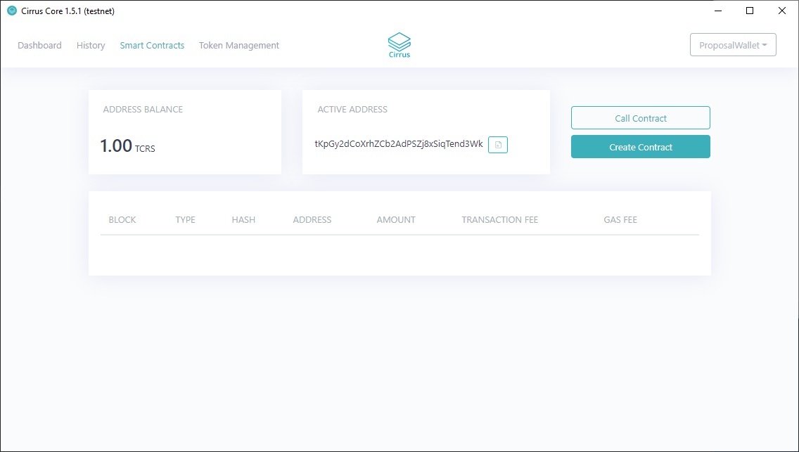
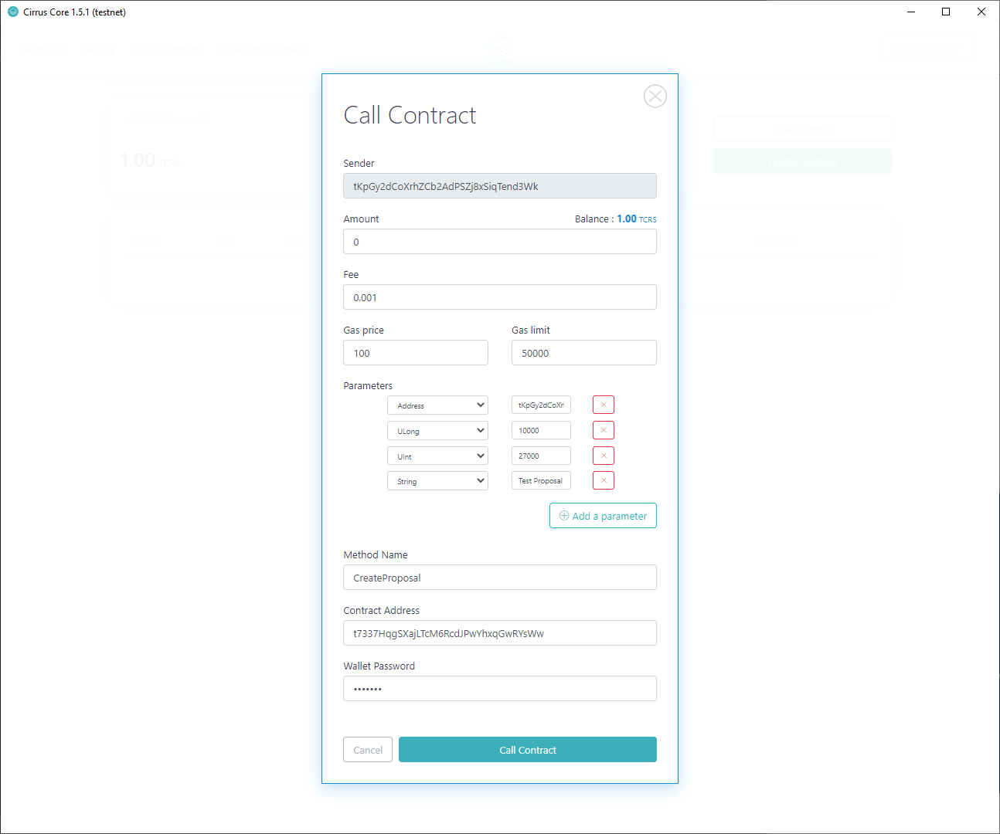
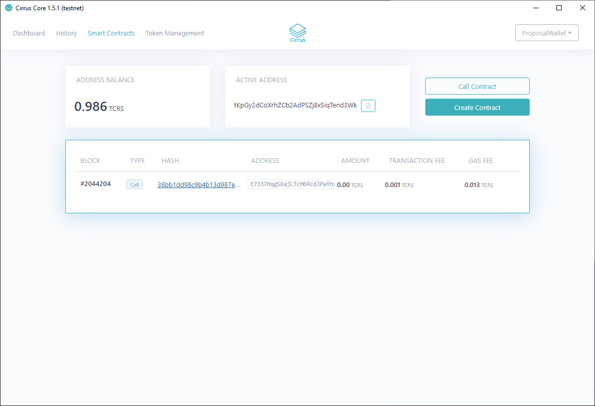

###################
Creating a Proposal
###################

1. Create a wallet and fund with at least 1 CRS

If you are unsure how to obtain CRS, instructions can be found on the
Stratis Academy, located here:
https://academy.stratisplatform.com/Operation%20Guides/Sidechain/AcquiringCRS/cross-chain-transfer.html

2. Navigate to Smart Contracts Tab

3. Select "Call Contract" button

.. image:: media/image3.png
   :width: 4.96512in
   :height: 3.96395in

4. Add relevant parameters for Creating a Proposal

**Call Contract Summary**

**Sender:** CckErAtdqkxx1ZLRmRj4akE9r9H8s8szw4

  This is the selected address that is interacting with the Smart
  Contract.

**Amount:** 0

  We are not sending any funds, we are interacting with a Smart Contract.

**Fee:** 0.001

  This is the default fee and can be left as default value

**Gas Price:** 100

  This is the default Gas Price and can be left as default value

**Gas Limit:** 50000

  This is the default Gas Price and can be left as default value

**Parameters**:

**Address**: CckErAtdqkxx1ZLRmRj4akE9r9H8s8szw4

   This parameter defines where, if successful, the requested funds will
   be distributed to. Ensure that this is an owned address.

**ULong**: 1000000000000

   This parameter defines that requested funding from the Stratis
   Decentralized Accelerator. In this example, we are requesting 10,000 CRS
   (in a 'satoshi' format)

**UInt**: 27000

   This parameter defines the length of the proposal vote. The value is
   defined in 'blocks'. This value can be determined using the below
   formula.

   *Seconds per Day (86,400) / Cirrus Block Time (16) \* Days (5)*

   The above result ensures that the proposal vote remains active for at
   least 5 days.

   It is important to note that requested amounts will not be released until
   the proposal length has passed. i.e. If a proposal recieves 51% of IDGB voting 
   in favour within the first 24hr, but the proposal length is set to 5 days the 
   proposal cannot be executed until the 5th day has passed.

**String**: Test Proposal

  This parameter defines a brief description of the proposal.

**Method Name:** CreateProposal

  This is the Smart Contract method that we are interacting with to create
  a proposal.

**Contract Address:** CbtYboKjnk7rhNbEFzn94UZikde36h6TCb

  This is the mainnet Stratis Decentralized Accelerator Smart Contract Address. The
  address defined here should not be used for creating production proposals.

**Wallet Password:** \******\*

  This is your wallet password.

5. Select Call Contract once you are confident with the populated
   fields.

The "HASH" of the Smart Contract call can be selected to view the
respective detail.

6. The response will look similar to the below

.. code-block:: bash

   {

   "transactionHash":
   "38bb1dd98c9b4b13d987e8091dd01a1cdb4b4bc8957bc146570752bf7e91f626",

   "blockHash":
   "87804a95ef594e368608cdd726183f77ac8f70925665ba46e33763d29f483077",

   "postState":
   "5cb521d7a99e0178caad196acef140ed37eb7195023c2804c359a1ad01845d0c",

   "gasUsed": 12833,

   "from": "CckErAtdqkxx1ZLRmRj4akE9r9H8s8szw4",

   "to": "CbtYboKjnk7rhNbEFzn94UZikde36h6TCb",

   "newContractAddress": null,

   "success": true,

   "returnValue": "2",

   "bloom":
   "00000000000000008000000000000000000000000000000000200000000000000000000000000000000001000000000000000000000000000000000000000000000000000000000000000000000000000000080000080000000000000000000000000000000000000000000000000000000080010000000000000000000000000000000000000000000000000000000000000000000080000000000000000000000000000000000000000000000000000000000000000000100000000000000080000000000000000000000000000000000000000000000000000000000000000001000000000000000000000000000000020000000000000000000000000000",

   "error": null,

   "logs": [

   {

   "address": "CbtYboKjnk7rhNbEFzn94UZikde36h6TCb",

   "topics": [

   "50726F706F73616C41646465644C6F67",

   "8D6735E17D8135AB56FF3D07160C6BE4F5B83F28",

   "02000000"

   ],

   "data":
   "F1948D6735E17D8135AB56FF3D07160C6BE4F5B83F2884020000008810270000000000008D546573742050726F706F73616C",

   "log": {

   "recipent": "CckErAtdqkxx1ZLRmRj4akE9r9H8s8szw4",

   "proposalId": 2,

   "amount": 1000000000000,

   "description": "Test Proposal"

   }

   }

   ]

   }

    

7. The "log" detail provides the information that should be presented to
   the InterFlux Decentralized Governance Board.

.. code-block:: bash

   "log": {

   "recipent": "CckErAtdqkxx1ZLRmRj4akE9r9H8s8szw4",

   "proposalId": 2,

   "amount": 1000000000000,

   "description": "Test Proposal"

   }
