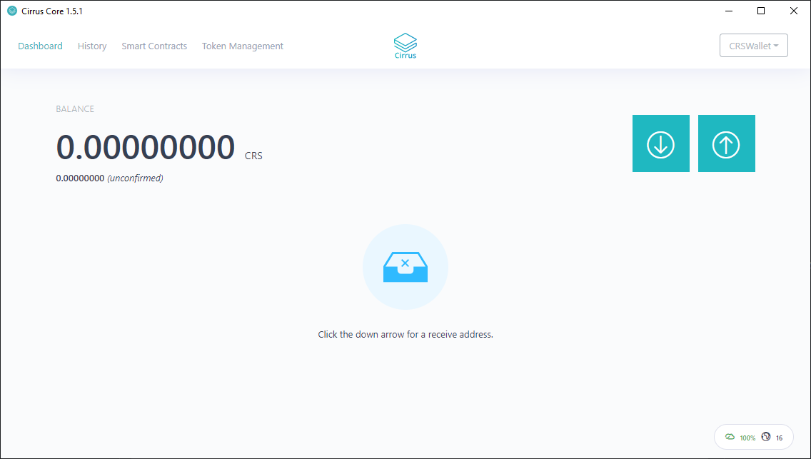
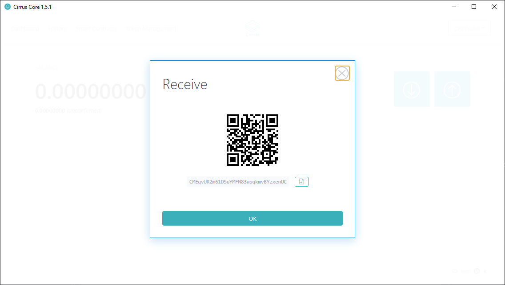
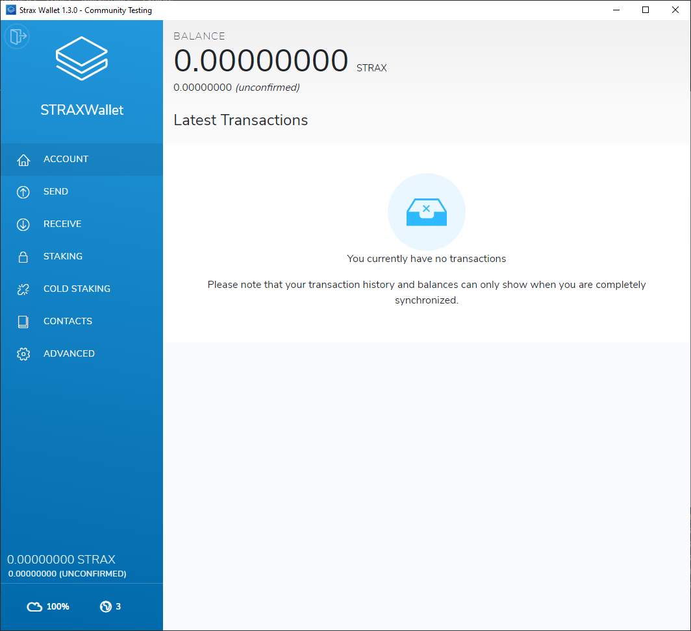
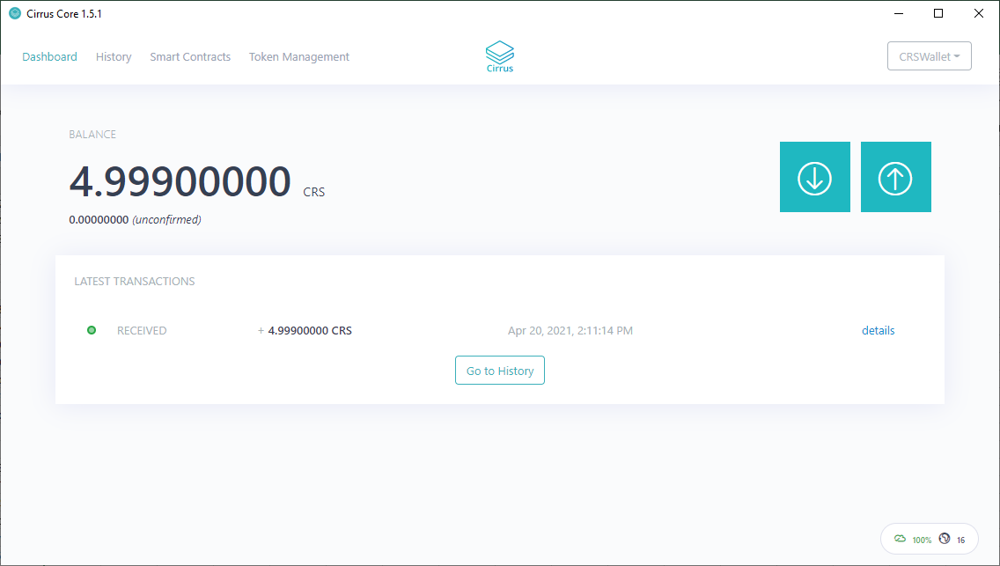

#########################
Acquiring the CRS Token
#########################
The CRS Token can be obtained in a genuinely trustless and decentralized
manner, achieved by utilizing a two-way-pegged sidechain. This operation
guide will take you through the simple steps required to get the CRS
Token.

1. Firstly, you must install both the Cirrus Core Wallet and the STRAX
   Wallet. Both wallets can be obtained from the `Stratis
   Wallets <https://www.stratisplatform.com/wallets/>`__ webpage. 
   Once installed, open up your Cirrus Core wallet, create a new Wallet
   or Restore using a set of stored recovery phrases.

2. Obtain an address relative to your wallet by selecting the receive
   button

3. Open your STRAX Wallet and create a new Wallet or Restore using a set
   of stored recovery phrases.

4. You will need at least 1.01 STRAX to perform a cross-chain transfer.
   Any transfers under 1 STRAX will be burned and unrecoverable. Obtain
   an address relative to your STRAX Wallet and send an amount of STRAX
   you wish to swap for CRS.

   **Please note: A fee of 0.001 will be applied to every cross-chain
   transfer**

   .. image:: media/image4.png
      :width: 6.26806in
      :height: 5.73194in

5. Now that a STRAX Balance is present, STRAX Tokens can be transferred
   to the Cirrus Sidechain and exchanged for CRS Token(s) by navigating
   to the Send Page.

..

   .. image:: media/image5.png
      :width: 6.26806in
      :height: 5.73194in

6. Populate the relevant fields, using the Cirrus Address that was
   obtained from your Cirrus Wallet

..

   .. image:: media/image6.png
      :width: 6.26806in
      :height: 5.73194in

7. Once you're happy with the amounts and have confirmed the address is
   accurate, select the send button.

..

   The confirmation time changes, depending on the size of the
   transaction, a summary of confirmation times can be found below.

   .. image:: media/image7.png
      :width: 6.26806in
      :height: 1.01944in

   Each confirmation constitutes a mined block on the Stratis Blockchain; a
   block is mined, on average, every 45 seconds. This results in a transfer
   under 50 STRAX being confirmed in under 20 minutes.

8. Once the respective amount of confirmations have occurred, the CRS
   Token balance can be observed in the Cirrus Core Wallet.

