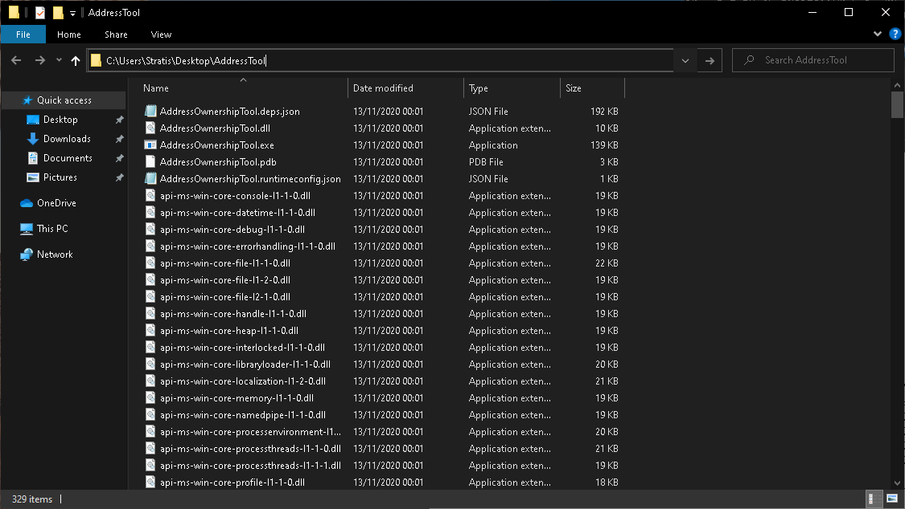
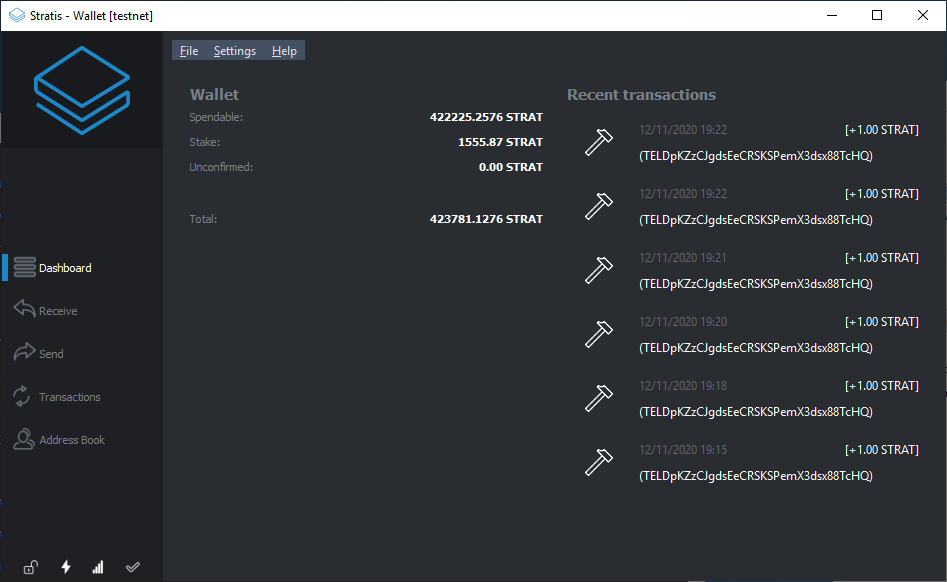
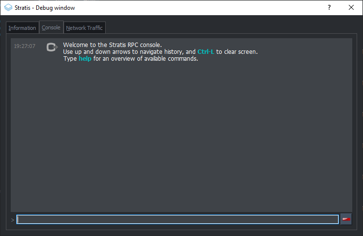
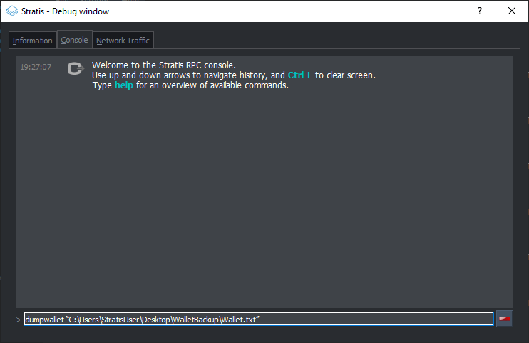

##################################
STRAX Token Swap Guide for Windows
##################################

************************************
Step 1 - Obtain STRAX Wallet Address
************************************

1. Download and install the STRAX Wallet from https://www.stratisplatform.com/wallets/.

..

2. Create a new wallet and ensure you keep a secure record of your mnemonic words and *optional* passphrase.

..

3. Obtain a Receive Address. **Keep note of this address as it will be defined later in the process.**

.. image:: media/receive.png
   :align: center
   :width: 900px

**************************************
Step 2 - Obtain Address Ownership Tool
**************************************

1. The **AddressOwnerShipTool** must be used to prove ownership of
   funds; please download the relevant package to your device using the
   release page below.

..

   https://github.com/stratisproject/StratisBitcoinFullNode/releases/tag/1.2.0.0

2. Extract the contents of the ZIP archive to a safe location on the
   device where your Stratis Wallet is located.

There are three wallets that are supported by the
**AddressOwnershipTool**.

**Only complete the steps relevant to
the wallet software that contains your STRAT Wallet.**

*************************************
Step 3 - StratisX/QT Recovery Process
*************************************

1. Open StratisX that contains your wallet

2. Once loaded; open the console via “Help > Debug Window > Console”

3. Enter the below command:

.. code-block:: bash

   dumpwallet “<filepath>.txt”

**Example**

4. Open CMD or PowerShell and navigate to the location where the
   **AddressOwnershipTool** was stored.

..

   The simplest way to achieve this is to open the folder where the tool
   was stored and type CMD into the navigation bar and hit ENTER. This
   will open a new instance of CMD in the opened directory

   .. image:: media/image6.png
      :width: 6.26806in
      :height: 3.53264in

5. Now call the AddressOwnershipTool executable with the following
   command:

.. code-block:: bash

   AddressOwnershipTool.exe -privkeyfile=“C:\Users\StratisUser\Desktop\WalletBackup\wallet.txt” -destination=**STRAXAddress**

Please replace **STRAXAddress** with **YOUR** STRAX Address.

6. A CSV file will be created in the directory where you launched the
   **AddressOwnershipTool**, named the same as your destination STRAX
   address, containing signatures, signed with your private key for each
   of the addresses contained within your wallet.

7. Upload this CSV to `STRAX Token Swap Process
   Form <https://www.stratisplatform.com/strax-token-swap-process-form/>`__

**************************************
Step 3 - Stratis Core Recovery Process
**************************************

1. Open CMD or PowerShell and navigate to the location where the
   **AddressOwnershipTool** was stored.

..

   The simplest way to achieve this is to open the folder where the tool
   was stored and type CMD into the navigation bar and hit ENTER. This
   will open a new instance of CMD in the opened directory

   .. image:: media/image6.png
      :width: 6.26806in
      :height: 3.53264in

2. Now call the AddressOwnershipTool executable with the following
   command:

.. code-block:: bash

   AddressOwnershipTool.exe -name=StratisCoreWalletName -password=walletPassword -destination=**STRAXAddress**

**Please replace the all values with your genuine values relating to
your Stratis Wallet; i.e. walletName, walletPassword, STRAXAddress**

3. The **AddressOwnerShipTool** will now load your wallet and return a
   line for each discovered address; the ending result will look like
   the below.

.. code-block:: bash

   SZ5fg1NkRk1qT3JBpNKopZmea4wgDcA7Hp;XU2jNwiac7XF8rQvSk2bgibmwsNLkkhsHV;IGbJN2tg1GBY3MXf9sGq2sQwGCdLy/CqsuD6CROf6lQrASDASDASWXe/MF8+fPrlNjf2vivTmW7gCcYG4Fk3Tak=
   SNR6v9CUxUwDgfkCoAJ1KKennZzeK5hS3D;XU2jNwiac7XF8rQvSk2bgibmwsNLkkhsHV;IM59KY8OtMnlTkdJCdIuGm5FNSDFDSFSDFSDSADASDASDVuO+EANs9hLGK8EqyL+A41/5LnhMIy8xaimLZlddx0=
   SWKAjAnBS44SWM9D5GZMNmTbKmYT7Xi7to;XU2jNwiac7XF8rQvSk2bgibmwsNLkkhsHV;H/QB1rHxSMA2qmaX1FycNFeEcP/dPWzBEw2ESyS2S615CasdasdsadOnAutuGh8SVnH2s/bMBCp7RNzl6o9Q/UI=
   SRib9v44CpufsrkRjHATb9D4bjdzXuQTrp;XU2jNwiac7XF8rQvSk2bgibmwsNLkkhsHV;IDr81471+aNwYIAVaDGMjigB9AmrM/m0nBasdsadsadasJBJJT/aCRZ9TmJsPpopcT4YgCDph6kVXPlGpjNzOJQ=
   SUpWKzs4Rn4CVFrGsBLW9SQzGgUH1g7KPo;XU2jNwiac7XF8rQvSk2bgibmwsNLkkhsHV;IL0GV9SJRmLFMiznalzGsZmDC5uCDFDFDFDFDSFDSFSDF+rcezkpCf22kmvIZXeFVYhAiQOkC2OmDvqkMkyKDj8=
   SXSZ4n944Z92iEyVyLiHhowAB5NBdAuYSY;XU2jNwiac7XF8rQvSk2bgibmwsNLkkhsHV;IPFp7KsX4Yig7bOBuInlNImuLX7F5dpHxUMqosI9DFDFDQ86VGa2EBZWwHn31bdP8Qx1qcr5F+8E4PcMEtZu6Nw=
   SRBtSj7ENKGDN4UBErrgMxy7yeb6NDDZ1g;XU2jNwiac7XF8rQvSk2bgibmwsNLkkhsHV;H7YO6696eMobss7GESzYgVXUwyYxiasdasdasdsaSDFDDFDH2kFX7uNPNbtMToO73Ozj8f4WXCBBIkbbGYX2Y4s=
   SVyj2SH9WUdPzprjXhSj74mHiZx1De5JQ9;XU2jNwiac7XF8rQvSk2bgibmwsNLkkhsHV;IFeetO0oQQ5aiS6t0K0RJvytmsj6U1oPjUQrBasdasdsssvGm687+mE6O0WK3+Jxdx+gwwjwkWoQOJ3oOZrSqyM=
   SXnKkjGLgDk1PoeT2pWxK4EH9FQmPVEEGU;XU2jNwiac7XF8rQvSk2bgibmwsNLkkhsHV;II5cb5F9xbw/uU9VNrg+DPgDoHVxLiSdXRjLio+htpH2aasdsadsadasd9e34dzfC46vYPHrXV0wB5cBYWmecw0=
   SYgFzZdLP8co96HHdkDQHaJdGfUte7SmvM;XU2jNwiac7XF8rQvSk2bgibmwsNLkkhsHV;HwZJJqJHAdBwXOdWpGYSwrW1DwYgVxQ1cevpVe6z0FjtcMxI8sQrBdfdfdfb+Eb3J/f2d+TyxhfVmFyGk2E/82A=
   SV7ZHcqbqRgXy1PkcvAkWxfbAhPCd9hRDs;XU2jNwiac7XF8rQvSk2bgibmwsNLkkhsHV;H3DetX1aczIQuxqmdkoZH+ObIKVo/adasdsadasdsaasdasdasdasdsadasdasd/wyaoSc/7v25XG82lM55x9KM=

4. A CSV file will be created in the directory where you launched the
   **AddressOwnershipTool**, named the same as your destination STRAX
   address, containing signatures, signed with your private key for each
   of the addresses contained within your wallet.

..

5. Upload this CSV to `STRAX Token Swap Process
   Form <https://www.stratisplatform.com/strax-token-swap-process-form/>`__

***************************************
Step 3 - Ledger Wallet Recovery Process
***************************************

1. Connect your Ledger device to the computer where you have downloaded
   the **AddressOwnerShipTool**

https://github.com/stratisproject/StratisBitcoinFullNode/releases/tag/1.2.0.0

2. Unlock your Ledger device and open the Stratis App on the Ledger
   Device

..

3. Open CMD or PowerShell and navigate to the location where the
   **AddressOwnershipTool** was stored.

..

   The simplest way to achieve this is to open the folder where the tool
   was stored and type CMD into the navigation bar and hit ENTER. This
   will open a new instance of CMD in the opened directory

   .. image:: media/image6.png
      :width: 6.26806in
      :height: 3.53264in

4. Now call the AddressOwnershipTool executable with the following
   command:

.. code-block:: bash

   AddressOwnershipTool.exe -ledger -destination=**STRAXAddress**

Please replace **STRAXAddress** with **YOUR** STRAX Address.

5. The AddressOwnershipTool will scan used addresses on your Ledger
   device and sign a message for any addresses found that contain a
   balance. For each address that contains a balance, you will be
   prompted to confirm the message signing on the device. **This process
   ensures that the private key never leaves your Ledger device.**

..

6. A CSV file will be created in the directory where you launched the
   **AddressOwnershipTool**, named the same as your destination STRAX
   address, containing signatures, signed with your private key for each
   of the addresses contained within your wallet.

..

7. Upload this CSV to `STRAX Token Swap Process
   Form <https://www.stratisplatform.com/strax-token-swap-process-form/>`__
