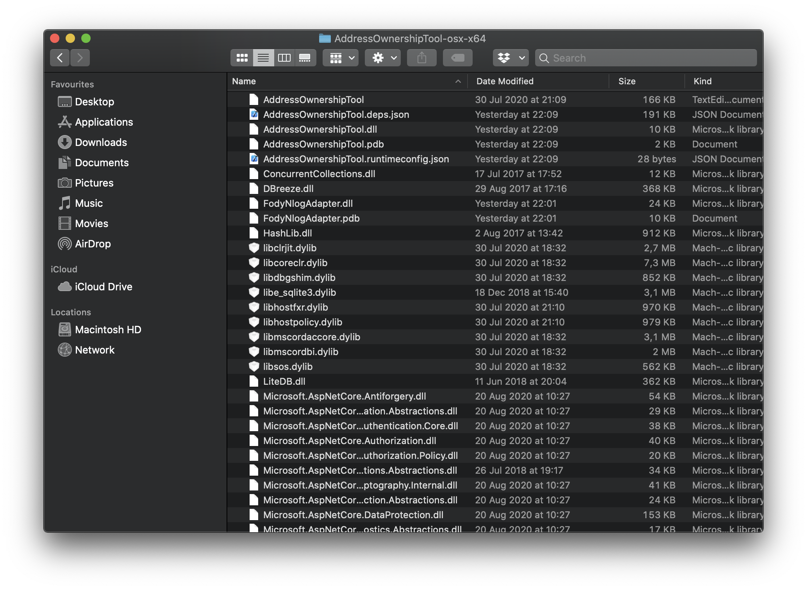

################################
STRAX Token Swap Guide for MacOS
################################

************************************
Step 1 - Obtain STRAX Wallet Address
************************************

1. Download and install the STRAX Wallet from https://www.stratisplatform.com/wallets/.

..

2. Create a new wallet and ensure you keep a secure record of your mnemonic words and *optional* passphrase.

..

3. Obtain a Receive Address. **Keep note of this address as it will be defined later in the process.**

.. image:: media/receive.png
   :align: center
   :width: 900px

**************************************
Step 2 - Obtain Address Ownership Tool
**************************************

1. The **AddressOwnerShipTool** must be used to prove ownership of
   funds; please download the relevant package to your device using the
   release page below.

..

   https://github.com/stratisproject/StratisBitcoinFullNode/releases/tag/1.1.0.0

2. Extract the contents of the ZIP Archive to a safe location on the
   device where your Stratis Wallet is located.

There are three wallets that are supported by the
**AddressOwnershipTool**.

**Only complete the steps relevant to
the wallet software that contains your STRAT Wallet.**

*************************************
Step 3 - StratisX/QT Recovery Process
*************************************

1. Open the Stratis Qt application that contains your wallet

.. image:: media/image3.png
   :width: 4.72599in
   :height: 3.05833in

2. Once loaded; open the console via “Help > Debug Window > Console”

.. image:: media/image4.png
   :width: 4.80833in
   :height: 3.57242in

3. Enter the below command:

.. code-block:: bash

   dumpwallet “<filepath>.txt”

**Example**

Please change “yourusername” to your own username.

.. image:: media/image5.png
   :width: 6.26806in
   :height: 4.65694in

1. Open Terminal and navigate to the location where the
   AddressOwnershipTool was stored.

..

   The simplest way to do this is to open terminal, type cd and paste
   the AddressOwnerShipTool folder into the terminal. Then press ENTER.

2. Temporarily disable Gatekeeper with the following command:

.. code-block:: bash

   sudo spctl --master-disable

3. Make sure we can run the AddressOwnerShipTool with the following
   command:

.. code-block:: bash

   chmod +x ./AddressOwnershipTool

4. Now call the AddressOwnershipTool executable with the following
   command:

.. code-block:: bash

   ./AddressOwnershipTool -privkeyfile=”/Users/yourusername/Desktop/Wallet.txt” -destination=destinationaddress

**Please replace “destinationaddress” with YOUR STRAX Address and
“yourusername” with YOUR username.**

5. Enable Gatekeeper again with the following command:

.. code-block:: bash

   sudo spctl --master-enable

6. A CSV file will be created in the directory where you launched the
   AddressOwnershipTool, named the same as your destination STRAX
   address, containing signatures, signed with your private key for each
   of the addresses contained within your wallet.

..

7. Upload this CSV to `STRAX Token Swap Process
   Form <https://www.stratisplatform.com/strax-token-swap-process-form/>`__

**************************************
Step 3 - Stratis Core Recovery Process
**************************************

1. Open Terminal and navigate to the location where the
   AddressOwnershipTool was stored.

..

   The simplest way to do this is to open terminal, type cd and paste
   the AddressOwnerShipTool folder into the terminal. Then press ENTER.

2. Temporarily disable Gatekeeper with the following command:

.. code-block:: bash

   sudo spctl --master-disable

3. Make sure we can run the AddressOwnerShipTool with the following
   command:

.. code-block:: bash

   chmod +x ./AddressOwnershipTool

4. Now call the AddressOwnershipTool executable with the following
   command:

.. code-block:: bash

   ./AddressOwnershipTool -name=StratisCoreWalletName -password=walletPassword -destination=STRAXAddress

**Please replace the all values with your genuine values relating to
your Stratis Wallet; i.e. walletName, walletPassword, STRAXAddress**

5. Enable Gatekeeper again with the following command:

.. code-block:: bash

   sudo spctl --master-enable

6. The AddressOwnerShip Tool will now load your wallet and return a line
   for each discovered address, the ending result will look like the
   below.

.. code-block:: bash

   SZ5fg1NkRk1qT3JBpNKopZmea4wgDcA7Hp;XU2jNwiac7XF8rQvSk2bgibmwsNLkkhsHV;IGbJN2tg1GBY3MXf9sGq2sQwGCdLy/CqsuD6CROf6lQrASDASDASWXe/MF8+fPrlNjf2vivTmW7gCcYG4Fk3Tak=
   SNR6v9CUxUwDgfkCoAJ1KKennZzeK5hS3D;XU2jNwiac7XF8rQvSk2bgibmwsNLkkhsHV;IM59KY8OtMnlTkdJCdIuGm5FNSDFDSFSDFSDSADASDASDVuO+EANs9hLGK8EqyL+A41/5LnhMIy8xaimLZlddx0=
   SWKAjAnBS44SWM9D5GZMNmTbKmYT7Xi7to;XU2jNwiac7XF8rQvSk2bgibmwsNLkkhsHV;H/QB1rHxSMA2qmaX1FycNFeEcP/dPWzBEw2ESyS2S615CasdasdsadOnAutuGh8SVnH2s/bMBCp7RNzl6o9Q/UI=
   SRib9v44CpufsrkRjHATb9D4bjdzXuQTrp;XU2jNwiac7XF8rQvSk2bgibmwsNLkkhsHV;IDr81471+aNwYIAVaDGMjigB9AmrM/m0nBasdsadsadasJBJJT/aCRZ9TmJsPpopcT4YgCDph6kVXPlGpjNzOJQ=
   SUpWKzs4Rn4CVFrGsBLW9SQzGgUH1g7KPo;XU2jNwiac7XF8rQvSk2bgibmwsNLkkhsHV;IL0GV9SJRmLFMiznalzGsZmDC5uCDFDFDFDFDSFDSFSDF+rcezkpCf22kmvIZXeFVYhAiQOkC2OmDvqkMkyKDj8=
   SXSZ4n944Z92iEyVyLiHhowAB5NBdAuYSY;XU2jNwiac7XF8rQvSk2bgibmwsNLkkhsHV;IPFp7KsX4Yig7bOBuInlNImuLX7F5dpHxUMqosI9DFDFDQ86VGa2EBZWwHn31bdP8Qx1qcr5F+8E4PcMEtZu6Nw=

7. A CSV file will be created in the directory where you launched the
   AddressOwnershipTool, named the same as your destination STRAX
   address, containing signatures, signed with your private key for each
   of the addresses contained within your wallet.

..

8. Upload this CSV to `STRAX Token Swap Process
   Form <https://www.stratisplatform.com/strax-token-swap-process-form/>`__
