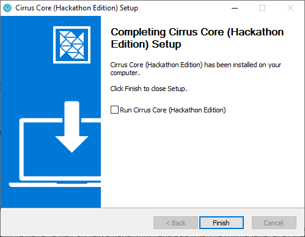
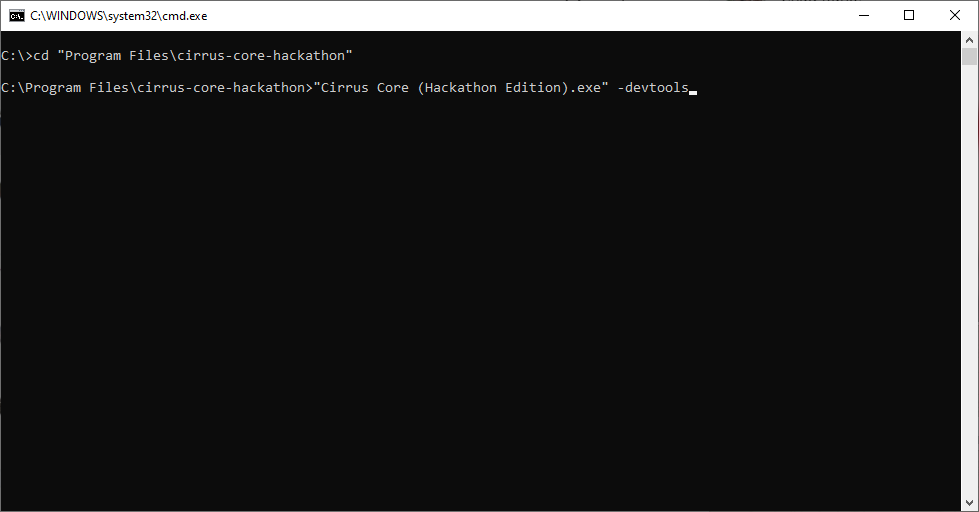
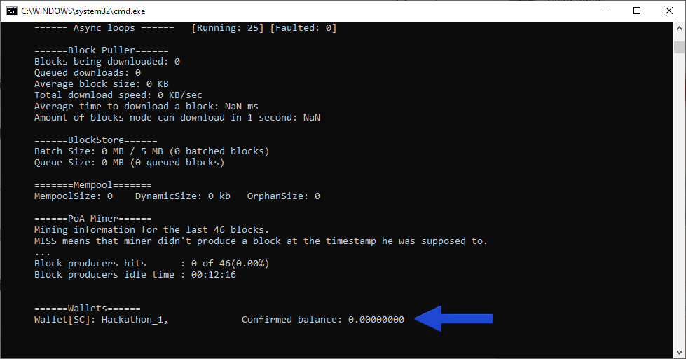
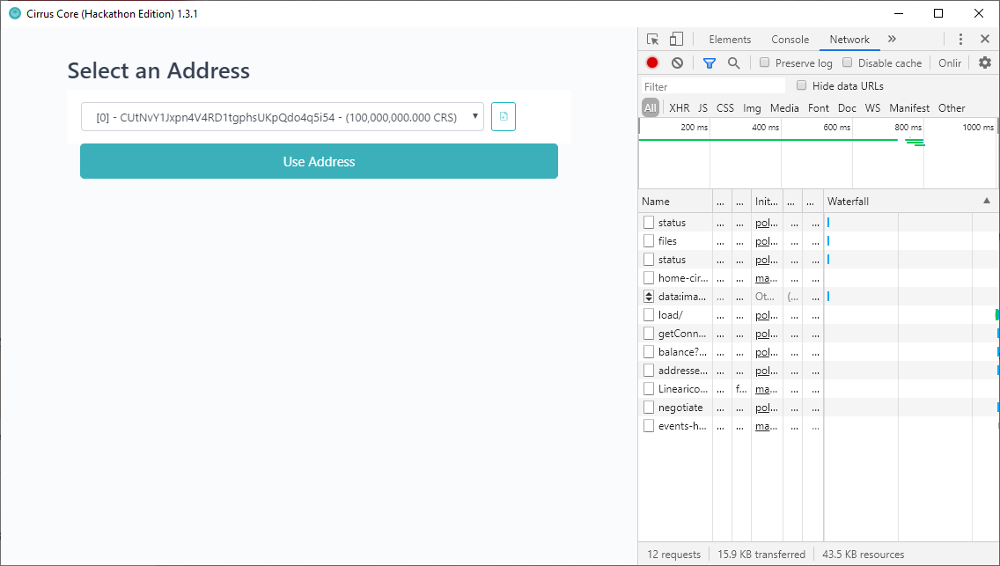
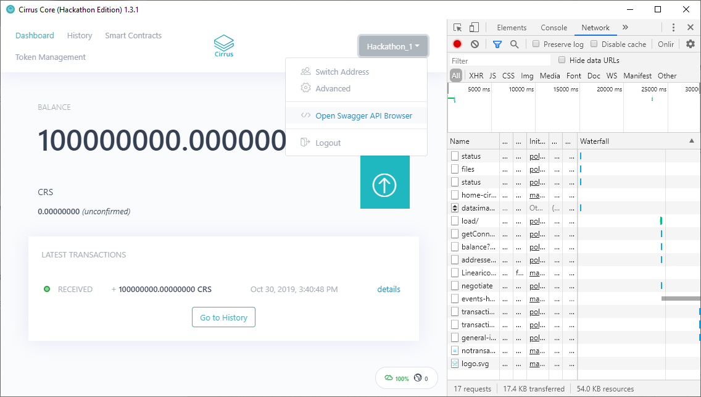
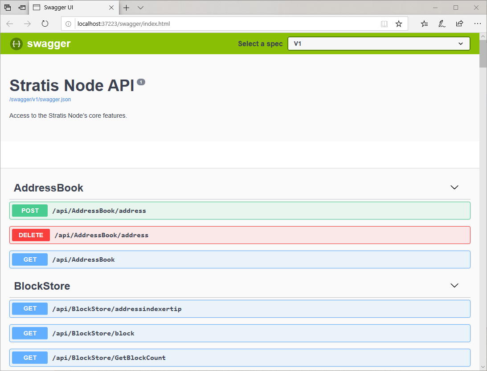
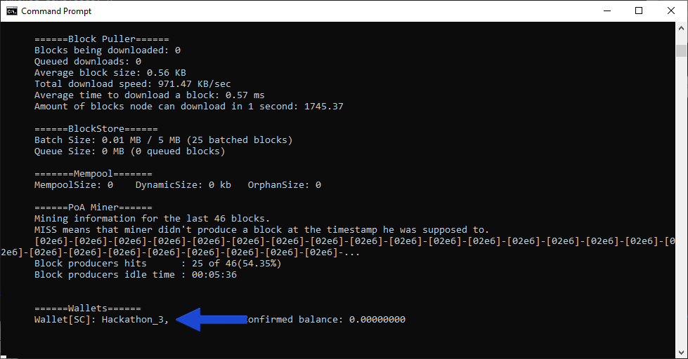

***************************************************************************
Running the Cirrus Core (Hackathon Edition) for the first time 
***************************************************************************

In an effort to greatly simplify the local development process, a 'Developer Edition' of our Cirrus Core wallet has been made available. 

This version of the Cirrus Core Wallet contains a bootstrapped PoA Blockchain that enables you to begin development without the need of setting up and configuring your own bespoke blockchain. 

Getting Started
=========================

The Cirrus Core (Hackathon Edition) can be downloaded from .... and is available for leading operating systems.

For the purpose of this tutorial, we will focus on using the Windows x64 instance of the wallet. Once downloaded simply run the installer through to completion.

Un-Check the 'Run Cirrus Core (Hackathon Edition)' check-box as illustrated above.

Running the Node
================================

One the Cirrus Core (Hackathon Edition) has been installed, you can now launch a node. Whilst you can launch a node by simply double-clicking the shortcut created on your desktop, it is recommended that the node is started via command line. This provides you a console view of the running node and allows you to also enable the development tools within the Cirrus Core UI.

To do this, open an instance of Command Prompt.

Navigate to the installation directory as above and execute the below command:

::

 "Cirrus Core (Hackathon Edition).exe" -devtools
 
This will start a node, however, initially, you will notice that there is no balance within the wallet that has been automatically created.

The pre-mine will be allocated after the second block has been mined, with the current block time set at 16 seconds, it won't be long before you will see a balance credited to the wallet.

.. image:: PreMine.png
     :width: 900px
     :alt: Pre-Mine
     :align: center

Interacting with the UI 
=================================

You would have noticed that when launching the node via Command Prompt, an additional application appeared on your task-bar. This is the Cirrus Core GUI, which can be seen below for reference.

.. image:: CirrusCoreHELanding.png
     :width: 900px
     :alt: Landing Screen
     :align: center

In addition to the GUI, DevTools has been made available within the GUI so you can clearly see what calls are being made to the respective API endpoints when interacting with the Cirrus Core GUI.

As part of the 'Hackathon Edition' of Cirrus Core, wallets are automatically created to save you time, login to the wallet by using the password 'stratis' as seen in the password text field.

Upon entering the password and logging into the wallet, you will be presented with the above screen, requesting you to select an address. Even though the Stratis Blockchain is built upon a UTXO model, to vastly improve user-experience we have introduced an account-based model look and feel to the Cirrus Core wallet. This change provides the end-user with the ability to interact with Smart Contracts in a more efficient manner. 

The pre-mine is deposited into the first available address, to proceed, select address [0] and select the 'Use Address' button to be presented with the wallet dashboard.

.. image:: CirrusCoreHEDashboard.png
     :width: 900px
     :alt: Dashboard
     :align: center

The Dashboard displays all information specific to your wallet. Since this is a local-chain this is the only node currently running on the network and all funds issued on-chain reside within this wallet. 

There are a number of ways that the Stratis Full Node can be interacted with within the Cirrus Core UI, aside from basic wallet functions, there is also the ability to issue tokens and deploy Smart Contracts. If you are interested in further API's that are available, the Swagger interface can be accessed via the Wallet drop-down in the top right.

	 
Swagger is utilised to provide a graphical representation of the APIs that are available on the Stratis Full Node.

	 
Additional Nodes 
=================================
	 
We are now in a position whereby we have a standalone node mining blocks every 16 seconds on the local chain. Additional nodes are also able to join the network and this can be simply achieved by launching a further instance of Cirrus Core as we did previously. 

Open another instance of Command Prompt, navigate to the installation directory of Cirrus Core and execute the same command used to launch the first instance.

::

 "Cirrus Core (Hackathon Edition).exe" -devtools
 
You will notice another instance starting, this additional instance has its own respective data directory and wallet associated and will automatically become a peer of the already running node.

.. image:: CirrusCoreHEConsole2.png
     :width: 900px
     :alt: Cirrus Node 2
     :align: center

This process can be repeated indefinitely to create a larger network if required.

This concludes the network setup and configuration, you can now move on to deploying a contract on the local network in Tutorial 2.

