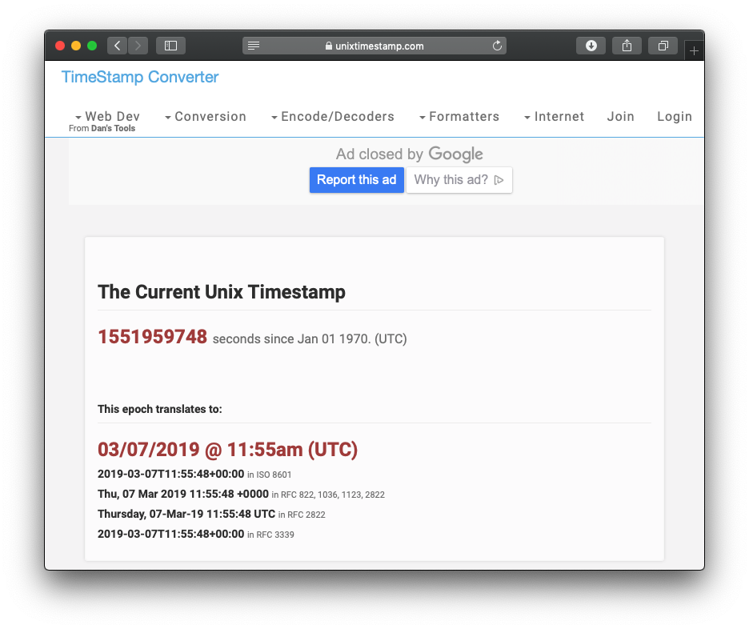
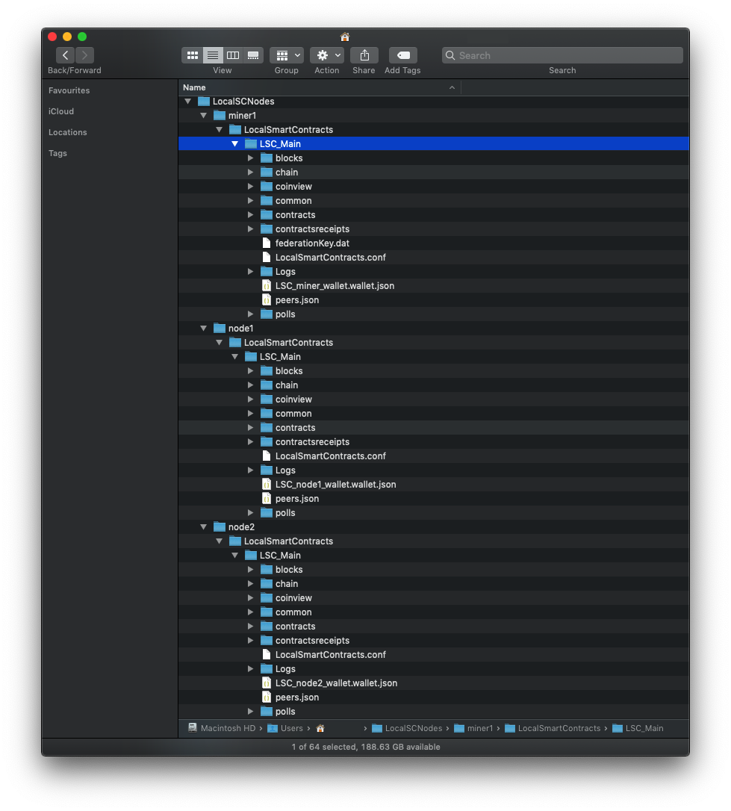
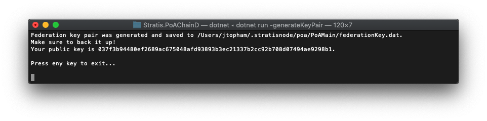

***************************************************************************
Running the Local Smart Contracts (LSC) network miner for the first time  
***************************************************************************

The Local Smart Contracts (LSC) network is held in a branch on the `Stratis Full Node repository on GitHub <https://github.com/stratisproject/StratisBitcoinFullNode>`_. Make a clone of the Full Node repository on your system and then switch to the ``LSC-tutorial`` branch.

The network node scripts
=========================

Let's look at the scripts in the ``LSC_Node_Scripts`` directory, which run the three nodes. Batch files (\*.bat) are supplied for Windows PCs, and Bash scripts (\*.sh) are supplied for Mac and Linux PCs. To give you an idea of how the three nodes are going to interact, we are going to examine the scripts in greater detail. 

Open the three scripts for your system. The scripts don't do anything other than make sure the correct branch of the GitHub repository is checked out and run one of two daemons with the required configuration options.

The miner node runs the ``Stratis.LocalSmartContracts.MinerD`` daemon, and the other two nodes run the ``Stratis.LocalSmartContracts.NodeD`` daemon. The configuration options are detailed in the next section and give us information on the topology of the network we are setting up.

Daemon configuration options
================================

The subsections below below describe the configuration options used for the miner and standard nodes daemons. These options represent a small subset of the configuration options available for the Stratis Full Node.

bootstrap
----------

Permits a PoA federation member to mine even if it has no peers connected. This option allows genesis and premine blocks to be mined.

datadir
---------

Specifies the directory in which to hold the data for a node. The node creates the directory structure the first time it is run. Based on settings in the scripts, you can find the data on a Windows PC in the miner1, node1, and node2 directories held within APPDATA\LocalSCNodes. On a Mac these directories are found in ~/LocalSCNodes. This overrides the standard settings which assume you will only run one node for each mainchain or sidechain on a device. In this slightly unusual situation, three nodes from one network are run on one machine.

port
-------

Specifies the port to use for peer interactions on the network.

apiport
---------

Specifies the port to use for interactions via the Swagger API.

txindex
---------

A flag that specifies that transactions should be saved in the database so they can be queried.

connect
---------

Specifies a peer to connect to on the network. Giving the miner an invalid IP address for this option (0) ensures it makes no attempt to connect to other peers. When the connect option is used, the node does not, by default, listen for other peers trying to connect.

listen
---------

Specifies the node should listen for other peers trying to connect. In the case of the miner, this flag is used to override the effect of connect which is to turn off listening.

addnode
--------

Specifies a peer (node) to connect to. When a peer is connected to using addnode, the peer sends back other nodes to connect to. For example, if node1 connects to miner1, then miner1 can, provided node2 has connected, send back node2 as a peer for node1 to connect to. The end result is that node1 is connected to miner1 and node2.

bind
-----

The IP address to accept data from. Specifying a local address ensures that the network remains entirely local.

The LSC miner 
=================================

Only the miner node needs to be running to create the genesis and premine blocks.

The genesis block has a timestamp, and if the timestamp is too far in the past, the miner will not begin mining the genesis block. The first thing to do before running the miner is to update the genesis block timestamp in the source code.

Setting the timestamp for your LSC network
-------------------------------------------------------------

The timestamp is set in the `LocalSmartContractsNetwork <https://github.com/stratisproject/StratisBitcoinFullNode/blob/LSC-tutorial/src/Stratis.LocalSmartContracts.Networks/LocalSmartContractsNetwork.cs>`_ class, which inherits from the `PoANetwork <https://github.com/stratisproject/StratisBitcoinFullNode/blob/LSC-tutorial/src/Stratis.Bitcoin.Features.PoA/PoANetwork.cs>`_ class and defines the LSC network. The following code excerpt from the ``LocalSmartContracts()`` constructor shows the line of code where the genesis block property is set:

::

    this.GenesisTime = 1551703905;

The next chapter covers the other genesis block settings and the ``CreateLSCGenesisBlock()`` function in more detail. For now, you just need to update the ``GenesisTime`` property. The `Epoch Unix Time Stamp Converter <https://www.unixtimestamp.com>`_ provides the current UNIX timestamp:

In this case, you would just update the line of code like this:

::

    this.GenesisTime = 1551958646;

Updating the expected hash values for the genesis block
--------------------------------------------------------

Now you have added the timestamp, run the miner node using the provided script. On a Windows system, use the following command:

::

    .\start_miner.bat

On a Mac or Linux system, use:

::

    ./start_miner.sh

The miner will build, run for a short time, and then abort. This is because of two ``Network.Assert()`` calls, which raise an exception if a boolean condition is not met. The two conditions are as follows:

1. The hash of the genesis block must match a supplied 256-bit integer representing the expected hash.
2. The hash of the genesis block Merkle Root must match a supplied 256-bit integer representing the expected hash.

Blockchain architecture means that blocks hold a hash of the previous block, so the hash of the genesis block will be held by the premine block. Because a change of even one byte will produce a different hash, these functions check if anything unexpected has changed in the genesis block. In this case, they have identified that you have updated the timestamp.

Because you know the reason for the change, you can go ahead and update the 256-bit integer values. Just before the "There was a problem initializing the node. Details: 'Invalid network'" line, you will notice two lines of console output similar to the following:

::

    Genesis Block Hash: 0x3e1a3d04c947b06285aa18873444cee68a7d2497e81c53514b5dac75e83c0d65
    Merkle Root Hash: 0x6abb8137b005211ddd2878aebd97b69c89a7115ca5020e8fb3a98cc9a8bab09c

The 256-bit integer values (expressed as hexadecimal strings) will not be the same as the above because your new timestamp will be different. Update the condition for the two assert functions:

::

    Assert(this.Consensus.HashGenesisBlock == uint256.Parse("0x3e1a3d04c947b06285aa18873444cee68a7d2497e81c53514b5dac75e83c0d65"));
    Assert(this.Genesis.Header.HashMerkleRoot == uint256.Parse("0x6abb8137b005211ddd2878aebd97b69c89a7115ca5020e8fb3a98cc9a8bab09c"));

Now, if any changes happen inadvertently to *your* genesis block setup, the node will not run. The updated values you see in the console output are provided by the following lines of code:

::

    Console.WriteLine("Genesis Block Hash: 0x{0}", genesisBlock.GetHash().ToString());
    Console.WriteLine("Merkle Root Hash: 0x{0}", genesisBlock.Header.HashMerkleRoot.ToString());

If you want, you can now comment them out. When you run the miner, the node now displays output similar to the following:

::

    ======Node stats====== 03/13/2019 11:20:13
    Headers.Height:      0        Headers.Hash:     3e1a3d04c947b06285aa18873444cee68a7d2497e81c53514b5dac75e83c0d65
    Consensus.Height:    0        Consensus.Hash:   3e1a3d04c947b06285aa18873444cee68a7d2497e81c53514b5dac75e83c0d65
    BlockStore.Height:   0        BlockStore.Hash:  3e1a3d04c947b06285aa18873444cee68a7d2497e81c53514b5dac75e83c0d65
    Wallet[SC].Height:   No Wallet
    
    ======Voting Manager======
    0 polls are pending, 0 polls are finished.
    0 votes are scheduled to be added to the next block this node mines.
    
    ======Connection====== agent LSC_Miner_Node:0.13.0 (70012) [in:0 out:0] [recv: 0 MB sent: 0 MB]
    
    
    ======Consensus Manager======
    Chained header tree size: 0.00 MB
    Unconsumed blocks: 0 -- (0 / 200 MB). Cache is filled by: 0%
    Downloading blocks: 0 queued out of 0 pending
    
    ======Block Puller======
    Blocks being downloaded: 0
    Queued downloads: 0
    Average block size: 0 KB
    Total download speed: 0 KB/sec
    Average time to download a block: NaN ms
    Amount of blocks node can download in 1 second: NaN
    
    ======BlockStore======
    Batch Size: 0 MB / 5 MB (0 batched blocks)
    Queue Size: 0 MB (0 queued blocks)
    
    =======Mempool=======
    MempoolSize: 0    DynamicSize: 0 kb   OrphanSize: 0   
    
    ======PoA Miner======
    Mining information for the last 20 blocks.
    MISS means that miner didn't produce a block at the timestamp he was supposed to.
    ...

Although the mining node is running, the miner will not mine because it requires a file containing its private federation key.

Adding the federation private key
-----------------------------------

The miner's federation public key is specified in the constructor for the  `LocalSmartContracts <https://github.com/stratisproject/StratisBitcoinFullNode/blob/LSC-tutorial/src/Stratis.LocalSmartContracts.Networks/LocalSmartContractsNetwork.cs>`_ class:

::

    var federationPublicKeys = new List<PubKey>
    {
        new PubKey("02f5b2a2fc2aa9f2ab85e9727720f9b280ed937f897e444810abaada26738b13c4"),
    };

However, as we have seen, the miner is currently not mining any blocks. This is because a corresponding file containing a private key, which matches the public key, has not been provided. The private key is required to sign the blocks produced for the network. The file is named ``federationKey.dat``, and you can find it in the ``Federation_Key`` directory of the ``LSC-tutorial`` branch. The file is not readable as the private key is necessarily encrypted.

The federationKey.dat file will only work for the public key supplied in the `LocalSmartContracts <https://github.com/stratisproject/StratisBitcoinFullNode/blob/LSC-tutorial/src/Stratis.LocalSmartContracts.Networks/LocalSmartContractsNetwork.cs>`_ class. If you wanted to change the public key or have more miners (PoA federation members), then you can use the key generation facility.

.. note:: To shutdown a node, press ``Ctrl + C``. In order to return to the command prompt, you may have to press ``Ctrl + C`` a second time.

Now stop the miner. Copy the ``federation.dat`` file into miner1's data directory. This is specified by the ``-datadir`` command line option and will have been created when you ran the miner node for the first time. The path on a Windows system will be something like ``C:\User\User_Name\LocalSCNodes/miner1/LocalSmartContracts/LSC``, and on a Mac or Linux system, it will be ``~/LocalSCNodes/miner1/LocalSmartContracts/LSC``. The following image shows miner1's directory structure and the ``federation.dat`` file in place. It includes the directories for node1 and node2, which you will not see until you have run them. The miner wallet file will also not be visible as no wallet has been created yet.

Once, you have copied the file over, the miner node will commence with creating the genesis block the next time it is run.

.. note:: Because the Full Node source does not have to be rebuilt after this point, you can add the ``--no-build`` option in the last line of the miner script, after the ``dotnet run`` command and before the config options. This speeds up the running of the script. After the two non-mining nodes have run once, you can also add this option to them. 

The LSC network magic number
-----------------------------

Blockchain nodes use a magic number to ensure that the nodes they connect to are on the same network. The magic number is used as the first four bytes of every network message, and no communication can be established if there is a mismatch. The magic number is also set in the `LocalSmartContractsNetwork <https://github.com/stratisproject/StratisBitcoinFullNode/blob/LSC-tutorial/src/Stratis.LocalSmartContracts.Networks/LocalSmartContractsNetwork.cs>`_ class:

::

   var messageStart = new byte[4];
    messageStart[0] = 0x76;
    messageStart[1] = 0x36;
    messageStart[2] = 0x23;
    messageStart[3] = 0x06;
    uint magic = BitConverter.ToUInt32(messageStart, 0);

This magic number is copied from the `PoANetwork <https://github.com/stratisproject/StratisBitcoinFullNode/blob/LSC-tutorial/src/Stratis.Bitcoin.Features.PoA/PoANetwork.cs>`_ class code, which is intended as a template PoA class. As this is a local network, it is safe to stick with the magic number from the template.

Generating a federation private key
------------------------------------

Just for reference, this subsection details how to generate a federation private key. For example, you might want to later experiment with adding extra miners to your LSC network.

To create the private key, on the command line, navigate to the `PoAChainD <https://github.com/stratisproject/StratisBitcoinFullNode/tree/LSC-tutorial/src/Stratis.PoAChainD>`_ project. Then run this command:

::

    dotnet run -generateKeyPair

You should see output similar to the following:

