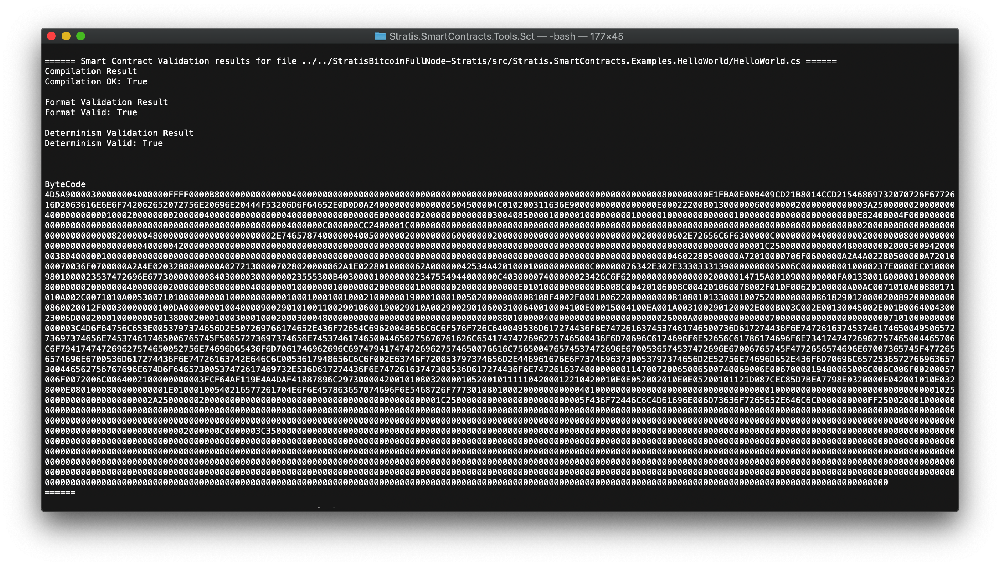

**********************************************************
Smart Contract Tutorial 2 - A "Hello World" smart contract
**********************************************************

The next tutorial in the series looks at a classic "Hello World" program.

Commonly, "Hello World" programs are very simple and consist of just one function, which outputs a string. However, because of the nature of smart contracts, this example is slightly more complicated, and we will take an opportunity to see how smart contracts are built from C# classes. Every interaction with a smart contract is made via a method call to the smart contract including its deployment. There is a limit of one call in any transaction.

If you are unfamiliar with any of the following C# topics, the following links will help you as you progress through the tutorial:

* `C# Classes <https://docs.microsoft.com/en-us/dotnet/csharp/programming-guide/classes-and-structs/classes>`_
* `C# Inheritance <https://docs.microsoft.com/en-us/dotnet/csharp/programming-guide/classes-and-structs/inheritance>`_
* `Class Constructors <https://docs.microsoft.com/en-us/dotnet/csharp/programming-guide/classes-and-structs/constructors>`_
* `Property Getters and Setters <https://docs.microsoft.com/en-us/dotnet/csharp/programming-guide/classes-and-structs/using-properties>`_

You can find the source code for the "Hello World" smart contract examples in the `Stratis.SmartContracts.Examples.HelloWord <https://github.com/stratisproject/StratisBitcoinFullNode/tree/LSC-tutorial/src/Stratis.SmartContracts.Examples.HelloWorld>`_ project, which is included in the ``LSC-tutorial`` branch of the Stratis Full Node. For this tutorial, you will study, build, and deploy `HelloWorld.cs <https://github.com/stratisproject/StratisBitcoinFullNode/blob/LSC-tutorial/src/Stratis.SmartContracts.Examples.HelloWorld/HelloWorld.cs>`_. 

How the concept of a class links to a smart contract
=====================================================

Smart contracts in C# are intrinsically linked to object-oriented design even when they are very basic.

Being object-oriented also enables smart contracts to inherit methods and properties. This allows a level of basic smart contract functionality to be readily available to all smart contracts via base class methods and properties.

The smart contract constructor
---------------------------------

Deployment of a smart contract involves calling the constructor for the smart contract class. This is where any initialization of the smart contract should take place. Before we look at what the constructor does, let's examine its syntax.

Firstly, as previously mentioned, all smart contracts in C# inherit from ``SmartContract``. It is mandatory to include the following line at the top of the file:

::

    using Stratis.SmartContracts;

This allows a smart contract to inherit from the base ``SmartContract`` class.

The class declaration specifies that your class inherits from the ``SmartContract`` class:

::

    [Deploy]
    public class HelloWorld : SmartContract
    {
        ...
    }

The ``[Deploy]`` attribute only needs to be specified when more than one class is declared in the file, but specifying it anyway is fine. When a smart contract is deployed, the entire C# file is compiled into Common Intermediate Language (CIL), which is then supplied to the deployment call.

The first parameter passed to the constructor must be an object conforming to the ``ISmartContractState`` interface:

::

    public HelloWorld(ISmartContractState smartContractState)
        : base(smartContractState)
    {
        ...
    }

You can define additional parameters, and when you deploy the smart contract, you only need to specify arguments for the parameters you defined. The first parameter is handled internally. The ``base`` constructor (the ``SmartContract`` constructor) must also be called with the ``ISmartContractState`` parameter, and you can see this in the code above. The name of the first parameter could theoretically be changed, but ``smartContractState`` will work fine.

Greeting - a smart contract property
--------------------------------------

In our Hello World example, we do one thing and that is initialize the ``Greeting`` property:

::

    this.Greeting = "Hello World!";

The actual line initiating the ``Greeting`` property is fairly self-explanatory. Let's take a look at the property getter and setters.

::

    private string Greeting
    {
        get 
        {
            return this.PersistentState.GetString("Greeting");
        }
        set
        {
            this.PersistentState.SetString("Greeting", value);
        }
    }

The ``PersistentState`` property belongs to the ``SmartContract`` class and facilitates the storage and retrieval of data (in this case a string). Smart contract data is stored as a series of key-value pairs and in this case "Greeting" is used as the key. The ``Greeting`` property is marked as private as there is no need for it to be accessed from anywhere other than inside the smart contract. Unlike methods, C# properties on a smart contract cannot be called even if they are public.

SayHello() - a smart contract method
--------------------------------------

Finally, let's look at the simple method ``Greeting()``, which returns the "Hello World!" string.

::

    public string SayHello()
    {
        return this.Greeting;
    }

As you can see, this method just accesses the ``Greeting`` property.

.. _compiling-the-hello-world-smart-contract:

Compiling the Hello World smart contract
==========================================

A smart contract in C# must be compiled into CIL before it can be deployed. For this, we are going to use the `Stratis sct tool <https://github.com/stratisproject/Stratis.SmartContracts.Tools.Sct>`_. After cloning the repository:

1. Navigate to ``Stratis.SmartContracts.Tools.Sct``.
2. Execute the following command: ``dotnet run -- validate [PATH_TO_SMART_CONTRACT] -sb``. A relative path to ```HelloWorld.cs`` in your Stratis Full Node repository should work fine.
3. Copy the CIL to your clipboard.

To see more information on the options available for the sct ``validate`` command, use the following command: ``dotnet run -- validate --help`` 

To see the general help on the sct, use the following command: ``dotnet run -- help``



.. note:: If you have previously cloned the Stratis sct tool repository, please ensure that before you compile any smart contracts, you sync the repository to the latest version of the source code and rebuild the tool.

.. _deploying-the-hello-world-smart-contract:

Deploying the Hello World smart contract
===========================================

Begin by making sure that you have the Local Smart Contract network running. You will need funds to deploy the smart contract, and if you got the local network up and running in Tutorial 1, you should now be in possession of 100,000,000 LSC (Local Smart Contract) tokens! In addition, each standard node should now have 100 LSC tokens. You can deploy the token using Swagger by connecting to either of the two standard nodes as long as they are running:

* http://localhost:38202/swagger/index.html
* http://localhost:38203/swagger/index.html

.. note:: *You must have the miner node up and running at all times when working on this tutorial and subsequent tutorial.* Only the miner has the ability to process these smart contract transactions into blocks. If a smart contract deployment or method call transaction does not make it into a block, the contract does not exist on the network, and any related persistent state change never happens.

You will use the ``/api/SmartContracts/build-and-send-create`` API call to deploy the smart contract. This involves filling out the ``BuildCreateContractTransactionRequest`` object. Each member of the object is fully documented in the API. Use the CIL code you generated in the previous section for the ``contractCode`` field. For the gas limit, specify the maximum value as we have plenty of LSC tokens to pay for the gas. For convenience, if you deploy on node 1, you can copy the following into the request and update the ``password``, ``contractCode``, and ``sender``: 

::

    {
      "walletName": "LSC_node1_wallet",
      "accountName": "account 0",
      "amount": "0",
      "feeAmount": "0.02",
      "password": "node_wallet_password",
      "contractCode": "CIL_code",
      "gasPrice": 100,
      "gasLimit": 100000,
      "sender": "node_smart_contract_account_address",
      "parameters": [
      ]
    }

Execute the API call, and you should see something like the following:

::

    {
      "newContractAddress": "Cf3VuvjuecfNX9JkNMYqZgFQkTr8nNk1XM",
      "fee": 12000000,
      "hex": "0100000001eb970c25de8a7fc76a5c075c93e648d1fd40d99ed3fc6ab5ec12357eff3333bb000000006a47304402205f1a1bbe336c8f1d8655bef4854450a11eef85af01b4443b79b1e576c107acdc02205b969285bac833f9d80c68e0f4c2ce0da72cb8f9aa47693a3bd2da8b545cc987012102ab26fc772cac7c2e082e9cd77a3c3919e1204b5ebd6414be1eda62860b2e7c7fffffffff0200c95453020000001976a91476fe05a5854979b67e40aba7f0b167d381ef0b1188ac0000000000000000fd1c0ac0010000006400000000000000a086010000000000f90a04b90a004d5a90000300000004000000ffff0000b800000000000000400000000000000000000000000000000000000000000000000000000000000000000000800000000e1fba0e00b409cd21b8014ccd21546869732070726f6772616d2063616e6e6f742062652072756e20696e20444f53206d6f64652e0d0d0a2400000000000000504500004c010200d45806930000000000000000e00022200b0130000006000000020000000000003a250000002000000040000000000010002000000002000004000000000000000400000000000000006000000002000000000000030040850000100000100000000010000010000000000000100000000000000000000000e82400004f000000000000000000000000000000000000000000000000000000004000000c000000cc2400001c0000000000000000000000000000000000000000000000000000000000000000000000000000000000000000200000080000000000000000000000082000004800000000000000000000002e7465787400000040050000002000000006000000020000000000000000000000000000200000602e72656c6f6300000c0000000040000000020000000800000000000000000000000000004000004200000000000000000000000000000000000000000000000000000000000000000000000000000000000000000000000000000000000000001c250000000000004800000002000500942000003804000001000000000000000000000000000000000000000000000000000000000000000000000000000000000000000000000000000000000000004602280500000a72010000706f0600000a2a4a02280500000a7201000070036f0700000a2a4e0203280800000a02721300007028020000062a1e0228010000062a00000042534a4201000100000000000c00000076342e302e33303331390000000005006c00000080010000237e0000ec0100009801000023537472696e677300000000840300003000000023555300b4030000100000002347554944000000c40300007400000023426c6f6200000000000000020000014715a0010900000000fa01330016000001000000080000000200000004000000020000000800000004000000010000000100000002000000010000000200000000000e0101000000000006008c0042010600bc004201060078002f010f00620100000a00ac0071010a00880171010a002c0071010a0053007101000000000100000000000100010001001000210000001900010001005020000000008108f4002f00010062200000000081080101330001007520000000008618290120000200892000000000860020012f00030000000100da00000001004000090029010100110029010600190029010a002900290106003100640010004100e00015004100ea001a003100290120002e000b003c002e00130045002e001b006400430023006d00020001000000050138000200010003000100020003000480000000000000000000000000000000008801000004000000000000000000000026000a000000000001000200010000000000000000007101000000000000003c4d6f64756c653e0053797374656d2e507269766174652e436f72654c69620048656c6c6f576f726c640049536d617274436f6e7472616374537461746500736d617274436f6e74726163745374617465004950657273697374656e745374617465006765745f50657273697374656e7453746174650044656275676761626c6541747472696275746500436f6d70696c6174696f6e52656c61786174696f6e73417474726962757465004465706c6f794174747269627574650052756e74696d65436f6d7061746962696c6974794174747269627574650076616c756500476574537472696e6700536574537472696e67006765745f4772656574696e67007365745f4772656574696e6700536d617274436f6e74726163742e646c6c0053617948656c6c6f002e63746f720053797374656d2e446961676e6f73746963730053797374656d2e52756e74696d652e436f6d70696c6572536572766963657300446562756767696e674d6f64657300537472617469732e536d617274436f6e74726163747300536d617274436f6e747261637400000000114700720065006500740069006e0067000019480065006c006c006f00200057006f0072006c006400210000000000434394ddb1a99046a0225689c4922d470004200101080320000105200101111104200012210420010e0e052002010e0e05200101121d087cec85d7bea7798e0320000e042001010e0328000e0801000800000000001e01000100540216577261704e6f6e457863657074696f6e5468726f77730108010002000000000004010000000000000000000000000000000000100000000000000000000000000000001025000000000000000000002a2500000020000000000000000000000000000000000000000000001c250000000000000000000000005f436f72446c6c4d61696e006d73636f7265652e646c6c0000000000ff2500200010000000000000000000000000000000000000000000000000000000000000000000000000000000000000000000000000000000000000000000000000000000000000000000000000000000000000000000000000000000000000000000000000000000000000000000000000000000000000000000000000000000000000000000000000000000000000000000000000000000000000000000000000000000000000000000000000000000000000000000000000000000000000000000000000002000000c0000003c35000000000000000000000000000000000000000000000000000000000000000000000000000000000000000000000000000000000000000000000000000000000000000000000000000000000000000000000000000000000000000000000000000000000000000000000000000000000000000000000000000000000000000000000000000000000000000000000000000000000000000000000000000000000000000000000000000000000000000000000000000000000000000000000000000000000000000000000000000000000000000000000000000000000000000000000000000000000000000000000000000000000000000000000000000000000000000000000000000000000000000000000000000000000000000000000000000000000000000000000000000000000000000000000000000000000000000000000000000000000000000000000000000000000000000000000000000000000000000000000000000000000000000000000000000000000000000000000000000000000000000000000000000000000000000000000000000000000000000000000000000000000000000000000000000000000000000000000000000000000000000000000000000000000000000000000000000000000000000000000000000000000000000000000000000000000000000000008000000000",
      "message": "Your CREATE transaction was sent. Check the receipt using the transaction ID once it has been included in a new block..",
      "success": true,
      "transactionId": "dc100bea2db5495ee3a065df1efd80bbe9e5c6eca069a4f7d209746ffd723c5a"
    }

Although the message says that the contract has been successfully deployed, it does not confirm whether the transaction containing the call to the smart contract constructor in now on the blockchain. You can check that the transaction has been added to the blockchain using the ``/api/SmartContracts/receipt`` API call. Copy the ``transactionId`` field from the response above and paste it into the ``txHash`` field of the receipt API call. If the transaction has been successfully added, this API call returns something like the following:

::

    {
      "transactionHash": "dc100bea2db5495ee3a065df1efd80bbe9e5c6eca069a4f7d209746ffd723c5a",
      "blockHash": "3e219b39a1086435daa7bc3c605d201d8941e058f981b2eccb91eb4ec98e6bfa",
      "postState": "13ed2836f420a91af665cb40dc2303ead467106ea7c1f27c6a425ddef4954a3b",
      "gasUsed": 12428,
      "from": "CTK4cSRgZiVDotQkHz8J5yxgUTKAbwyDw8",
      "to": null,
      "newContractAddress": "Cf3VuvjuecfNX9JkNMYqZgFQkTr8nNk1XM",
      "success": true,
      "returnValue": null,
      "bloom": "00000000000000000000000000000000000000000000000000000000000000000000000000000000000000000000000000000000000000000000000000000000000000000000000000000000000000000000000000000000000000000000000000000000000000000000000000000000000000000000000000000000000000000000000000000000000000000000000000000000000000000000000000000000000000000000000000000000000000000000000000000000000000000000000000000000000000000000000000000000000000000000000000000000000000000000000000000000000000000000000000000000000000000000000000000000",
      "error": null,
      "logs": []
    }

.. note:: If the transaction has been added to the blockchain, this also means that a miner has executed the smart contract constructor. The constructor is, in fact, executed by all nodes who receive the block containing this transaction during block validation. Executing the smart contract constructor effectively persists the ``Greeting`` property on all the nodes. 

The ``newContractAddres`` field is particularly important as you use this to identify a smart contract when you call a method on it.

Calling the SayHello() method locally
===========================================

We are going to call the ``SayHello()`` method as a local call. This means that:

1. No gas will be expended making the call.
2. The persisted state for the ``Greeting`` property will be copied and worked on for the duration of the call.

The second point is academic in this situation because the value is only read and not written to. However, as we shall see, what this means is that persistent state is not updated by local calls made to smart contract methods.

Use the ``/api/SmartContracts/local-call`` API call to make a local method call on the smart contract. This involves filling out the ``LocalCallContractRequest`` object. Each member of the object is fully documented in the API. For the gas limit, specify the maximum value as you can afford that cost in LSC tokens when calling the method for real. For convenience, you can copy the following into the request and update the ``contractAddress`` and ``sender``:

::

    {
      "contractAddress": "hello_world_smart_contract_address",
      "methodName": "SayHello",
      "amount": “0”,
      "gasPrice": 100,
      "gasLimit": 100000,
      "sender": "node_smart_contract_account_address",
      "parameters": []
    }
    

You should see the following response:

::

    {
      "InternalTransfers": [],
      "GasConsumed": {
        "Value": 10038
      },
      "Revert": false,
      "ErrorMessage": null,
      "Return": "Hello World!",
      "Logs": []
    }

The ``Return`` field proves the local call was successful.

.. _creating-a-real-transaction-which-calls-sayhello:

Creating a transaction which calls SayHello()
======================================================

The value returned when the ``SayHello()`` method is called from within a transaction will be the same as when it is called locally. This is because the method just retrieves the state for the ``Greeting`` property, which was persisted when the smart contract was deployed. However, when the call is part of a broadcast transaction and subsequently included in a mined block, other nodes are able to see the result of the transaction call.

Use the ``/api/SmartContracts/build-and-send-call`` API call to create a transaction containing a call to the smart contract. This involves filling out the ``BuildCallContractTransactionRequest`` object. Each member of the object is fully documented in the API. For the gas limit, specify the maximum value as we have plenty of LSC tokens to pay for the gas. For convenience, if you deploy on node 1, you can copy the following into the request and update the ``contractAddress``, ``password``, and ``sender``:

::

    {
      "walletName": "LSC_node1_wallet",
      "accountName": "account 0",
      "contractAddress": "hello_world_smart_contract_address",
      "methodName": "SayHello",
      "amount": "0",
      "feeAmount": "0.02",
      "password": "node_wallet_password",
      "gasPrice": 100,
      "gasLimit": 100000,
      "sender": "node_smart_contract_account_address",
      "parameters": []
    }

Execute the API call, and you should see something like the following:

::

    {
      "fee": 12000000,
      "hex": "01000000015a3c72fd6f7409d2f7a469a0ecc6e5e9bb80fd1edf65a0e35e49b52dea0b10dc000000006b483045022100dd3c2b89dfb77336afaf0a8fbc44b72be70397e466971316857de7982281fe6a02207e17bcc022600f136ba9a62bc3ca8de7248b03a7fad74e8afe47a18cf8560fce012102ab26fc772cac7c2e082e9cd77a3c3919e1204b5ebd6414be1eda62860b2e7c7fffffffff0200ae9d52020000001976a91476fe05a5854979b67e40aba7f0b167d381ef0b1188ac000000000000000034c1010000006400000000000000a086010000000000f7adff28fbac3d0b546e6c99f0c632ac36f4b05cca8853617948656c6c6f8000000000",
      "message": "Your CALL method SayHello transaction was sent. Check the receipt using the transaction ID once it has been included in a new block.",
      "success": true,
      "transactionId": "40dce1de9495eb0be358be32feaa1bc8ff30dcea9ff6ffc08d4a0059aac5f086"
    }

Although the message says that the contract method was successfully deployed, it does not confirm whether the transaction containing the call to the ``SayHello()`` method is now on the blockchain. Check that the transaction has been added to the blockchain using the ``/api/SmartContracts/receipt`` API call. Copy the ``transactionId`` field from *the response you received* and paste it into the ``txHash`` field of the receipt API call. If the transaction has been successfully added, this API call returns something like the following:

::

    {
      "transactionHash": "40dce1de9495eb0be358be32feaa1bc8ff30dcea9ff6ffc08d4a0059aac5f086",
      "blockHash": "3e5451dfaf9fe54949778c055e38717301f1687ea145c115a0faf803c1d2bcaa",
      "postState": "13ed2836f420a91af665cb40dc2303ead467106ea7c1f27c6a425ddef4954a3b",
      "gasUsed": 10038,
      "from": "CTK4cSRgZiVDotQkHz8J5yxgUTKAbwyDw8",
      "to": "Cf3VuvjuecfNX9JkNMYqZgFQkTr8nNk1XM",
      "newContractAddress": null,
      "success": true,
      "returnValue": "Hello World!",
      "bloom": "00000000000000000000000000000000000000000000000000000000000000000000000000000000000000000000000000000000000000000000000000000000000000000000000000000000000000000000000000000000000000000000000000000000000000000000000000000000000000000000000000000000000000000000000000000000000000000000000000000000000000000000000000000000000000000000000000000000000000000000000000000000000000000000000000000000000000000000000000000000000000000000000000000000000000000000000000000000000000000000000000000000000000000000000000000000",
      "error": null,
      "logs": []
    }


