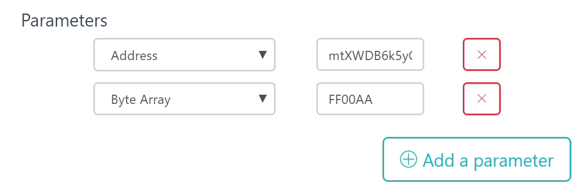

#####################################
Working with Contracts
#####################################

Writing a contract
-------------------
Stratis smart contracts are CIL bytecode that is executed on top of the dotnet core runtime. Tooling and support is currently provided for writing and compiling contracts in the C# language.

Contracts can be written in any editor that supports C#, however Visual Studio is the recommended contract development environment.

Installing the Visual Studio Project Template 
~~~~~~~~~~~~~~~~~~~~~~~~~~~~~
There is a Visual Studio Project Template that provides an easy way to create a new smart contract project. The template can be `found on the Visual Studio marketplace <https://marketplace.visualstudio.com/items?itemName=StratisGroupLtd.StratisSmartContractsTemplate>`_.

Validating a contract
-------------------
A Stratis smart contract must not contain any non-deterministic elements. This restricts the standard .NET libraries that can be used when writing a contract. There are additional constraints around the format of the contract that are required to be met before it can be executed. 

All contracts are validated by a node when the contract is being deployed. Invalid contracts will fail validation on-chain. Because of this, it is recommended to validate contracts locally before deployment. 

Validation can be done using the ``sct`` command line tool.

::

  cd src/Stratis.SmartContracts.Tools.Sct
  dotnet run -- validate [CONTRACT_PATH_HERE]

Compiling a contract
-------------------
Contracts can be compiled using the ``sct`` command line tool.

::

  cd src/Stratis.SmartContracts.Tools.Sct
  dotnet run -- compile [CONTRACT_PATH_HERE]

Deploying a contract
-------------------
Contracts can be deployed in several ways:

* Using the ``sct`` command line tool
* Via the swagger API
* Via the wallet

Interacting with a contract
-------------------
The easiest way to interact with a contract is to use the Stratis Core wallet with smart contracts enabled.

- Local calls

Parameter Serialization
-------------------

When deploying or interacting with a contract via the wallet, the API, or SCT, contract parameters must be provided as a string. This requires that a parameter is serialized to a string in the format that the API is expecting.

Additionally, when using the API or SCT, the type of each parameter must be provided in the format "{0}#{1}", where: {0} is an integer representing the Type of the serialized data and {1} is the serialized data itself.

Refer to the following table for the mapping between a type, its integer representation, serializer and an example.

.. csv-table:: Param Type Serialization
  :header: "Type", "Integer representing
   serialized type", "Serializer", "Example"

  System.Boolean, 1, System.Boolean.ToString(), "1#true"
  System.Byte, 2, System.Byte.ToString(), "2#255"
  System.Char, 3, System.Char.ToString(), "3#c"
  System.String, 4, System.String, "4#Stratis"
  System.UInt32, 5, System.UInt32.ToString(), "5#123"
  System.Int32, 6, System.Int32.ToString(), "6#-123"
  System.UInt64, 7, System.UInt64.ToString(), "7#456"
  System.Int64, 8, System.Int64.ToString(), "8#-456"
  Stratis.SmartContracts.Address, 9, Base58Address.ToString(), "9#mtXWDB6k5yC5v7TcwKZHB89SUp85yCKshy"
  System.Byte[], 10, BitConverter.ToString(), "10#04A6B9"

The parameters must be provided in the order they occur in the method signature. For example, calling a method with the signature ``SomeMethod(Address myAddress, byte[] someData)`` with the values ``myAddress = mtXWDB6k5yC5v7TcwKZHB89SUp85yCKshy``, ``someData = 0xFF00AA`` looks like:

In the API:
::

  parameters: [
    "9#mtXWDB6k5yC5v7TcwKZHB89SUp85yCKshy",
    "10#FF00AA"
  ]

As parameters to SCT:
::

  -param="9#mtXWDB6k5yC5v7TcwKZHB89SUp85yCKshy" -param="10#FF00AA"

In the wallet:

    Entering contract parameters in the wallet

Testing a contract
-------------------

Gas
-------------------
Gas fees charged
Gas fees and refunds and where they end up on a transaction (coinbase)

SmartContract object
---------------
What the diff fields are etc

1. Download or clone the source.
2. Installing the Visual Studio Project Template. 
3. Create a smart contracts project, which will include an auction smart contract and unit tests.
4. Validate the smart contract with the smart contract tool (SCT).
5. Run the smart contract enabled version of the full node...
6. Get the funds to deploy the auction smart contract and place a bid.
7. Build and deploy the smart contract.
8. Place a bid.
9. Check the bid has been stored on the test network.

.. note::
    This chapter assumes a Windows development environment. Stratis smart contracts can be developed on other platforms, and documentation to support this will be available soon.

Validating your smart contract
------------------------------

When you attempt to deploy a smart contract by including it in a transaction, it is tested to see if its C# code is correct and deterministic. Mining nodes carry out this testing before they include a smart contract transaction in a block. In addition, other nodes on the network attempt to validate any smart contracts that they find in any blocks they receive. If the smart contracts are not valid, the entire block is rejected. Therefore, you will want to know your smart contract meets the validation criteria before you try and deploy it. Stratis provides SCT (a command-line tool) for validating and building smart contracts.

The SCT tool is located within the source code of the full node that was cloned earlier. Navigate to this source code directory, and then change into the SCT project directory:

::

  cd src/Stratis.SmartContracts.Tools.Sct

You are now going to validate the auction smart contract and request to see its byte code. When you begin writing your own smart contracts, you will also carry out this step for them before you deploy. Right click on your Auction.cs file tab in Visual Studio and click ‘Copy Path’. Then, back on the command line, use the ``validate`` command:

::

  dotnet run -- validate [PASTE_YOUR_PATH HERE] -sb

You should see the following output:

::

  ====== Smart Contract Validation results for file [YOUR_FILE_PATH] ======
  Compilation Result
  Compilation OK: True

  Format Validation Result
  Format Valid: True

  Determinism Validation Result
  Determinism Valid: True

  ByteCode
  4D5A90000300000004000000F...
  
Congratulations! You have compiled your first smart contract in C#. The bytecode is a hexadecimal representation of the .NET IL compiled for this contract and is all you need to deploy your contract on a network (provided you have a node running).

To further understand why this tool is important, go back to your contract and add this line in the constructor:

::

  var test = DateTime.Now;

And this line at the top of the Auction.cs file:

::

  using System;  

So why is the first line problematic inside a smart contract? Different nodes are going to execute the code at different times and because of this, they all receive a different result for ``DateTime.Now``. If this value was persisted in some way, all of the nodes would receive a different outcome for the contract state and would fail to reach a consensus.

Make sure you have saved Auction.cs and run the validation command again. SCT recognizes this non-deterministic call:

::

  ====== Smart Contract Validation results for file [YOUR_FILE_PATH] ======
  Compilation Result
  Compilation OK: True

  Format Validation Result
  Format Valid: True

  Determinism Validation Result
  Determinism Valid: False

  .ctor:
     System.DateTime System.DateTime::get_Now() is non-deterministic.
   
Now back out the non-deterministic code and resave.

More about the SCT
^^^^^^^^^^^^^^^^^^

The SCT uses 3 commands:

+---------+-----------------------------------------------------------+
|Command  |Description                                                |
+=========+===========================================================+
|build    |Builds a contract and outputs a dll. For testing purposes. |
+---------+-----------------------------------------------------------+
|deploy   |Deploys a smart contract to the given node.                |
+---------+-----------------------------------------------------------+
|validate |Validates smart contracts for structure and determinism.   |
+---------+-----------------------------------------------------------+

The SCT provides further information on using these commands. For example, the following usage requests help on the validate command:

::

 dotnet run -- validate  --help

Running a smart contract enabled version of the Stratis full node
-----------------------------------------------------------------

To interact with the smart contract test network, you now need to build the smart contract daemon. This is the Stratis.StratisSmartContractsD project in the `sc-alpha branch of the Stratis Smart Contract Enabled Full Node <https://github.com/stratisproject/StratisBitcoinFullNode/tree/sc-alpha>`_, which you either downloaded or cloned. When the project is built, run the daemon as follows:

::

  cd src/Stratis.StratisSmartContractsD
  dotnet run -- -addnode=13.64.119.220 -addnode=20.190.57.145 -addnode=40.68.165.12

Adding the three nodes attempts to connect the daemon to the smart contract test network. 

.. note::
  The smart contract test network is a testing environment and its uptime may fluctuate. For the most up-to-date information on the test network status, join us on Discord: :ref:`support_and_community`.

Getting the funds to deploy smart contracts
-------------------------------------------

To deploy a smart contract you need funds to pay the transaction fees and the gas to run the smart contract. In this case, you are also going to test the smart contract out by placing a bid, which involves calling one of its methods. There is additional expenditure involved here because you must pay for:

1. The amount you are going to bid.
2. The transaction fees involved when making the bid (sending money to a deployed auction smart contract).
3. The gas to run the smart contract method.

To get funds, you must first create a wallet and then request the funds. The next two subsections detail how to do this.

Creating a wallet
^^^^^^^^^^^^^^^^^

Because the smart contract API hasn't been integrated with any GUI wallets yet, you must use the API directly via Swagger. Whilst your node is running, navigate to `http://localhost:38220/swagger <http://localhost:38220/swagger>`_.

To create a wallet, navigate to the Wallet section and use the `/api/Wallet/create` call. You only need to specify a name and password in the request. For example:

::

  {
    "name": "Satoshi",
    "password": "password"
  }

You now have a wallet containing some TSTRAT addresses. To see the addresses, use the `/api/Wallet/addresses` call, which is also found in the Wallet section. You just need to specify your wallet name and an AccountName of "account 0".

Getting funds 
^^^^^^^^^^^^^

The easiest way to get some TSTRAT is use the `smart contracts faucet <https://smartcontractsfaucet.stratisplatform.com/>`_. To receive 100 TSTRAT, specify a TSTRAT address from your wallet. Make a note of the address you use. Use this TSTRAT address for deploying and testing the smart contract.  

Alternatively, if you want to get more involved and earn some TSTRAT along the way, feel free to start mining! To begin mining, restart your node with an address from your wallet:

::

  dotnet run -- -addnode=13.64.119.220 -addnode=20.190.57.145 -addnode=40.68.165.12 -mine=1 -mineaddress=[YOUR_WALLET_ADDRESS]
  
Use the TSTRAT address you use for the mine address when deploying and testing the smart contract. 

Deploying the auction smart contract
------------------------------------

While you deploy your smart contract, it is important to remember that deploying a smart contract involves several steps:

* Compiling the contract.
* Validating the contract.
* Creating a transaction which contains the contract’s code.
* Broadcasting the transaction to the network.

From the command-line, you can use the ``deploy`` command to achieve all these steps:

::

  dotnet run -- deploy [PATH_TO_SMART_CONTRACT] http://localhost:38220 -wallet [YOUR_WALLET_NAME] -password [YOUR_PASSWORD] -fee 0.002 -sender=[YOUR_WALLET_ADDRESS] -params=[CONSTRUCTOR_PARAMS_IF_REQUIRED]
  
As before, when you were validating the auction smart contract, you need to obtain the path to the Auction.cs file. However, because the Auction C# class contains a constructor parameter, ``durationBlocks``, you must pass this value as well. The ``durationBlocks`` parameter specifies how many blocks are added to blockchain before the auction ends. In the following example, 20 blocks are added to the blockchain before the auction ends:

::

  dotnet run -- deploy PATH_TO_SMART_CONTRACT http://localhost:38220 -wallet [YOUR_WALLET_NAME] -password [YOUR_PASSWORD] -fee 0.002 -sender=[YOUR_WALLET_ADDRESS] -params="10#20"
  
A value of 20 is used because blocks are not confirmed until they are 5 blocks deep. Until the block which the smart contract is in has been confirmed, you cannot run the smart contract. You will notice that the value of 20 is preceeded by 10#. This information is part of the ``durationBlocks`` constructor parameter. More information on specifying constructor parameters is given in `Specifying smart contract parameters`_. 

When you deploy the smart contract, you should also check the block height. To do this, find the Consensus.Height in the Node Stats of the full node output. Keep checking the block height. After Consensus.Height has incremented by 5, you can be sure the smart contract has been deployed.

The tool returns the address of the contract if the contract was deployed successfully. Make sure you record this as you are going to use it when you place a bid.

Specifying smart contract parameters
^^^^^^^^^^^^^^^^^^^^^^^^^^^^^^^^^^^^^^^^^^^^^^^^

Smart contract parameters are serialized into a string. The format of each parameter is "{0}#{1}" where: {0} is an integer representing the Type of the serialized data and {1} is the serialized data itself. Serialized array values are separated by a dash ``-`` character.

These params must be serialized into a string. The format of each parameter is "{0}#{1}", where {0} is an integer representing the Type of the serialized data, and {1} is the serialized data itself.

Multiple params must be specified in order and can be done like so: ``-param="7#abc" -param="8#123"``.

Currently, only certain types of data can be serialized. Refer to the following table for the mapping between a type and its integer representation.

.. csv-table:: Param Type Serialization
  :header: "Type", "Integer representing
   serialized type", "Serialize to string", "Example"

  System.Boolean, 1, System.Boolean.ToString(), "1#true"
  System.Byte, 2, System.Byte.ToString(), "2#255"
  System.Char, 3, System.Char.ToString(), "3#c"
  System.String, 4, System.String, "4#Stratis"
  System.UInt32, 5, System.UInt32.ToString(), "5#123"
  System.Int32, 6, System.Int32.ToString(), "6#-123"
  System.UInt64, 7, System.UInt64.ToString(), "7#456"
  System.Int64, 8, System.Int64.ToString(), "8#-456"
  Stratis.SmartContracts.Address, 9, Base58Address.ToString(), "9#mtXWDB6k5yC5v7TcwKZHB89SUp85yCKshy"
  System.Byte[], 10, BitConverter.ToString(), "10#04A6B9"
  
As a further example, imagine a smart contract which has a constructor with the following signature:

::

  public Token(ISmartContractState state, Address owner, UInt64 supply, Byte[] secretBytes)

In addition to the mandatory ISmartContractState, there are 3 parameters which need to be supplied. Assuming they have these values:

* Address owner = mtXWDB6k5yC5v7TcwKZHB89SUp85yCKshy
* UInt64 supply = 1000000
* Byte[] secretBytes = { 0xAD, 0xBC, 0xCD }

The serialized string representation of this data looks like this:

The command for passing these params to sct looks like this:

::

  -param="9#mtXWDB6k5yC5v7TcwKZHB89SUp85yCKshy" -param="7#1000000" -param="10#ADBCCD"

Placing a bid on the auction smart contract
-------------------------------------------

You can use Swagger to place a bid on the auction smart contract you have deployed. Navigate to the SmartContracts section and use `/api/SmartContracts/build-and-send-call`. For example, the following usage places a bid of 10 TSTRAT.

::

  {
    "walletName": "[YOUR_WALLET_NAME]",
    "contractAddress": "[YOUR_CONTRACT_ADDRESS]",
    "methodName": "Bid",
    "amount": "10",
    "feeAmount": "0.001",
    "password": "[YOUR_PASSWORD]",
    "sender": "[YOUR_WALLET_ADDRESS]",
  }

Once you have placed the bid, you will need to wait for the Consensus.Height to be incremented by another 5 blocks. At this point the bid transaction is confirmed. Finally, you can check the bid is stored on the test network.
 
Checking the bid has been stored on the test network
-----------------------------------------------------

Bids are persisted on each node in the network. You can use a Swagger call to check your bid has been stored on the test network. Navigate to the SmartContracts section and use `/api/SmartContracts/storage`. For the parameters, use the address of your deployed auction smart contract, the string "HighestBid" for the StorageKey, and Ulong for the DataType. A value of 10 should be returned.

